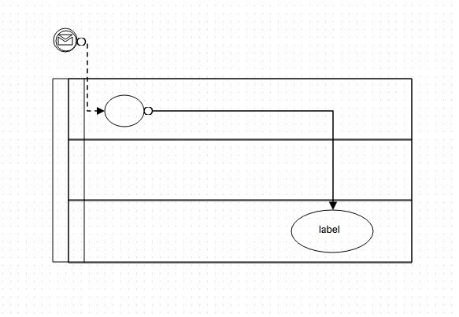

OpenGraph
=========

JavaScript graph visualization library for workflow, BPM, org charts, UML, ER, network diagrams.

 - [Getting Started](docs/getting-start.md)
 
 - Tutorials
   - Canvas
      - [Canvas Drawing](docs/canvas.md)
      - [Canvas Selector](docs/selector.md)
      - [Canvas Data](docs/data.md)
      - [Canvas Event](docs/event.md)
   - Renderer
      - [Renderer](docs/renderer.md)
   - Handler
      - [Handler](docs/handler.md)
   - Element
      - [Element](docs/element.md)
        - [Structure](docs/element.md#structure)
        - [Event binding](docs/element.md#event-binding)
      - [Geometry](docs/geometry.md)
        - [Point](docs/geometry.md#point)
        - [Coordinate](docs/geometry.md#coordinate)
        - [Envelope](docs/geometry.md#envelope)
        - [Style](docs/geometry.md#style)
        - [Geometry](docs/geometry.md#geometry)
        - [GeometryCollection](docs/geometry.md#geometrycollection)
        - [Polygon](docs/geometry.md#polygon)
        - [Rectangle](docs/geometry.md#rectangle)
        - [PolyLine](docs/geometry.md#polyline)
        - [Line](docs/geometry.md#line)
        - [Curve](docs/geometry.md#curve)
        - [BezierCurve](docs/geometry.md#beziercurve)
        - [Ellipse](docs/geometry.md#ellipse)
        - [Circle](docs/geometry.md#circle)
      - [Shape](docs/shapes.md)
        - [IShape](docs/shapes.md#ishape)
        - [Configuration](docs/shapes.md#configuration)
        - [GeomShape](docs/shapes.md#geomshape)
        - [EdgeShape](docs/shapes.md#edgeshape)
        - [GroupShape](docs/shapes.md#groupshape)
        - [ImageShape](docs/shapes.md#imageshape)
        - [TextShape](docs/shapes.md#textshape)
      - [Extend Shape](docs/extend-shape.md)
        - [CircleShape](docs/extend-shape.md#circleshape)
        - [EllipseShape](docs/extend-shape.md#ellipseshape)
        - [RectangleShape](docs/extend-shape.md#rectangleshape)
        - [PoolShape](docs/extend-shape.md#poolshape)
        - [LaneShape](docs/extend-shape.md#laneshape)
        - [Define Custom Shape](docs/extend-shape.md#define-custom-shape)
      - [Marker](docs/marker.md)
        - [Default Marker](docs/marker.md#default-marker)
        - [Custom Marker](docs/marker.md#custom-marker)
        - [Custom Marker Size](docs/marker.md#custom-marker-size)
        - [Custom Marker Ref](docs/marker.md#custom-marker-ref)
        - [Custom Marker Style](docs/marker.md#custom-marker-style)
      - [Pattern](docs/pattern.md)
        - [Custom Pattern](docs/pattern.md#custom-pattern)
        - [Custom Pattern Size](docs/pattern.md#custom-pattern-size)
        - [Custom Pattern Unit Size](docs/pattern.md#custom-pattern-unit-size)
        - [Custom Pattern Style && Transform](docs/pattern.md#custom-pattern-style-&&-transform)
        - [Hatched Pattern](docs/pattern.md#hatched-pattern)
        - [Custom Pattern in EdgeShape](docs/pattern.md#custom-pattern-in-edgeshape)
      - [Multi Line Edge](docs/multi.md)
        - [Basic Multi Edge](docs/multi.md#basic-multi-edge)
        - [Multi Edge from to](docs/multi.md#multi-edge-from-to)
        - [Multi Edge Examples](docs/multi.md#multi-edge-examples)
      - [Animation](docs/animation.md)
      - [Sub Shape](docs/subshape.md)
        - [Basic Sub Shape](docs/subshape.md#basic-sub-shape)
        - [Sub Shape Size && Position](docs/subshape.md#sub-shape-size-&&-position)
        - [Sub Shape index](docs/subshape.md#sub-shape-index)
        - [Sub Shape Data model](docs/subshape.md#sub-shape-data-model)

  

  

  

