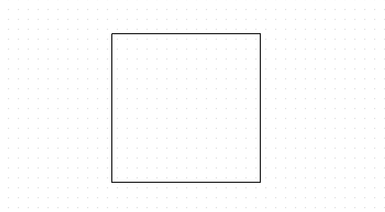
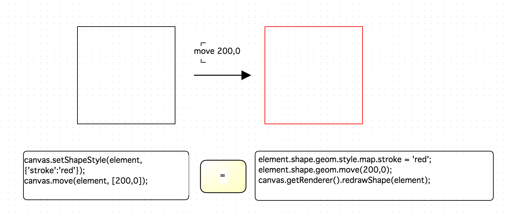

Element
=======

 - [Structure](#structure)
 - [Event binding](#event-binding)

## Structure

오픈그래프의 도형을 하나 그려보고, 도형을 콘솔로 출력하여 봅니다.

```
var canvas = new OG.Canvas('canvas', [1000, 800], 'white', 'url(resources/images/symbol/grid.gif)');
var element = canvas.drawShape([200, 200], new OG.RectangleShape(), [150, 150]);
console.log(element);
```



출력된 element 객체를 살펴보면, 다음과 같은 Dom 객체로 이루어져 있는 것을 확인할 수 있습니다.

```
<g x="0" y="0" fill="none" stroke="#000" id="OG_4648_2" _type="SHAPE" _shape="GEOM" style="-webkit-tap-highlight-color: rgba(0, 0, 0, 0); cursor: move; position: relative;" _shape_id="OG.shape.RectangleShape">
    <path fill="#ffffff" stroke="#000000" d="M125,125L275,125L275,275L125,275L125,125" style="-webkit-tap-highlight-color: rgba(0, 0, 0, 0);" fill-r=".5" fill-cx=".5" fill-cy=".5" fill-opacity="0" id="OG_4648_3"></path><path fill="none" stroke="#ffffff" d="M125,125L275,125L275,275L125,275L125,125" fill-opacity="0" stroke-width="20" stroke-opacity="0" id="OG_4648_4" name="CONNECT_GUIDE" style="-webkit-tap-highlight-color: rgba(0, 0, 0, 0); stroke-opacity: 0;">
    </path>
</g>
```

오픈그래프의 도형은 Dom 객체의 내용대로, g 태그 그룹이 있고 하위에 실제 화면에 표현되는 path / image / text svg 요소들로 이루어져 있습니다.

실제 화면에 표현되는 것은 g 태그 그룹 안의 내용이기 때문에, 화면 표현의 내용을 바꾸기 위해 element 의 요소를 직접 컨트롤 해도 적용되지 않습니다.

아래는 잘못된 접근 방식의 예제와 올바른 접근 방법의 예제 입니다.

```
//잘못된 접근 방식: element 를 Jquery 로 직접 스타일 변경을 주어도 화면에 적용되지 않는다.
var element = canvas.drawShape([200, 200], new OG.RectangleShape(), [150, 150]);
$(element).css('stroke','red');
$(element).attr('x',200);

//올바른 접근 방식
canvas.setShapeStyle(element,{'stroke':'red'});
canvas.move(element, [200,0]);
```

위와 같은 효과를 내면서 다른방법으로 접근할 수 있는 방법을 알아보도록 합니다.
 
```
var element = canvas.drawShape([200, 200], new OG.RectangleShape(), [150, 150]);

element.shape.geom.style.map.stroke = 'red';
element.shape.geom.move(200,0);
canvas.getRenderer().redrawShape(element);
```



위의 예제를 살펴보면, element 하위에 shape 객체가 있고, 다시 geom 객체, style 객체가 있는 것을 볼 수 있습니다.

각각의 객체를 출력해보고, 그 결과를 살펴봅시다.

```
var element = canvas.drawShape([200, 200], new OG.RectangleShape(), [150, 150]);

console.log(element.shape);
console.log(element.shape.geom);
console.log(element.shape.geom.style);
```

각각의 객체를 오픈그래프의 클래스에 대입하면 다음과 같습니다.

```
element.shape = OG.shape.RectangleShape
element.shape.geom = OG.geometry.Rectangle
element.shape.geom.style = OG.geometry.Style
```

오픈그래프의 고급 기능을 활용하고 현업의 다양한 요구에 수용하기 위해서는 위의 구조를 이해할 필요가 있습니다.

본 문서의 [Geometry](./geometry.md), [Shape](./shape.md) , [Extend Shape](./extend-shape.md) 페이지를 통해 더 자세히 살펴보도록 합니다.

## Event binding

위에서 오픈그래프의 도형의 Dom 객체를 통해 화면상의 스타일링에 변화를 줄 수 없는 것을 확인했습니다.

하지만 다른 UI 프레임워크를 활용한 이벤트 바인딩은 가능합니다.

이벤트 바인딩은 중첩될 수 있기 때문에, 오픈그래프 라이브러리가 이미 Dom 에 바인딩한 경우라도 바인딩 요소를 추가할 수 있습니다.

### case

 - 도형을 클릭시 선스타일과 채움색 변경

```
var element = canvas.drawShape([200, 200], new OG.RectangleShape(), [150, 150]);
$(element).click(function () {
    canvas.setShapeStyle(this, {'stroke': 'red',fill: 'blue', 'fill-opacity': 1})
});
```


