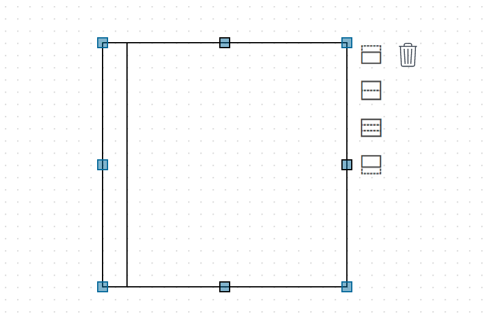
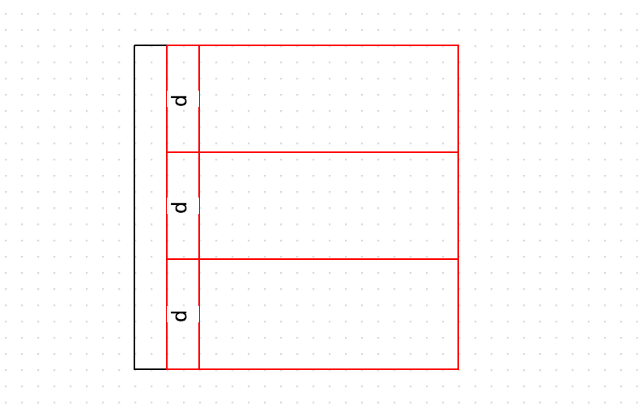
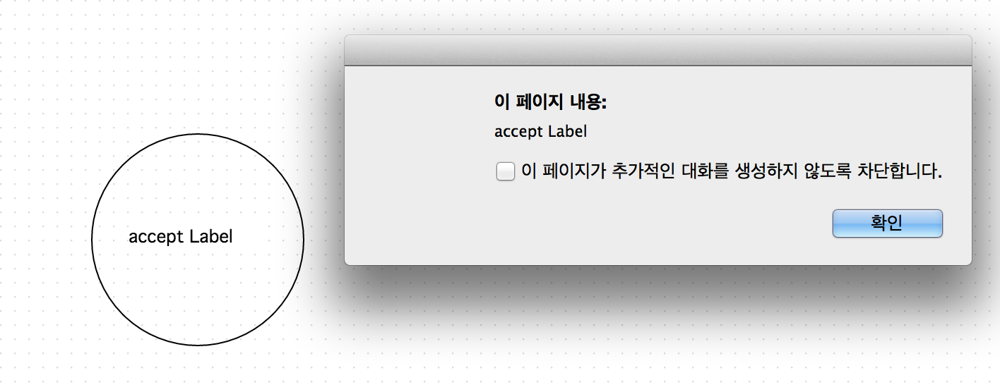
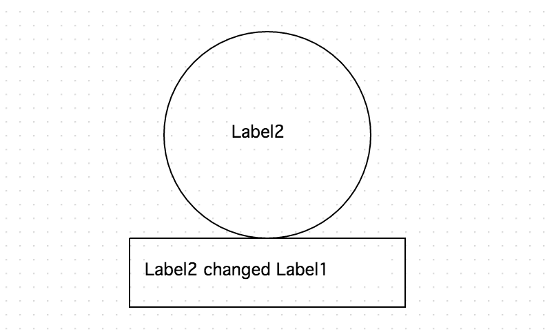
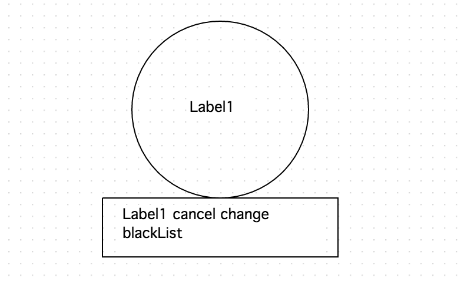
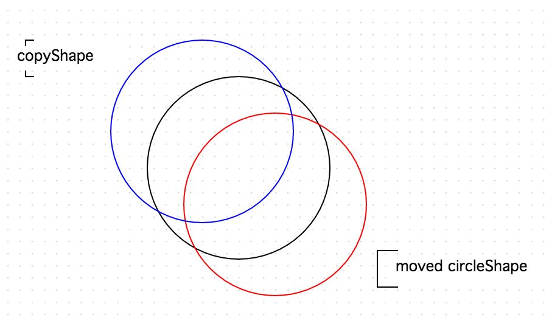

Event
=====

 - [onDrawShape && onRedrawShape](#ondrawshape-&&-onredrawshape)
 - [onUndo && onRedo](#onundo-&&-onredo)
 - [onDivideLane](#ondividelane)
 - [onDrawLabel](#ondrawlabel)
 - [onLabelChanged](#onlabelchanged)
 - [onBeforeLabelChange](#onbeforelabelchange)
 - [onRemoveShape && onBeforeRemoveShape](#onremoveshape-&&-onbeforeremoveshape)
 - [onRotateShape](#onrotateshape)
 - [onMoveShape](#onmoveshape)
 - [onResizeShape](#onresizeshape)
 - [onBeforeConnectShape](#onbeforeconnectshape)
 - [onConnectShape](#onconnectshape)
 - [onDisconnectShape](#ondisconnectshape)
 - [onGroup](#ongroup)
 - [onUnGroup](#onungroup)
 
 
오픈그래프의 캔버스가 제공하는 이벤트에 대해 알아보도록 합니다.

## onDrawShape && onRedrawShape

onDrawShape && onRedrawShape 는 도형이 캔버스에 draw 되었을때의 이벤트 리스너입니다.

onDrawShape 는 canvas.drawShape 를 통해 draw 되었을 때의 리스너이며, 
onRedrawShape 는 move 혹은 resize, 또는 그룹 도형 이동시 내부 도형의 이동 등 기존의 그려진 도형이 사용자에 의해 다시 draw 되었을 경우 리스너입니다.

```
/**
* Shape 이 처음 Draw 되었을 때의 이벤트 리스너
*
* @param {Function} callbackFunc 콜백함수(event, shapeElement)
*/
canvas.onDrawShape(function(event,element){
   console.log('onDrawShape', element);
});

/**
* Shape 이 Redraw 되었을 때의 이벤트 리스너
*
* @param {Function} callbackFunc 콜백함수(event, shapeElement)
*/
canvas.onRedrawShape(function(event,element){
    console.log('onRedrawShape', element);
});

//onDrawShape 리스너가 실행됨.
var element = canvas.drawShape([100, 100], new OG.CircleShape(), [50, 50], null, 'CircleShape1');

//onRedrawShape 리스너가 실행됨.
canvas.move(element,[-30,0]);

//onRedrawShape 리스너가 실행됨.
canvas.resize(element,[5,5,5,5]);
```

## onUndo && onRedo

캔버스가 undo 또는 redo 되었을땨의 리스너 입니다.

```
/**
* Undo 되었을때의 이벤트 리스너
*
* @param {Function} callbackFunc 콜백함수(event)
*/
canvas.onUndo(function(event){
    console.log('onUndo');
});

/**
* Redo 되었을때의 이벤트 리스너
*
* @param {Function} callbackFunc 콜백함수(event)
*/
canvas.onRedo(function(event){
    console.log('onRedo');
});
```

## onDivideLane

오픈그래프에는 Lane 도형이 기본으로 제공되는데, 이 Lane 도형은 분기를 할 수 있는 ui 인터페이스를 제공합니다.

사용자가 gui 상에서 분기 실행을 하였을 경우 일어나는 이벤트 입니다.

분기하여 새로 생성된 Lane 도형마다 이벤트를 발생시킵니다.

```
canvas.onDivideLane(function (event, dividedLane) {
    canvas.drawLabel(dividedLane, 'd');
    canvas.setShapeStyle(dividedLane, {stroke: 'red'});
});

var laneElement = canvas.drawShape([200, 200], new OG.HorizontalLaneShape(), [200, 200]);
```

- 분기 되기 전



- 분기 된 후, 이벤트에 의해 stroke 바 바뀌었다.


  
## onDrawLabel

라벨이 Draw 되었을 때의 이벤트 리스너 입니다.

```
canvas.onDrawLabel(function (event, shapeElement, labelText) {
    console.log(shapeElement,labelText);
    setTimeout(function(){
        alert(labelText);
    },1000);
});

var circleShape = canvas.drawShape([200, 200], new OG.CircleShape(), [150, 150]);
canvas.drawLabel(circleShape,'accept Label');
```



## onLabelChanged

사용자가 UI 상에서 라벨을 바꾸거나, 한번 그려진 라벨을 프로그램적으로 redraw 할 때의 이벤트 리스너입니다.

```
/**
* 라벨이 Change 되었을 때의 이벤트 리스너
*
* @param {Function} callbackFunc 콜백함수(event, shapeElement, afterText, beforeText)
*/
canvas.onLabelChanged(function(event, shapeElement, afterText, beforeText){
    console.log(shapeElement, afterText, beforeText);
    canvas.drawShape([200, 300], new OG.RectangleShape(beforeText + ' changed ' + afterText), [200, 50]);
});


var circleShape = canvas.drawShape([200, 200], new OG.CircleShape(), [150, 150]);

canvas.drawLabel(circleShape,'Label1');

canvas.drawLabel(circleShape,'Label2');
```



## onBeforeLabelChange

사용자가 UI 상에서 라벨을 바꾸거나, 한번 그려진 라벨을 프로그램적으로 redraw 할 때 라벨을 변경하기 전 발생되는 리스너 입니다.

이 리스너에서 return 을 false 로 주게 되면 라벨이 변경되지 않습니다.

```
canvas.onBeforeLabelChange(function(event, shapeElement, afterText, beforeText){
    if(afterText == 'blackList'){
        console.log(shapeElement, afterText, beforeText);
        canvas.drawShape([200, 300], new OG.RectangleShape(beforeText + ' cancel change ' + afterText), [200, 50]);
        return false;
    }
});

var circleShape = canvas.drawShape([200, 200], new OG.CircleShape(), [150, 150]);
canvas.drawLabel(circleShape,'Label1');
canvas.drawLabel(circleShape,'blackList');

```



## onRemoveShape && onBeforeRemoveShape

사용자가 UI 상에서 도형을 삭제하거나, 프로그램적으로 삭제할 경우 onRemoveShape 리스너가 호출됩니다.

삭제하기 전 발생되는 리스너는 onBeforeRemoveShape 입니다. 리턴 값을 false 로 줄 경우 삭제되지 않습니다.

```
/**
* Shape 이 Remove 될 때의 이벤트 리스너
*
* @param {Function} callbackFunc 콜백함수(event, shapeElement)
*/
canvas.onRemoveShape(function(event, shapeElement){
    
});

canvas.onBeforeRemoveShape(function(event, shapeElement){
    
});
```

## onRotateShape

도형이 Rotate 되었을 경우 이벤트 리스너 입니다.

```
/**
* Shape 이 Rotate 될 때의 이벤트 리스너
*
* @param {Function} callbackFunc 콜백함수(event, element, angle)
*/
canvas.onRotateShape(function(event, element, angle){
    
});
```

## onMoveShape

도형이 이동되었을 경우 이벤트 리스너 입니다.

다음은 리스너를 통해 이동되었던 도형을 이동되었던 x,y 값 만큼 역으로 이동시킨 도형을 새로 그리는 예제입니다.

```
/**
* Shape 이 Move 되었을 때의 이벤트 리스너
*
* @param {Function} callbackFunc 콜백함수(event, shapeElement, offset)
*/
var originalShape = canvas.drawShape([200, 200], new OG.CircleShape(), [150, 150]);

canvas.onMoveShape(function(event, shapeElement, offset){
    var boundary = canvas.getBoundary(shapeElement);
    var copyShape = canvas.drawShape(
            [boundary.getCentroid().x - (offset[0] * 2), boundary.getCentroid().y - (offset[1] * 2)],
            new OG.CircleShape(),
            [150, 150]);
    canvas.setShapeStyle(copyShape, {stroke: 'blue'});
});
var circleShape = canvas.drawShape([200, 200], new OG.CircleShape(), [150, 150]);
canvas.move(circleShape,[30,30]);
canvas.setShapeStyle(circleShape, {stroke: 'red'});
```



## onResizeShape

도형이 리사이즈 되었을 경우의 이벤트 리스너 입니다.

콜백 값의 offset 은 상, 하, 좌, 우 각 방향으로 이동된 + 값을 리턴합니다.

```
/**
* Shape 이 Resize 되었을 때의 이벤트 리스너
*
* @param {Function} callbackFunc 콜백함수(event, shapeElement, offset)
*/
canvas.onResizeShape(function (event, shapeElement, offset) {
    
});
```

## onBeforeConnectShape

도형이 연결되기 전 리스너이며, false 리턴을 주게 되면 연결이 취소됩니다.

```
/**
* Shape 이 Connect 되기전 이벤트 리스너
*
* @param {Function} callbackFunc 콜백함수(event, edgeElement, fromElement, toElement)
*/
canvas.onBeforeConnectShape(function(event, edgeElement, fromElement, toElement){

});
```

## onConnectShape

```
/**
* Shape 이 Connect 되었을 때의 이벤트 리스너
*
* @param {Function} callbackFunc 콜백함수(event, edgeElement, fromElement, toElement)
*/
canvas.onConnectShape(function(event, edgeElement, fromElement, toElement){

});
```

## onDisconnectShape

```
/**
* Shape 이 Disconnect 되었을 때의 이벤트 리스너
*
* @param {Function} callbackFunc 콜백함수(event, edgeElement, fromElement, toElement)
*/
canvas.onDisconnectShape(function(event, edgeElement, fromElement, toElement){
    
});
```

## onGroup

```
/**
* Shape 이 Grouping 되었을 때의 이벤트 리스너
*
* @param {Function} callbackFunc 콜백함수(event, groupElement)
*/
canvas.onGroup(function(event, groupElement){
    
});
```

## onUnGroup

```
/**
* Shape 이 UnGrouping 되었을 때의 이벤트 리스너
*
* @param {Function} callbackFunc 콜백함수(event, ungroupedElements)
*/
canvas.onUnGroup(function(event, ungroupedElements){
    
});
```

