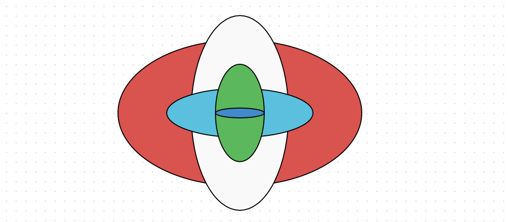
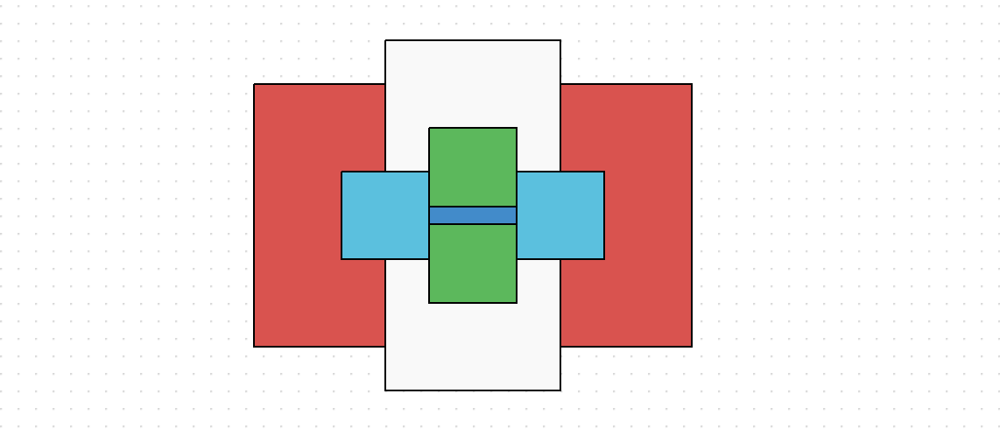
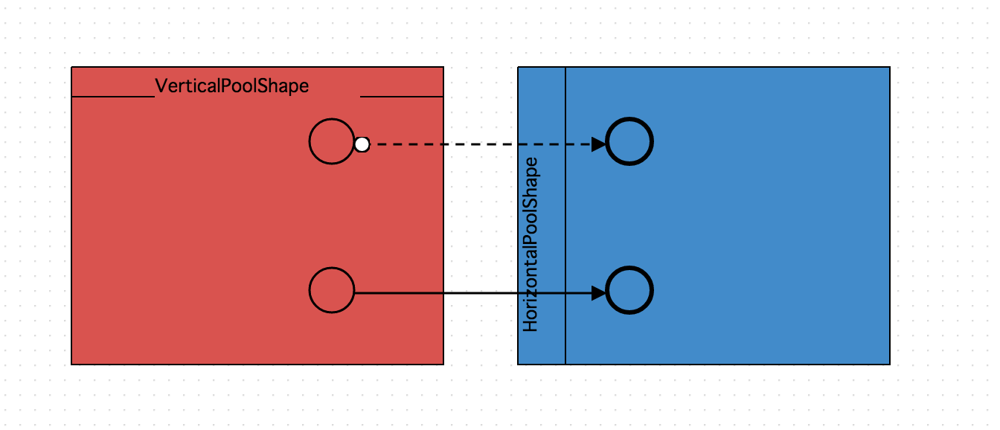
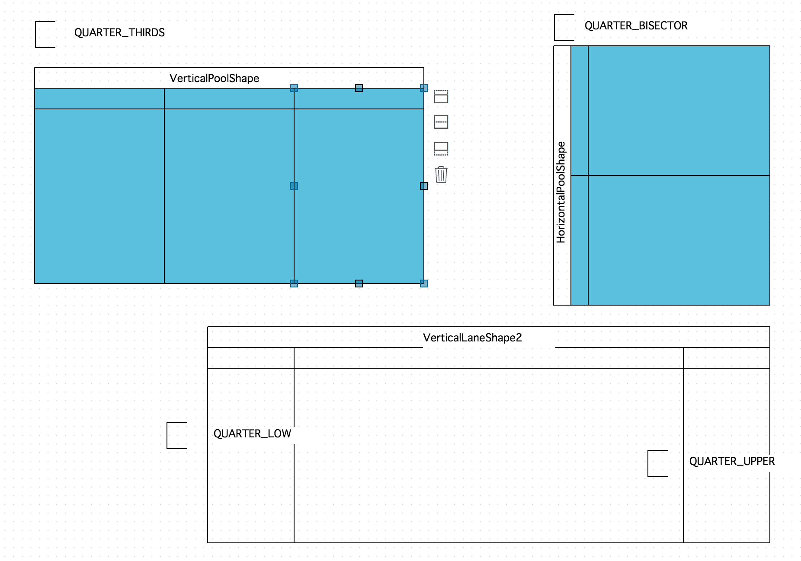
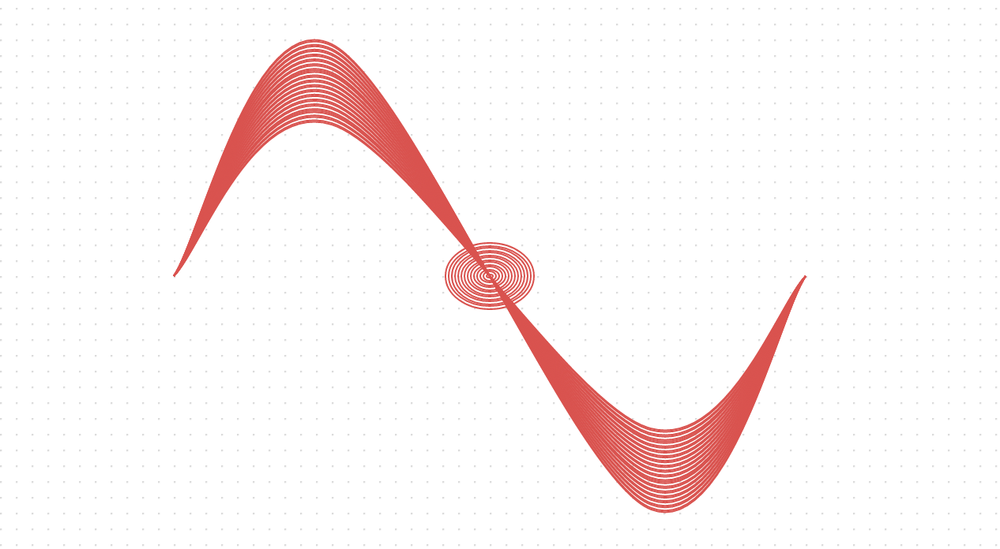
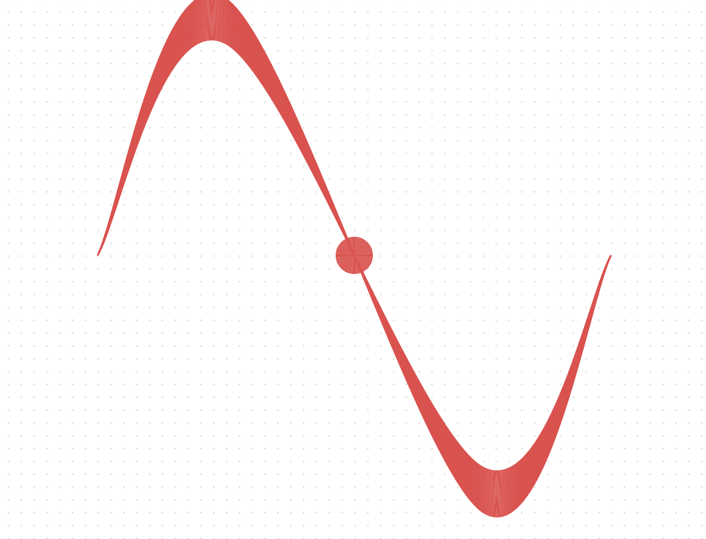
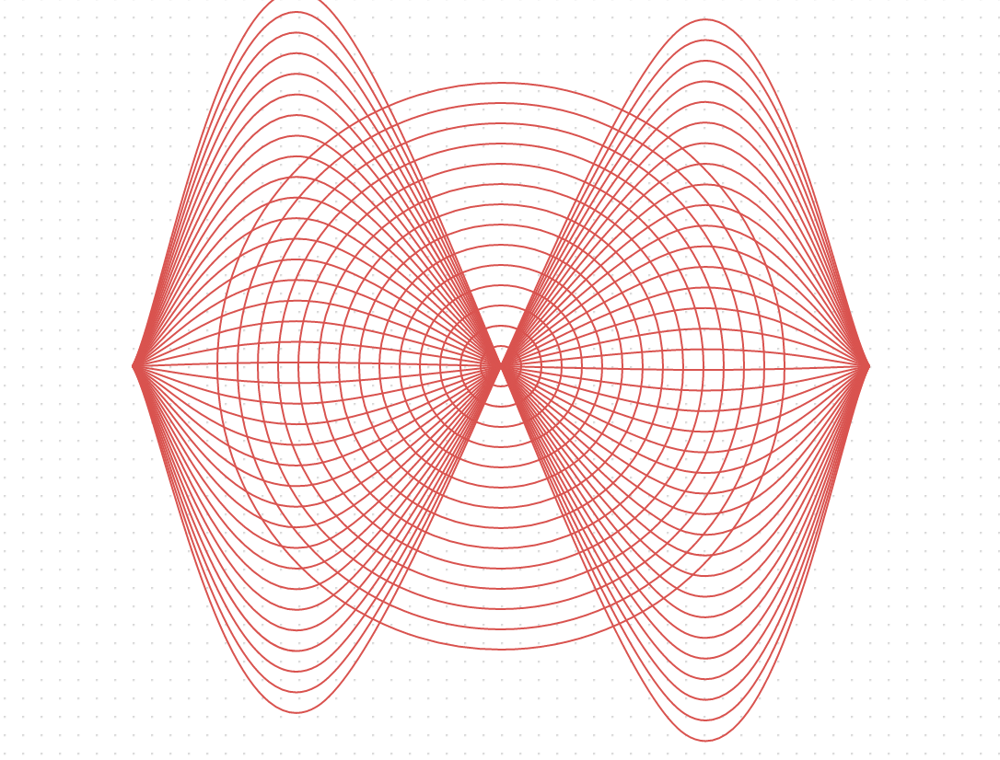

Extend Shape
============

 - [CircleShape](#circleshape)
 - [EllipseShape](#ellipseshape)
 - [RectangleShape](#rectangleshape)
 - [PoolShape](#poolshape)
 - [LaneShape](#laneshape)
 - [Define Custom Shape](#define-custom-shape)

[Shape](shapes.md) 섹션에서 기본적인 다음의 기본적인 Shape 클래스들을 살펴보았습니다.

 - [GeomShape](shapes.md#geomshape)
 - [EdgeShape](shapes.md#edgeshape)
 - [GroupShape](shapes.md#groupshape)
 - [ImageShape](shapes.md#imageshape)
 - [TextShape](shapes.md#textshape)
 
다음 살펴볼 Shape 들은 위의 기본 Shape 클래스들을 상속받는 도형들입니다.
 
## CircleShape

OG.shape.CircleShape 는 원형 도형입니다.

OG.shape.GeomShape 를 상속받습니다.

```
/**
 * Circle Shape
 *
 * @class
 * @extends OG.shape.GeomShape
 * @requires OG.common.*
 * @requires OG.geometry.*
 *
 * @param {String} label 라벨 [Optional]
 * @author <a href="mailto:sppark@uengine.org">Seungpil Park</a>
 */
 
Example)
canvas.drawShape([300, 300], new OG.CircleShape(), [250, 250], {'fill': '#d9534f', 'fill-opacity': 1});
canvas.drawShape([300, 300], new OG.CircleShape(), [200, 200], {'fill': '#f9f9f9', 'fill-opacity': 1});
canvas.drawShape([300, 300], new OG.CircleShape(), [150, 150], {'fill': '#5bc0de', 'fill-opacity': 1});
canvas.drawShape([300, 300], new OG.CircleShape(), [100, 100], {'fill': '#5cb85c', 'fill-opacity': 1});
canvas.drawShape([300, 300], new OG.CircleShape(), [50, 50], {'fill': '#428bca', 'fill-opacity': 1});
```


## EllipseShape

OG.shape.EllipseShape 는 타원형 도형입니다.

OG.shape.GeomShape 를 상속받습니다.

```
/**
 * Ellipse Shape
 *
 * @class
 * @extends OG.shape.GeomShape
 * @requires OG.common.*
 * @requires OG.geometry.*
 *
 * @param {String} label 라벨 [Optional]
 * @author <a href="mailto:sppark@uengine.org">Seungpil Park</a>
 */

Example)
canvas.drawShape([300, 300], new OG.EllipseShape(), [250, 150], {'fill': '#d9534f', 'fill-opacity': 1});
canvas.drawShape([300, 300], new OG.EllipseShape(), [100, 200], {'fill': '#f9f9f9', 'fill-opacity': 1});
canvas.drawShape([300, 300], new OG.EllipseShape(), [150, 50], {'fill': '#5bc0de', 'fill-opacity': 1});
canvas.drawShape([300, 300], new OG.EllipseShape(), [50, 100], {'fill': '#5cb85c', 'fill-opacity': 1});
canvas.drawShape([300, 300], new OG.EllipseShape(), [50, 10], {'fill': '#428bca', 'fill-opacity': 1});
```



## RectangleShape

OG.shape.EllipseShape 는 직사각형 도형입니다.

OG.shape.GeomShape 를 상속받습니다.

```
/**
 * Rectangle Shape
 *
 * @class
 * @extends OG.shape.GeomShape
 * @requires OG.common.*
 * @requires OG.geometry.*
 *
 * @param {String} label 라벨 [Optional]
 * @author <a href="mailto:sppark@uengine.org">Seungpil Park</a>
 */
 
Example)
canvas.drawShape([300, 300], new OG.RectangleShape(), [250, 150], {'fill': '#d9534f', 'fill-opacity': 1});
canvas.drawShape([300, 300], new OG.RectangleShape(), [100, 200], {'fill': '#f9f9f9', 'fill-opacity': 1});
canvas.drawShape([300, 300], new OG.RectangleShape(), [150, 50], {'fill': '#5bc0de', 'fill-opacity': 1});
canvas.drawShape([300, 300], new OG.RectangleShape(), [50, 100], {'fill': '#5cb85c', 'fill-opacity': 1});
canvas.drawShape([300, 300], new OG.RectangleShape(), [50, 10], {'fill': '#428bca', 'fill-opacity': 1});
```



## PoolShape

PoolShape 는 OG.shape.GroupShape 를 상속받으며 Label 이 도형의 상단라인에 위치하는 특성이 있습니다. 

PoolShape 의 종류는 OG.shape.VerticalPoolShape 와 OG.shape.HorizontalPoolShape 이 있습니다.

PoolShape 의 자식으로 그려진 도형은, PoolShape 외부에 그려진 도형과 선연결이 될 경우 연결 스타일이 바뀌게 되는 속성이 있는데, 이는 BPM 의 일반적 표현입니다.

이를 방지 하기 위해서는 canvas 의 CONNECT_STYLE_CHANGE 컨피그를 false 로 주시면 됩니다.

```
var verticalPool = canvas.drawShape([200, 200], new OG.VerticalPoolShape('VerticalPoolShape'), [250, 200], {
    'fill': '#d9534f',
    'fill-opacity': 1
});
var horizontalPool = canvas.drawShape([500, 200], new OG.HorizontalPoolShape('HorizontalPoolShape'), [250, 200], {
    'fill': '#428bca',
    'fill-opacity': 1
});

//verticalPool 안에 도형을 그린다.
var startShape1 = canvas.drawShape([250, 150], new OG.E_Start(), [30, 30]);
canvas.appendChild(startShape1, verticalPool);

//horizontalPool 안에 도형을 그린다.
var endShape1 = canvas.drawShape([450, 150], new OG.E_End(), [30, 30]);
canvas.appendChild(endShape1, horizontalPool);

//startShape1 과 endShape1 를 연결한다.(Group 간의 선 연결)
canvas.connect(startShape1, endShape1);

//Group 간의 연결시 선 스타일의 변경 여부를 false 로 줄 경우
canvas._CONFIG.CONNECT_STYLE_CHANGE = false;
var startShap2 = canvas.drawShape([250, 250], new OG.E_Start(), [30, 30]);
canvas.appendChild(startShap2, verticalPool);

var endShape2 = canvas.drawShape([450, 250], new OG.E_End(), [30, 30]);
canvas.appendChild(endShape2, horizontalPool);
canvas.connect(startShap2, endShape2);
```



## LaneShape

LaneShape 는 PoolShape 와 마찬가지로 OG.shape.GroupShape 를 상속받으며 Label 이 도형의 상단라인에 위치하는 특성이 있고, UI 상에서 도형에 대한 분기를 실행할 수 있습니다.

LaneShape 의 종류는 OG.shape.VerticalLaneShape 와 OG.shape.HorizontalLaneShape 이 있습니다.

PoolShape 와 마찬가지로 내부의 도형이 외부의 도형과 연결될 경우 선연결의 변화를 방지하려면 CONNECT_STYLE_CHANGE 컨피그를 false 로 주시면 됩니다.

UI 이외에 프로그램 적으로 LaneShape 를 분기할 때는, canvas.getRenderer().divideLane(LaneShape Dom element, 분기명령) 으로 실행합니다.


| 분기 명령        | 방향                                                                  |
|------------------|-----------------------------------------------------------------------|
| QUARTER_UPPER    | VerticalLane 인 경우 좌측 방향, Horizontal 인 경우 상단 방향으로 확장 |
| QUARTER_LOW      | VerticalLane 인 경우 우측 방향, Horizontal 인 경우 하단 방향으로 확장 |
| QUARTER_BISECTOR | 내부적으로 2분기                                                      |
| QUARTER_THIRDS   | 내부적으로 3분기                                                      |


```
var verticalLane = canvas.drawShape([300, 300], new OG.VerticalLaneShape('VerticalLaneShape'), [450, 250]);
var divideLanes = canvas.getRenderer().divideLane(verticalLane, 'QUARTER_THIRDS');
for(var i = 0 ; i <divideLanes.length; i++){
    canvas.setShapeStyle(divideLanes[i],{'fill':'#5bc0de', 'fill-opacity':1});
}

var horizontalLane = canvas.drawShape([800, 300], new OG.HorizontalLaneShape('HorizontalLaneShape'), [250, 300]);
divideLanes = canvas.getRenderer().divideLane(horizontalLane,'QUARTER_BISECTOR');
for(var i = 0 ; i <divideLanes.length; i++){
    canvas.setShapeStyle(divideLanes[i],{'fill':'#5bc0de', 'fill-opacity':1});
}

var verticalLane2 = canvas.drawShape([600, 600], new OG.VerticalLaneShape('VerticalLaneShape2'), [450, 250]);
canvas.getRenderer().divideLane(verticalLane2,'QUARTER_LOW');
canvas.getRenderer().divideLane(verticalLane2,'QUARTER_UPPER');
```



## Define Custom Shape

OG.shape 네임스페이스에 새로운 사용자 지정 Shape 를 등록하여 사용하는 방법을 알아보겠습니다.

구현을 위해 [GeometryCollection](geometry.md#geometrycollection) 의 예제를 재사용하도록 하겠습니다.

```
var shape = new OG.GeomShape();
shape.SHAPE_ID = 'OG.shape.CustomCollection';
shape.createShape = function () {
.
.
```

예제에서는 GeomShape 클래스를 하나 생성하고, OG.shape.CustomCollection 아이디를 부여한 후, createShape 메소드를 오버라이딩 하여 사용했습니다.

이번 파트에서 진행할 내용은 오픈그래프 네임스페이스에 OG.shape.CustomCollection 를 등록하고, 필요할 경우 이 Shape 을 재사용할 수 있도록 하는 예제입니다.

Html 페이지가 시작할 떄, 오픈그래프 라이브러리를 읽어들인 후, 다음의 스크립트를 실행하도록 하십시오.

```
<!DOCTYPE html PUBLIC "-//W3C//DTD XHTML 1.0 Transitional//EN"
        "http://www.w3.org/TR/xhtml1/DTD/xhtml1-transitional.dtd">
<html xmlns="http://www.w3.org/1999/xhtml" xml:lang="ko" lang="ko">
<head>
    <title>BPMN Modeler Example</title>
    <meta http-equiv="Content-Type" content="text/html; charset=UTF-8"/>
    <meta http-equiv="X-UA-Compatible" content="IE=EmulateIE8">


    <!-- jquery -->
    <script type="text/javascript" src="./lib/jquery-1.11.1/jquery-1.11.1.min.js"></script>

    <!-- jquery ui -->
    <script type="text/javascript" src="./lib/jquery-ui-1.11.0.custom/jquery-ui.min.js"></script>
    <link rel="stylesheet" type="text/css" href="./lib/jquery-ui-1.11.0.custom/jquery-ui.css"/>

    <!-- jquery Context Menu -->
    <link rel="stylesheet" type="text/css" href="./lib/contextmenu/jquery.contextMenu.css"/>
    <script type="text/javascript" src="./lib/contextmenu/jquery.contextMenu-min.js"></script>

    <!-- Opengraph -->
    <script type="text/javascript" src="./lib/opengraph/OpenGraph-0.1.1-SNAPSHOT.js"></script>

    <script type="text/javascript">
        $(document).ready(function () {
            OG.shape.CustomCollection = function (label) {
                OG.shape.CustomCollection.superclass.call(this);

                this.SHAPE_ID = 'OG.shape.CustomCollection';
                this.label = label;
            };
            OG.shape.CustomCollection.prototype = new OG.shape.GeomShape();
            OG.shape.CustomCollection.superclass = OG.shape.GeomShape;
            OG.shape.CustomCollection.prototype.constructor = OG.shape.CustomCollection;
            OG.CustomCollection = OG.shape.CustomCollection;

        });

    </script>
</head>
<body>

<div id="canvas" style="cursor: default;"></div>

</body>
</html>
```

위의 코드에서는 OG.shape.GeomShape() 클래스를 상속받은 OG.shape.CustomCollection 클래스를 생성하였고, SHAPE_ID 로 'OG.shape.CustomCollection' 를 지정하였습니다.

이제 이 클래스가 도형을 어떻게 그릴 것인가 정의하는 createShape 메소드를 생성할 차례입니다.

```
$(document).ready(function () {
    OG.shape.CustomCollection = function (label) {
        OG.shape.CustomCollection.superclass.call(this);

        this.SHAPE_ID = 'OG.shape.CustomCollection';
        this.label = label;
    };
    OG.shape.CustomCollection.prototype = new OG.shape.GeomShape();
    OG.shape.CustomCollection.superclass = OG.shape.GeomShape;
    OG.shape.CustomCollection.prototype.constructor = OG.shape.CustomCollection;
    OG.CustomCollection = OG.shape.CustomCollection;

    OG.shape.CustomCollection.prototype.createShape = function () {
        if (this.geom) {
            return this.geom;
        }

        var geomCollection = [];
        if (this.geom) {
            return this.geom;
        }

        for (var i = 0; i < 36; i++) {
            var geom = new OG.geometry.Curve([[500, 200], [400, 400 - i * 2], [200, 0 + i * 2], [100, 200]]);
            geomCollection.push(geom);
        }
        for (var i = 0; i < 15; i++) {
            geomCollection.push(new OG.geometry.Circle([300, 200], i * 2));
        }

        this.geom = new OG.geometry.GeometryCollection(geomCollection);

        this.geom.style = new OG.geometry.Style({
            'cursor': 'default',
            'stroke': '#d9534f',
            'stroke-width': '1',
            'fill': 'none',
            'fill-opacity': 0
        });
        return this.geom;
    };
});
```

이제 오픈그래프 네임스페이스에 OG.shape.CustomCollection 도형을 그릴 준비가 완료되었습니다.

실제로 이 클래스를 사용하여 화면에 드로잉 해 보도록 합니다.

```
var canvas = new OG.Canvas('canvas', [1000, 800], 'white', 'url(resources/images/symbol/grid.gif)');

var shape = new OG.CustomCollection();
var customShape = canvas.drawShape([400, 300], shape, [400, 300]);
```



OG.shape.CustomCollection 에 특별한 메소드를 만들어보도록 합니다.

createShape 메소드 바로 아래에, animation 이라는 새로운 프로포타입 메소드를 생성하도록 합니다.

```
.
.
OG.shape.CustomCollection.prototype.animation = function(canvas, element){
    var count = 0;
    var command = 'plus';
    var interval = setInterval(function(){
        if(command == 'plus' && count > 10){
            command = 'minus';
        }else if(command == 'minus' && count < 1){
            command = 'plus';
        }
        if(command == 'plus'){
            count++;
        }else{
            count--;
        }
        var geomCollection = [];
        for (var i = 0; i < 36; i++) {
            var geom = new OG.geometry.Curve([[500, 200], [400, 400 - i * count], [200, 0 + i * count], [100, 200]]);
            geomCollection.push(geom);
        }
        for (var i = 0; i < 15; i++) {
            geomCollection.push(new OG.geometry.Circle([300, 200], i * count));
        }
        element.shape.geom = new OG.geometry.GeometryCollection(geomCollection);
        element.shape.geom.style = new OG.geometry.Style({
            'cursor': 'default',
            'stroke': '#d9534f',
            'stroke-width': '1',
            'fill': 'none',
            'fill-opacity': 0
        });

        canvas.getRenderer().redrawShape(element);
    },100);
};
```

위의 animation 메소드는, canvas 와 Dom 객체를 인자값으로 받아, 0.1 초마다 번화하는 geometry 를 캔버스 상의 Dom 객체에 적용시킬 것입니다.

animation 메소드를 실행시켜 보도록 합니다.

```
var canvas = new OG.Canvas('canvas', [1000, 800], 'white', 'url(resources/images/symbol/grid.gif)');

var shape = new OG.CustomCollection();
var customShape = canvas.drawShape([400, 300], shape, [400, 300]);
customShape.shape.animation(canvas, customShape);
```





 - 풀 소스 코드
 
```
<!DOCTYPE html PUBLIC "-//W3C//DTD XHTML 1.0 Transitional//EN"
        "http://www.w3.org/TR/xhtml1/DTD/xhtml1-transitional.dtd">
<html xmlns="http://www.w3.org/1999/xhtml" xml:lang="ko" lang="ko">
<head>
    <title>BPMN Modeler Example</title>
    <meta http-equiv="Content-Type" content="text/html; charset=UTF-8"/>
    <meta http-equiv="X-UA-Compatible" content="IE=EmulateIE8">


    <!-- jquery -->
    <script type="text/javascript" src="./lib/jquery-1.11.1/jquery-1.11.1.min.js"></script>

    <!-- jquery ui -->
    <script type="text/javascript" src="./lib/jquery-ui-1.11.0.custom/jquery-ui.min.js"></script>
    <link rel="stylesheet" type="text/css" href="./lib/jquery-ui-1.11.0.custom/jquery-ui.css"/>

    <!-- jquery Context Menu -->
    <link rel="stylesheet" type="text/css" href="./lib/contextmenu/jquery.contextMenu.css"/>
    <script type="text/javascript" src="./lib/contextmenu/jquery.contextMenu-min.js"></script>

    <!-- Opengraph -->
    <script type="text/javascript" src="./lib/opengraph/OpenGraph-0.1.1-SNAPSHOT.js"></script>

    <script type="text/javascript">
        $(document).ready(function () {
            OG.shape.CustomCollection = function (label) {
                OG.shape.CustomCollection.superclass.call(this);

                this.SHAPE_ID = 'OG.shape.CustomCollection';
                this.label = label;
            };
            OG.shape.CustomCollection.prototype = new OG.shape.GeomShape();
            OG.shape.CustomCollection.superclass = OG.shape.GeomShape;
            OG.shape.CustomCollection.prototype.constructor = OG.shape.CustomCollection;
            OG.CustomCollection = OG.shape.CustomCollection;

            OG.shape.CustomCollection.prototype.createShape = function () {
                if (this.geom) {
                    return this.geom;
                }

                var geomCollection = [];
                if (this.geom) {
                    return this.geom;
                }

                for (var i = 0; i < 36; i++) {
                    var geom = new OG.geometry.Curve([[500, 200], [400, 400 - i * 2], [200, 0 + i * 2], [100, 200]]);
                    geomCollection.push(geom);
                }
                for (var i = 0; i < 15; i++) {
                    geomCollection.push(new OG.geometry.Circle([300, 200], i * 2));
                }

                this.geom = new OG.geometry.GeometryCollection(geomCollection);

                this.geom.style = new OG.geometry.Style({
                    'cursor': 'default',
                    'stroke': '#d9534f',
                    'stroke-width': '1',
                    'fill': 'none',
                    'fill-opacity': 0
                });
                return this.geom;
            };

            OG.shape.CustomCollection.prototype.animation = function(canvas, element){
                var count = 0;
                var command = 'plus';
                var interval = setInterval(function(){
                    if(command == 'plus' && count > 10){
                        command = 'minus';
                    }else if(command == 'minus' && count < 1){
                        command = 'plus';
                    }
                    if(command == 'plus'){
                        count++;
                    }else{
                        count--;
                    }
                    var geomCollection = [];
                    for (var i = 0; i < 36; i++) {
                        var geom = new OG.geometry.Curve([[500, 200], [400, 400 - i * count], [200, 0 + i * count], [100, 200]]);
                        geomCollection.push(geom);
                    }
                    for (var i = 0; i < 15; i++) {
                        geomCollection.push(new OG.geometry.Circle([300, 200], i * count));
                    }
                    element.shape.geom = new OG.geometry.GeometryCollection(geomCollection);
                    element.shape.geom.style = new OG.geometry.Style({
                        'cursor': 'default',
                        'stroke': '#d9534f',
                        'stroke-width': '1',
                        'fill': 'none',
                        'fill-opacity': 0
                    });

                    canvas.getRenderer().redrawShape(element);
                },100);
            };

            var canvas = new OG.Canvas('canvas', [1000, 800], 'white', 'url(resources/images/symbol/grid.gif)');

            var shape = new OG.CustomCollection();
            var customShape = canvas.drawShape([400, 300], shape, [400, 300]);
            customShape.shape.animation(canvas, customShape);

        });

    </script>
</head>
<body>

<div id="canvas" style="cursor: default;"></div>

</body>
</html>
```


