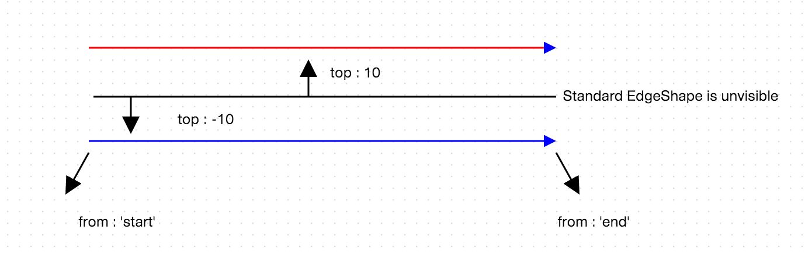
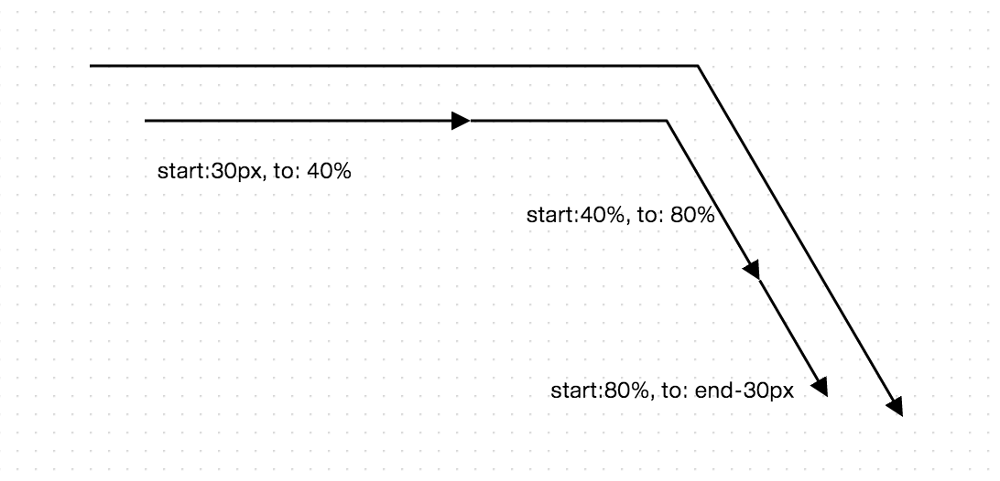
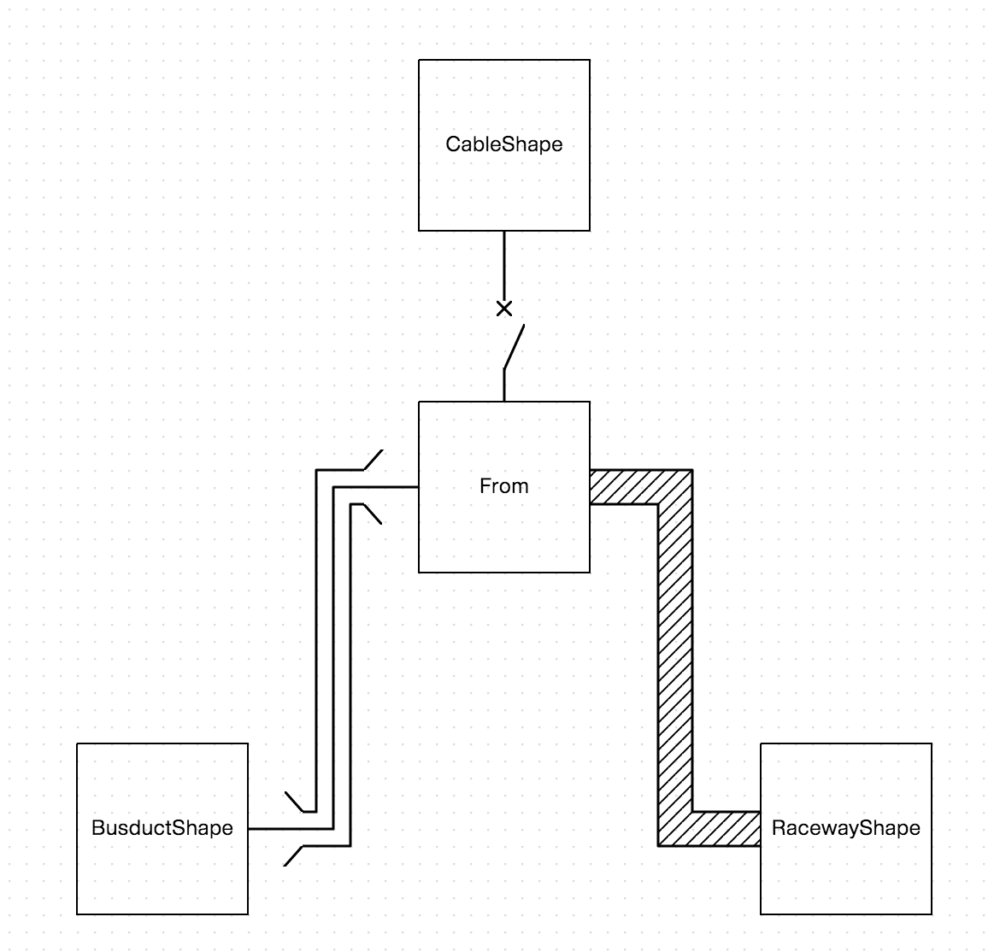

Multi Line Edge
===============

 - [Basic Multi Edge](#basic-multi-edge)
 - [Multi Edge from to](#multi-edge-from-to)
 - [Multi Edge Examples](#multi-edge-examples)

## Basic Multi Edge

오픈그래프의 EdgeShape 를 드로잉할 때, 기본적으로 하나의 선분으로 표현됩니다.

도형 "multi" 스타일 어트리뷰트를 통해 다수의 선분으로 이루어진 연결선 표현이 가능한데, 각각의 선분마다 개별적인 스타일 및 마커를 적용할 수 있습니다.

또한, "multi" 스타일 어트리뷰트가 붙은 선분은 스스로는 보이지 않게 되고, multi 안에 표현된 선분만 드로잉됩니다.

"multi" 스타일 어트리뷰트는 몇가지 프로퍼티와 함께 json 형식으로 표현하도록 합니다.

| 프로퍼티 | 설명             | 설명                      | 비고 |
|----------|------------------|---------------------------|------|
| top      | number           | 기준선으로부터의 거리     |      |
| from     | number or string | 기준선 대비 선분의 시작점 | 10,'10','10px','10%','start','center','end','end-10'     |
| to       | number or string | 기준선 대비 선분의 종료점 | 10,'10','10px','10%','start','center','end','end-10'     |
| style    | Object           | 선분의 스타일             |      |												   |


위의 표를 참조하여 두 줄로 이루어진 EdgeShape 를 생성해보도록 합니다.
  
```
var edge1 = canvas.drawShape(null, new OG.EdgeShape([100, 100], [500, 100]), null);

canvas.setShapeStyle(edge1, {
	multi: [
		{
			'top': 10,
			'from': 'start',
			'to': 'end',
			'style': {
				'arrow-end': 'block',
				'stroke': 'red'
			}
		},
		{
			'top': -10,
			'from': 'start',
			'to': 'end',
			'style': {
				'arrow-end': 'block',
				'stroke': 'blue'
			}
		}
	]
});
```



## Multi Edge from to

from 과 to 프로퍼티는 선분이 가진 Path 로부터 시작점, 종료점을 의미합니다.

표현방식은 px, number, percentage, end-number 방식으로 가능합니다.

| 표현식 | 설명                        |
|--------|-----------------------------|
| 10     | 시작점으로부터 10px         |
| 10     | 시작점으로부터 10px         |
| 10px   | 시작점으로부터 10px         |
| 10%    | 시작점으로부터 10퍼센테이지 |
| start  | 시작점                      |
| center | 중앙점                      |
| end    | 끝점                        |
| end-10 | 끝점으로부터 10px           |

위의 표현식으로 아래의 샘플 코드를 구현해보도록 합니다.

```
var edge1 = canvas.drawShape(null, new OG.EdgeShape([100, 100], [500, 100]), null);

canvas.setShapeStyle(edge1, {
	multi: [
		{
			'top': 0,
			'from': 'start',
			'to': 'end',
			'style': {
				'arrow-end': 'block'
			}
		},
		{
			'top': -30,
			'from': '30px',
			'to': '40%',
			'style': {
				'arrow-end': 'block'
			}
		},
		{
			'top': -30,
			'from': '40%',
			'to': '80%',
			'style': {
				'arrow-end': 'block'
			}
		},
		{
			'top': -30,
			'from': '80%',
			'to': 'end-30px',
			'style': {
				'arrow-end': 'block'
			}
		}
	]
});
```



## Multi Edge Examples

EdgeShape 를 상속받는 선 도형 클래스를 만들고, 도형간의 연결에 활용해보도록 하겠습니다.


```
/**
 * ELECTRONIC : CableShape
 *
 * @class
 * @extends OG.shape.CableShape
 * @requires OG.common.*
 * @requires OG.geometry.*
 *
 * @param {Number[]} from 와이어 시작 좌표
 * @param {Number[]} to 와이어 끝 좌표
 * @param {String} label 라벨 [Optional]
 * @author <a href="mailto:sppark@uengine.org">Seungpil Park</a>
 * @private
 */
OG.shape.elec.CableShape = function (from, to, label) {
    OG.shape.elec.CableShape.superclass.call(this, from, to, label);

    this.SHAPE_ID = 'OG.shape.elec.CableShape';
};
OG.shape.elec.CableShape.prototype = new OG.shape.EdgeShape();
OG.shape.elec.CableShape.superclass = OG.shape.EdgeShape;
OG.shape.elec.CableShape.prototype.constructor = OG.shape.elec.CableShape;
OG.CableShape = OG.shape.elec.CableShape;

/**
 * 드로잉할 Shape 을 생성하여 반환한다.
 *
 * @return {OG.geometry.Geometry} Shape 정보
 * @override
 */
OG.shape.elec.CableShape.prototype.createShape = function () {
    if (this.geom) {
        return this.geom;
    }

    this.geom = new OG.Line(this.from || [0, 0], this.to || [70, 0]);
    this.geom.style = new OG.geometry.Style({
        'multi': [
            {
                top: 0,
                from: 'start',
                to: 'center',
                style: {
                    'marker': {
                        'end': {
                            'id': 'OG.marker.SwitchLMarker',
                            'size': [20, 8],
                            'ref': [3, 0]
                        }
                    }
                }
            },
            {
                top: 0,
                from: 'center',
                to: 'end',
                style: {
                    'marker': {
                        'start': {
                            'id': 'OG.marker.SwitchXMarker',
                            'size': [6, 6]
                        }
                    }
                }
            }
        ]
    });
    return this.geom;
};


/**
 * ELECTRONIC : Busduct Shape
 *
 * @class
 * @extends OG.shape.BusductShape
 * @requires OG.common.*
 * @requires OG.geometry.*
 *
 * @param {Number[]} from 와이어 시작 좌표
 * @param {Number[]} to 와이어 끝 좌표
 * @param {String} label 라벨 [Optional]
 * @author <a href="mailto:sppark@uengine.org">Seungpil Park</a>
 * @private
 */
OG.shape.elec.BusductShape = function (from, to, label) {
    OG.shape.elec.BusductShape.superclass.call(this, from, to, label);

    this.SHAPE_ID = 'OG.shape.elec.BusductShape';
};
OG.shape.elec.BusductShape.prototype = new OG.shape.EdgeShape();
OG.shape.elec.BusductShape.superclass = OG.shape.EdgeShape;
OG.shape.elec.BusductShape.prototype.constructor = OG.shape.elec.BusductShape;
OG.BusductShape = OG.shape.elec.BusductShape;

/**
 * 드로잉할 Shape 을 생성하여 반환한다.
 *
 * @return {OG.geometry.Geometry} Shape 정보
 * @override
 */
OG.shape.elec.BusductShape.prototype.createShape = function () {
    if (this.geom) {
        return this.geom;
    }

    this.geom = new OG.Line(this.from || [0, 0], this.to || [70, 0]);
    this.geom.style = new OG.geometry.Style({
        'multi': [
            {
                top: -10,
                from: '20px',
                to: 'end-20px',
                style: {
                    'marker': {
                        'start': {
                            'id': 'OG.marker.SwitchRMarker',
                            'size': [8, 8],
                            'ref': [8, 0]
                        },
                        'end': {
                            'id': 'OG.marker.SwitchLMarker',
                            'size': [8, 8],
                            'ref': [1, 0]
                        }
                    }
                }
            },
            {
                top: 10,
                from: '20px',
                to: 'end-20px',
                style: {
                    'marker': {
                        'start': {
                            'id': 'OG.marker.SwitchLMarker',
                            'size': [8, 8],
                            'ref': [7, 8]
                        },
                        'end': {
                            'id': 'OG.marker.SwitchRMarker',
                            'size': [8, 8],
                            'ref': [0, 8]
                        }
                    }
                }
            },
            {
                top: 0,
                from: 'start',
                to: 'end',
                style: {}
            }
        ]
    });
    return this.geom;
};

/**
 * ELECTRONIC : Raceway Shape
 *
 * @class
 * @extends OG.shape.RacewayShape
 * @requires OG.common.*
 * @requires OG.geometry.*
 *
 * @param {Number[]} from 와이어 시작 좌표
 * @param {Number[]} to 와이어 끝 좌표
 * @param {String} label 라벨 [Optional]
 * @author <a href="mailto:sppark@uengine.org">Seungpil Park</a>
 * @private
 */
OG.shape.elec.RacewayShape = function (from, to, label) {
    OG.shape.elec.RacewayShape.superclass.call(this, from, to, label);

    this.SHAPE_ID = 'OG.shape.elec.RacewayShape';
};
OG.shape.elec.RacewayShape.prototype = new OG.shape.EdgeShape();
OG.shape.elec.RacewayShape.superclass = OG.shape.EdgeShape;
OG.shape.elec.RacewayShape.prototype.constructor = OG.shape.elec.RacewayShape;
OG.RacewayShape = OG.shape.elec.RacewayShape;

/**
 * 드로잉할 Shape 을 생성하여 반환한다.
 *
 * @return {OG.geometry.Geometry} Shape 정보
 * @override
 */
OG.shape.elec.RacewayShape.prototype.createShape = function () {
    if (this.geom) {
        return this.geom;
    }

    this.geom = new OG.Line(this.from || [0, 0], this.to || [70, 0]);
    this.geom.style = new OG.geometry.Style({
        'multi': [
            {
                top: -10,
                from: 'start',
                to: 'end',
                style: {}
            },
            {
                top: 10,
                from: 'start',
                to: 'end',
                style: {}
            },
            {
                top: 0,
                from: 'start',
                to: 'end',
                style: {
                    pattern: {
                        'id': 'OG.pattern.HatchedPattern',
                        'thickness': 10,
                        'unit-width': 12,
                        'unit-height': 12,
                        'pattern-width': 8,
                        'pattern-height': 8,
                        'style': {
                            'stroke': 'black'
                        }
                    },
                    'stroke': 'none'
                }
            }
        ]
    });
    return this.geom;
};

var rect1 = canvas.drawShape([400, 400], new OG.RectangleShape('From'), [100, 100]);
var rect2 = canvas.drawShape([400, 200], new OG.RectangleShape('CableShape'), [100, 100]);
var rect3 = canvas.drawShape([200, 600], new OG.RectangleShape('BusductShape'), [100, 100]);
var rect4 = canvas.drawShape([600, 600], new OG.RectangleShape('RacewayShape'), [100, 100]);

canvas.connect(rect1, rect2, null, null, null, null, null, null, new OG.CableShape());
canvas.connect(rect1, rect3, null, null, null, null, null, null, new OG.BusductShape());
canvas.connect(rect1, rect4, null, null, null, null, null, null, new OG.RacewayShape());
```




