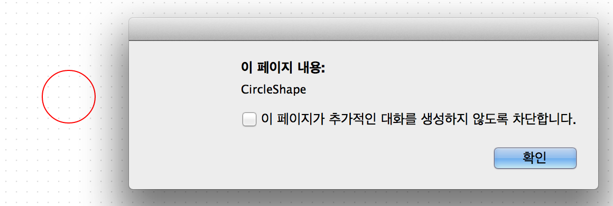
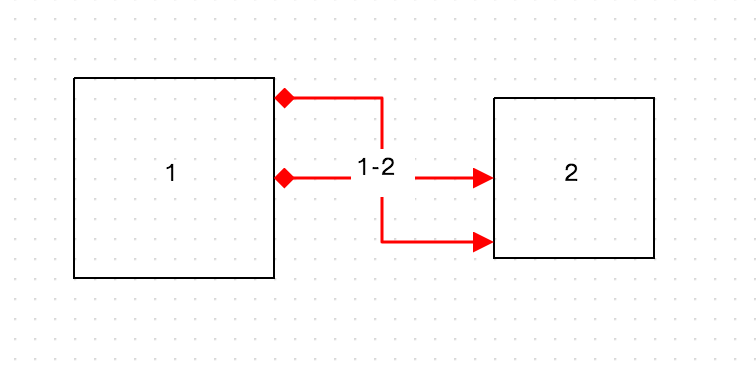
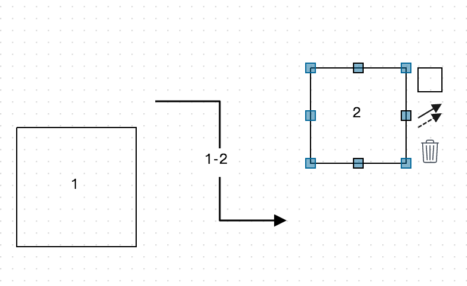
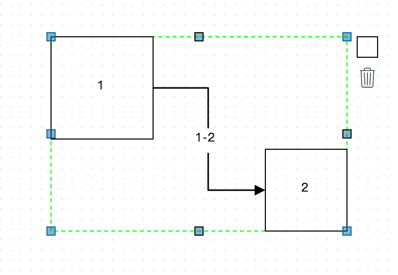
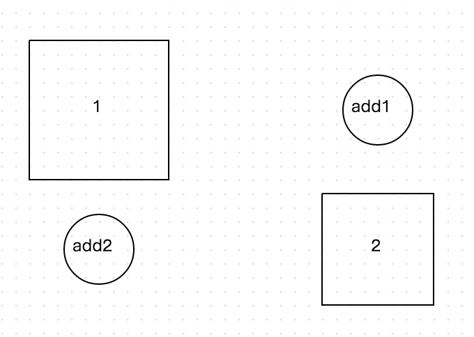
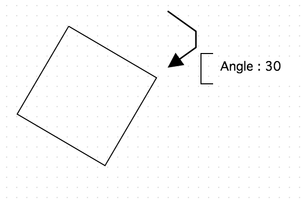

Canvas
======

오픈그래프의 캔버스 객체는 다음을 선언함으로써 얻을 수 있습니다.

```
var canvas = new OG.Canvas('canvas', [1000, 800], 'white', 'url(resources/images/symbol/grid.gif)');
```

## Configuration

오픈그래프 캔버스의 Configuration 을 알아보겠습니다.

```
* - selectable         : 클릭선택 가능여부(디폴트 true)
* - dragSelectable     : 마우스드래그선택 가능여부(디폴트 true)
* - movable            : 이동 가능여부(디폴트 true)
* - resizable          : 리사이즈 가능여부(디폴트 true)
* - connectable        : 연결 가능여부(디폴트 true)
* - selfConnectable    : Self 연결 가능여부(디폴트 true)
* - connectCloneable   : 드래그하여 연결시 대상 없을 경우 자동으로 Shape 복사하여 연결 처리 여부(디폴트 true)
* - connectRequired    : 드래그하여 연결시 연결대상 있는 경우에만 Edge 드로잉 처리 여부(디폴트 true)
* - labelEditable      : 라벨 수정여부(디폴트 true)
* - groupDropable      : 그룹핑 가능여부(디폴트 true)
* - collapsible        : 최소화 가능여부(디폴트 true)
* - enableHotKey       : 핫키 가능여부(디폴트 true)
* - enableContextMenu  : 마우스 우클릭 메뉴 가능여부(디폴트 true)
* - autoExtensional    : 캔버스 자동 확장 기능(디폴트 true)
* - useSlider          : 확대축소 슬라이더 사용 여부(디폴트 true)
* - stickGuide         : 스틱 가이드 표시 여부(디폴트 true)
* - checkBridgeEdge    : 연결된 두 오브젝트의 소속에 따른 연결선 스타일 변화 여부(디폴트 true)
```

Configuration 설정은 canvas 를 선언한 후 initConfig 메소드로 조정할 수 있습니다.

```
canvas.initConfig({
                selectable: true,
                dragSelectable: true,
                movable: true,
                resizable: true,
                connectable: true,
                selfConnectable: true,
                connectCloneable: true,
                connectRequired: true,
                labelEditable: true,
                groupDropable: true,
                collapsible: true,
                enableHotKey: true,
                enableContextMenu: true,
                useSlider: true,
                stickGuide: true,
                checkBridgeEdge: true
            });
```

예를 들어, 도형의 이동 및 사이즈 조절이 불가능한 캔버스를 만들고싶다면, 다음과 같은 코드로 생성할 수 있습니다.

```
<!DOCTYPE html PUBLIC "-//W3C//DTD XHTML 1.0 Transitional//EN"
        "http://www.w3.org/TR/xhtml1/DTD/xhtml1-transitional.dtd">
<html xmlns="http://www.w3.org/1999/xhtml" xml:lang="ko" lang="ko">
<head>
    <title>BPMN Modeler Example</title>
    <meta http-equiv="Content-Type" content="text/html; charset=UTF-8"/>
    <meta http-equiv="X-UA-Compatible" content="IE=EmulateIE8">


    <!-- jquery -->
    <script type="text/javascript" src="./lib/jquery-1.11.1/jquery-1.11.1.min.js"></script>

    <!-- jquery ui -->
    <script type="text/javascript" src="./lib/jquery-ui-1.11.0.custom/jquery-ui.min.js"></script>
    <link rel="stylesheet" type="text/css" href="./lib/jquery-ui-1.11.0.custom/jquery-ui.css"/>

    <!-- jquery Context Menu -->
    <link rel="stylesheet" type="text/css" href="./lib/contextmenu/jquery.contextMenu.css"/>
    <script type="text/javascript" src="./lib/contextmenu/jquery.contextMenu-min.js"></script>

    <!-- Opengraph -->
    <script type="text/javascript" src="./lib/opengraph/OpenGraph-0.1.1-SNAPSHOT.js"></script>

    <script type="text/javascript">
        $(document).ready(function () {
            var canvas = new OG.Canvas('canvas', [1000, 800], 'white', 'url(resources/images/symbol/grid.gif)');
            canvas.initConfig({
                selectable: true,
                dragSelectable: true,
                movable: true,
                resizable: true,
                connectable: true,
                selfConnectable: true,
                connectCloneable: true,
                connectRequired: true,
                labelEditable: true,
                groupDropable: true,
                collapsible: true,
                enableHotKey: true,
                enableContextMenu: true,
                useSlider: true,
                stickGuide: true,
                checkBridgeEdge: true
            });

            //Simple example
            var circleShape = canvas.drawShape([100, 100], new OG.CircleShape(), [100, 100]);
            var ellipseShape = canvas.drawShape([200, 300], new OG.EllipseShape('label'), [100, 50]);
            var edge = canvas.connect(circleShape, ellipseShape);
        });

    </script>
</head>
<body>

<div id="canvas" style="cursor: default;"></div>
<div id="canvas_slider"></div>

</body>
</html>
```

## More Detail Configuration

더 자세한 Configuration 설정값에 대해 알아보겠습니다.

캔버스 객체의 _CONFIG 오브젝트 값을 직접 설정함으로써 Configuration 을 바꿀 수 있습니다.

예를 들면, 선 연결이 불가능한 캔버스를 _CONFIG 오브젝트 설정으로 만들고싶을 때, CONNECTABLE 값을 false 로 지정함으로써 가능합니다.

```
var canvas = new OG.Canvas('canvas', [1000, 800], 'white', 'url(resources/images/symbol/grid.gif)');
canvas._CONFIG.CONNECTABLE = false;
```

아래의 목록은 _CONFIG 를 통해 조절할 수 있는 Configuration 의 목록입니다.

```
{
        /**
         * 연결된 두 오브젝트의 소속에 따른 연결선 스타일 변화 여부
         */
        CHECK_BRIDGE_EDGE: true,
        
        /**
         * 스틱 가이드 생성 여부
         */
        STICK_GUIDE: true,
        
        /**
         * 슬라이더
         */
        SLIDER: null,
        
        /**
         * 서버 수신 데이터 처리중
         */
        REMOTE_PERFORMED_DURING: false,
        
        /**
         * 리모트 데피니션
         */
        REMOTE_IDENTIFIER: null,
        
        /**
         * 리모트 모드
         */
        REMOTEABLE: false,
        
        /**
         * 리모트 모드 수정권한
         */
        REMOTE_EDITABLE: false,
        
        /**
         * 리모트 모드 마스터모드
         */
        REMOTE_ISMASTER: false,
        
        /**
         * 히스토리 인덱스
         */
        HISTORY_INDEX: 0,
        
        /**
         * 히스토리 저장소
         */
        HISTORY: [],
        
        /**
         * 히스토리 저장 횟수
         */
        HISTORY_SIZE: 100,

        /**
         * 확대/축소 슬라이더
         */
        USE_SLIDER: true,

        /**
         * 클릭선택 가능여부
         */
        SELECTABLE: true,

        /**
         * 마우스드래그선택 가능여부
         */
        DRAG_SELECTABLE: true,

        /**
         * 이동 가능여부
         */
        MOVABLE: true,
        MOVABLE_: {
            GEOM: true,
            TEXT: true,
            HTML: true,
            IMAGE: true,
            EDGE: true,
            GROUP: true
        },

        /**
         * 리사이즈 가능여부
         */
        RESIZABLE: true,
        RESIZABLE_: {
            GEOM: true,
            TEXT: true,
            HTML: true,
            IMAGE: true,
            EDGE: true,
            GROUP: true
        },

        /**
         * 연결 가능여부
         */
        CONNECTABLE: true,

        /**
         * Self 연결 가능여부
         */
        SELF_CONNECTABLE: true,

        /**
         * 가이드에 자기자신을 복사하는 컨트롤러 여부.
         */
        CONNECT_CLONEABLE: true,

        /**
         * 드래그하여 연결시 연결대상 있는 경우에만 Edge 드로잉 처리 여부
         */
        CONNECT_REQUIRED: true,

        /**
         * 드래그하여 연결시 그룹을 건너뛸때 스타일 변경 여부
         */
        CONNECT_STYLE_CHANGE: true,
        CONNECT_STYLE_CHANGE_: {
            GEOM: true,
            TEXT: true,
            HTML: true,
            IMAGE: true,
            EDGE: true,
            GROUP: true
        },

        /**
         * 가이드에 삭제 컨트롤러 여부
         */
        DELETABLE: true,
        DELETABLE_: {
            GEOM: true,
            TEXT: true,
            HTML: true,
            IMAGE: true,
            EDGE: true,
            GROUP: true
        },

        /**
         * 라벨 수정여부
         */
        LABEL_EDITABLE: true,
        LABEL_EDITABLE_: {
            GEOM: true,
            TEXT: true,
            HTML: true,
            IMAGE: true,
            EDGE: true,
            GROUP: true
        },

        /**
         * 그룹핑 가능여부
         */
        GROUP_DROPABLE: true,

        /**
         * 최소화 가능여부
         */
        GROUP_COLLAPSIBLE: true,

        /**
         * 이동, 리사이즈 드래그시 MOVE_SNAP_SIZE 적용 여부
         */
        DRAG_GRIDABLE: true,

        /**
         * 핫키 가능여부
         */
        ENABLE_HOTKEY: true,

        /**
         * 핫키 : UNDO REDO 키 가능여부
         */
        ENABLE_HOTKEY_CTRL_Z: true,

        /**
         * 핫키 : DELETE 삭제 키 가능여부
         */
        ENABLE_HOTKEY_DELETE: true,

        /**
         * 핫키 : Ctrl+A 전체선택 키 가능여부
         */
        ENABLE_HOTKEY_CTRL_A: true,

        /**
         * 핫키 : Ctrl+C 복사 키 가능여부
         */
        ENABLE_HOTKEY_CTRL_C: true,

        /**
         * 핫키 : Ctrl+V 붙여넣기 키 가능여부
         */
        ENABLE_HOTKEY_CTRL_V: true,

        /**
         * 핫키 : Ctrl+D 복제하기 키 가능여부
         */
        ENABLE_HOTKEY_CTRL_D: true,

        /**
         * 핫키 : Ctrl+G 그룹 키 가능여부
         */
        ENABLE_HOTKEY_CTRL_G: true,

        /**
         * 핫키 : Ctrl+U 언그룹 키 가능여부
         */
        ENABLE_HOTKEY_CTRL_U: true,

        /**
         * 핫키 : 방향키 가능여부
         */
        ENABLE_HOTKEY_ARROW: true,

        /**
         * 핫키 : Shift + 방향키 가능여부
         */
        ENABLE_HOTKEY_SHIFT_ARROW: true,

        /**
         * 마우스 우클릭 메뉴 가능여부
         */
        ENABLE_CONTEXTMENU: true,

        /**
         * 캔버스 스케일(리얼 사이즈 : Scale = 1)
         */
        SCALE: 1,

        /**
         * 캔버스 최소 스케일
         */
        SCALE_MIN: 0.1,

        /**
         * 캔버스 최대 스케일
         */
        SCALE_MAX: 10,

        /**
         * Edge 꺽은선 패딩 사이즈
         */
        EDGE_PADDING: 20,

        /**
         * 라벨의 패딩 사이즈
         */
        LABEL_PADDING: 5,

        /**
         * 라벨 에디터(textarea)의 디폴트 width
         */
        LABEL_EDITOR_WIDTH: 500,

        /**
         * 라벨 에디터(textarea)의 디폴트 height
         */
        LABEL_EDITOR_HEIGHT: 16,

        /**
         * 시작, 끝점 라벨의 offsetTop 값
         */
        FROMTO_LABEL_OFFSET_TOP: 15,

        /**
         * Move & Resize 용 가이드 선 콘트롤 Rect 사이즈
         */
        GUIDE_LINE_SIZE: 20,
        /**
         * Move & Resize 용 가이드 선 콘트롤 마진 사이즈
         */
        GUIDE_LINE_MARGIN: 10,

        /**
         * Move & Resize 용 가이드 콘트롤 Rect 사이즈
         */
        GUIDE_RECT_SIZE: 8,

        /**
         * Move & Resize 용 가이드 가로, 세로 최소 사이즈
         */
        GUIDE_MIN_SIZE: 18,

        /**
         * Collapse & Expand 용 가이드 Rect 사이즈
         */
        COLLAPSE_SIZE: 10,

        /**
         * Shape Move & Resize 시 이동 간격
         */
        MOVE_SNAP_SIZE: 8,

        /**
         * 터미널 cross 사이즈
         */
        TERMINAL_SIZE: 5,

        /**
         * Shape 복사시 패딩 사이즈
         */
        COPY_PASTE_PADDING: 20,

        /**
         * Fit Canvas 시 패딩 사이즈
         */
        FIT_CANVAS_PADDING: 20,

        /**
         * 캔버스 영역 자동 확장 여부
         */
        AUTO_EXTENSIONAL: true,

        /**
         * 캔버스 영역 자동 확장시 증가 사이즈
         */
        AUTO_EXTENSION_SIZE: 100,

        /**
         * 캔버스 배경색
         */
        CANVAS_BACKGROUND: "#f9f9f9",

        /**
         * 이미지 url 정보
         */
        IMAGE_USER: "http://processcodi.com/images/opengraph/User.png",
        IMAGE_SEND: "http://processcodi.com/images/opengraph/Send.png",
        IMAGE_RECEIVE: "http://processcodi.com/images/opengraph/Receive.png",
        IMAGE_MANUAL: "http://processcodi.com/images/opengraph/Manual.png",
        IMAGE_SERVICE: "http://processcodi.com/images/opengraph/Service.png",
        IMAGE_RULE: "http://processcodi.com/images/opengraph/BusinessRule.png",
        IMAGE_SCRIPT: "http://processcodi.com/images/opengraph/Script.png",
        IMAGE_MAPPER: "http://processcodi.com/images/opengraph/mapper.png",
        IMAGE_WEB: "http://processcodi.com/images/opengraph/w_services.png",

        /**
         * Edge 선 자동마춤 각도 최소값
         */
        TRIM_EDGE_ANGLE_SIZE: 170,
        /**
         * Edge 선 이동딜레이 거리
         */
        EDGE_MOVE_DELAY_SIZE: 14,

        /**
         * swimLane 리사이즈 최소 폭
         */
        LANE_MIN_SIZE: 50,

        /**
         * swimLane 확장 기본 폭
         */
        LANE_DEFAULT_SIZE: 100,

        /**
         * swimLane, pool 생성 기본 가로,세로
         */
        POOL_DEFAULT_SIZE: [300, 200],

        /**
         * 그룹 하위 shape 와 그룹사이의 여유폭
         */
        GROUP_INNER_SAPCE: 10,

        /**
         * 라벨 최소 크기(IE)
         */
        LABEL_MIN_SIZE: 100,

        /**
         * 라벨 최대 크기(IE)
         */
        LABEL_MAX_SIZE: 300,

        /**
         * 디폴트 스타일 정의
         */
        DEFAULT_STYLE: {
            SHAPE: {cursor: "default"},
            GEOM: {
                stroke: "black",
                "fill-r": ".5",
                "fill-cx": ".5",
                "fill-cy": ".5",
                fill: "white",
                "fill-opacity": 0,
                "label-position": "center"
            },
            TEXT: {stroke: "none", "text-anchor": "middle"},
            HTML: {"label-position": "bottom", "text-anchor": "middle", "vertical-align": "top"},
            IMAGE: {"label-position": "bottom", "text-anchor": "middle", "vertical-align": "top"},
            EDGE: {
                stroke: "black",
                fill: "none",
                "fill-opacity": 0,
                "stroke-width": 1.5,
                "stroke-opacity": 1,
                "edge-type": "plain",
                "arrow-start": "none",
                "arrow-end": "block",
                "stroke-dasharray": "",
                "label-position": "center",
                "stroke-linejoin": "round",
                cursor: "pointer"
            },
            EDGE_SHADOW: {
                stroke: "#00FF00",
                fill: "none",
                "fill-opacity": 0,
                "stroke-width": 1,
                "stroke-opacity": 1,
                "arrow-start": "none",
                "arrow-end": "none",
                "stroke-dasharray": "- ",
                "edge-type": "plain",
                cursor: "pointer"
            },
            EDGE_HIDDEN: {
                stroke: "white",
                fill: "none",
                "fill-opacity": 0,
                "stroke-width": 10,
                "stroke-opacity": 0,
                cursor: "pointer"
            },
            GROUP: {
                stroke: "black",
                fill: "none",
                "fill-opacity": 0,
                "label-position": "bottom",
                "text-anchor": "middle",
                "vertical-align": "top"
            },
            GROUP_HIDDEN: {stroke: "black", fill: "white", "fill-opacity": 0, "stroke-opacity": 0, cursor: "move"},
            GROUP_SHADOW: {
                stroke: "white",
                fill: "none",
                "fill-opacity": 0,
                "stroke-width": 15,
                "stroke-opacity": 0,
                cursor: "pointer"
            },
            GROUP_SHADOW_MAPPER: {
                stroke: "white",
                fill: "none",
                "fill-opacity": 0,
                "stroke-width": 1,
                "stroke-opacity": 0,
                cursor: "pointer"
            },
            GUIDE_BBOX: {
                stroke: "#00FF00",
                fill: "white",
                "fill-opacity": 0,
                "stroke-dasharray": "- ",
                "shape-rendering": "crispEdges",
                cursor: "move"
            },
            GUIDE_UL: {
                stroke: "#03689a",
                fill: "#03689a",
                "fill-opacity": 0.5,
                cursor: "nwse-resize",
                "shape-rendering": "crispEdges"
            },
            GUIDE_UR: {
                stroke: "#03689a",
                fill: "#03689a",
                "fill-opacity": 0.5,
                cursor: "nesw-resize",
                "shape-rendering": "crispEdges"
            },
            GUIDE_LL: {
                stroke: "#03689a",
                fill: "#03689a",
                "fill-opacity": 0.5,
                cursor: "nesw-resize",
                "shape-rendering": "crispEdges"
            },
            GUIDE_LR: {
                stroke: "#03689a",
                fill: "#03689a",
                "fill-opacity": 0.5,
                cursor: "nwse-resize",
                "shape-rendering": "crispEdges"
            },
            GUIDE_LC: {
                stroke: "#03689a",
                fill: "#03689a",
                "fill-opacity": 0.5,
                cursor: "ew-resize",
                "shape-rendering": "crispEdges"
            },
            GUIDE_UC: {
                stroke: "black",
                fill: "#03689a",
                "fill-opacity": 0.5,
                cursor: "ns-resize",
                "shape-rendering": "crispEdges"
            },
            GUIDE_RC: {
                stroke: "black",
                fill: "#03689a",
                "fill-opacity": 0.5,
                cursor: "ew-resize",
                "shape-rendering": "crispEdges"
            },
            GUIDE_LWC: {
                stroke: "black",
                fill: "#03689a",
                "fill-opacity": 0.5,
                cursor: "ns-resize",
                "shape-rendering": "crispEdges"
            },
            GUIDE_FROM: {stroke: "black", fill: "#00FF00", cursor: "move", "shape-rendering": "crispEdges"},
            GUIDE_TO: {stroke: "black", fill: "#00FF00", cursor: "move", "shape-rendering": "crispEdges"},
            GUIDE_CTL_H: {stroke: "black", fill: "#00FF00", cursor: "ew-resize", "shape-rendering": "crispEdges"},
            GUIDE_CTL_V: {stroke: "black", fill: "#00FF00", cursor: "ns-resize", "shape-rendering": "crispEdges"},
            GUIDE_SHADOW: {stroke: "black", fill: "none", "stroke-dasharray": "- ", "shape-rendering": "crispEdges"},
            GUIDE_LINE: {
                stroke: "black",
                fill: "none",
                "fill-opacity": 0,
                "stroke-width": 1.2,
                "stroke-opacity": 1,
                "stroke-dasharray": "",
                "arrow-end": "block",
                "stroke-linejoin": "round",
                cursor: "pointer"
            },
            GUIDE_LINE_ESSENSIA: {
                stroke: "black",
                fill: "none",
                "fill-opacity": 0,
                "stroke-width": 1.2,
                "stroke-opacity": 1,
                "stroke-dasharray": "",
                "arrow-start": "diamond",
                "arrow-end": "none",
                "stroke-linejoin": "round",
                cursor: "pointer"
            },
            GUIDE_VIRTUAL_EDGE: {
                stroke: "black",
                fill: "none",
                "fill-opacity": 0,
                "stroke-width": 1,
                "stroke-opacity": 1,
                "stroke-dasharray": "- ",
                "stroke-linejoin": "round",
                "arrow-start": "none",
                "arrow-end": "none"
            },
            GUIDE_LINE_AREA: {
                stroke: "#ffffff",
                fill: "#ffffff",
                "fill-opacity": 0.1,
                "stroke-width": 1,
                "stroke-opacity": 0.2,
                cursor: "pointer"
            },
            GUIDE_RECT_AREA: {
                stroke: "black",
                fill: "#ffffff",
                "fill-opacity": 0,
                "stroke-width": 1,
                "stroke-opacity": 1,
                cursor: "pointer"
            },
            RUBBER_BAND: {stroke: "#0000FF", opacity: 0.2, fill: "#0077FF"},
            DROP_OVER_BBOX: {stroke: "#0077FF", fill: "none", opacity: 0.3, "shape-rendering": "crispEdges"},
            LABEL: {"font-size": 12, "font-color": "black", "fill": "white"},
            LABEL_EDITOR: {
                position: "absolute",
                overflow: "visible",
                resize: "none",
                "text-align": "center",
                display: "block",
                padding: 0
            },
            COLLAPSE: {
                stroke: "black",
                fill: "none",
                "fill-opacity": 0,
                cursor: "pointer",
                "shape-rendering": "crispEdges"
            },
            COLLAPSE_BBOX: {stroke: "none", fill: "none", "fill-opacity": 0},
            BUTTON: {
                stroke: "#9FD7FF",
                fill: "white",
                "fill-opacity": 0,
                cursor: "pointer",
                "shape-rendering": "crispEdges"
            },
            CONNECT_GUIDE_EVENT_AREA: {
                stroke: "#ffffff",
                fill: "none",
                "fill-opacity": 0,
                "stroke-width": 20,
                "stroke-opacity": 0
            },
            CONNECT_GUIDE_BBOX: {
                stroke: "#00FF00",
                fill: "none",
                "stroke-dasharray": "- ",
                "shape-rendering": "crispEdges"
            },
            CONNECT_GUIDE_BBOX_EXPEND: 10,
            CONNECT_GUIDE_SPOT_CIRCLE: {
                r: 7,
                stroke: "#A6A6A6",
                "stroke-width": 1,
                fill: "#FFE400",
                "fill-opacity": 0.5,
                cursor: "pointer"
            },
            CONNECT_GUIDE_SPOT_RECT: {
                stroke: "#A6A6A6",
                "stroke-width": 1,
                fill: "#FFE400",
                "fill-opacity": 0.2,
                cursor: "ns-resize",
                w: 20,
                h: 10
            },
            CONNECTABLE_HIGHLIGHT: {
                "stroke-width": 2
            },
            NOT_CONNECTABLE_HIGHLIGHT: {
                fill: "#FAAFBE",
                "fill-opacity": 0.5
            }
        }
}
```

## Zoom Panel

줌 패널을 생성하고 삭제하는 코드입니다.

```
var canvas = new OG.Canvas('canvas', [1000, 800], 'white', 'url(resources/images/symbol/grid.gif)');

//줌 패널 추가
canvas.addSlider({
    slider: $("#canvas_slider"),
    width: 200,
    height: 300,
    appendTo: "body"
});

//줌 패널 삭제
canvas.removeSlider();
```

## drawShape

캔버스에 도형을 위치 및 사이즈 지정하여 드로잉합니다.

메소드의 파라미터는 다음과 같습니다.

* @param {Number[]} position 드로잉할 위치 좌표(중앙 기준)
* @param {OG.shape.IShape} shape Shape
* @param {Number[]} size Shape Width, Height
* @param {OG.geometry.Style|Object} style 스타일 (Optional)
* @param {String} id Element ID 지정 (Optional)
* @param {String} parentId 부모 Element ID 지정 (Optional)
* @param {Boolean} preventDrop Lane, Pool 생성 drop 모드 수행 방지
* @return {Element} Group DOM Element with geometry

### style

예를 들어 빨간색 테두리의 원 도형을 캔버스에 그릴 때, 다음과 같이 실행합니다.

스타일은 Json 오브젝트 형식으로 지정하며, 일반적인 css 스타일이 아닌 svg 스타일 표준을 따릅니다.

```
var canvas = new OG.Canvas('canvas', [1000, 800], 'white', 'url(resources/images/symbol/grid.gif)');
canvas.drawShape([100, 100], new OG.CircleShape(), [50, 50], {stroke:'red'});
```


### set Id

도형을 그릴 때 아이디를 부여하지 않으면 랜덤한 아이디가 생성되나, 그릴 때 아이디를 지정하게 되면 해당 도형의 아이디로 지정됩니다.

```
var canvas = new OG.Canvas('canvas', [1000, 800], 'white', 'url(resources/images/symbol/grid.gif)');
var element = canvas.drawShape([100, 100], new OG.CircleShape(), [50, 50], {stroke: 'red'}, 'CircleShape');
alert(element.id);
```



### set Parent

parentId 를 지정하게 되면 해당 도형은 parentId 가 id 인 도형의 자식으로 그려지게 됩니다.

```
var canvas = new OG.Canvas('canvas', [1000, 800], 'white', 'url(resources/images/symbol/grid.gif)');
var parent = canvas.drawShape([100, 100], new OG.GroupShape(), [80, 80], {stroke: 'blue'}, 'parentShape');
var element = canvas.drawShape([100, 100], new OG.CircleShape(), [50, 50], {stroke: 'red'}, 'CircleShape','parentShape');
```

이떄 parent 가 되는 도형은 GroupShape 이거나 GroupShape 를 상속받는 도형이여야 합니다.

GroupShape 의 자식으로 등록 될 경우 해당 GroupShape 도형을 움직이거나 삭제 또는 복사 할 때, 자식으로 등록된 도형도 함께 적용되게 됩니다.
 
 - 파란색 테두리의 GroupShape 를 이동시 빨간색 CircleShape 가 함께 움직인다.


## setShapeStyle

setShapeStyle 메소드를 통해 존재하는 도형의 스타일을 변경 할 수 있습니다.

```
var canvas = new OG.Canvas('canvas', [1000, 800], 'white', 'url(resources/images/symbol/grid.gif)');
var element = canvas.drawShape([100, 100], new OG.CircleShape(), [50, 50], {stroke: 'red'}, 'CircleShape', 'parentShape');
canvas.setShapeStyle(element, {
    stroke: 'blue',
    'stroke-width': '5',
    fill: 'yellow',
    'fill-opacity': '1'
});
```


## setTextListInController

setTextListInController 메소드를 통해 도형의 연결선에 대한 라벨링을 지정할 수 있습니다.

getTextListInController 메소드를 통해 도형의 연견선에 대한 라벨링 리스트를 가져올 수도 있습니다.

```
var canvas = new OG.Canvas('canvas', [1000, 800], 'white', 'url(resources/images/symbol/grid.gif)');

var rectangleShape = canvas.drawShape([100, 100], new OG.RectangleShape('Rectangle'), [100, 100]);
var ellipseShape = canvas.drawShape([300, 100], new OG.CircleShape('Circle'), [100, 100]);

canvas.setTextListInController(rectangleShape,['One','Two','Three']);

console.log(canvas.getTextListInController(rectangleShape));

```


## drawLabel

도형에 라벨을 붙일 때는 도형을 정의 할 때 라벨을 정의하는 방법과 canvas 메소드를 통하는 방법이 있습니다.

```
var canvas = new OG.Canvas('canvas', [1000, 800], 'white', 'url(resources/images/symbol/grid.gif)');

//case1)
var rectangleShape = canvas.drawShape([100, 100], new OG.RectangleShape('Rectangle'), [100, 100]);

//case2)
canvas.drawLabel(rectangleShape, 'Redraw Label', {'font-size': 30});
```


## connect

두개의 Shape 을 Edge 로 연결합니다.

* @param {Element} fromElement from Shape Element
* @param {Element} toElement to Shape Element
* @param {OG.geometry.Style|Object} style 스타일
* @param {String} label Label
* @param fromP fromElement 와 연결될 터미널 좌표 [x,y](optional)
* @param toP toElement 와 연결될 터미널 좌표 [x,y](optional)
* @param preventTrigger 참 일 경우 이벤트 발생을 방지
* @param id 연결선의 아이디
* @returns {*|Element}

연결선과 도형의 접점 지점을 터미널이라 하는데, 이 터미널의 좌표를 따로 설정하지 않으면 터미널은 도형의 센터가 됩니다.

```
var canvas = new OG.Canvas('canvas', [1000, 800], 'white', 'url(resources/images/symbol/grid.gif)');

var rectangleShape = canvas.drawShape([100, 100], new OG.RectangleShape('1'), [100, 100]);
var circleShape = canvas.drawShape([300, 100], new OG.RectangleShape('2'), [80, 80]);

/**
 * connect at default center position
 */
canvas.connect(rectangleShape, circleShape, {
    stroke: 'red',
    'arrow-start': 'diamond',
    'arrow-end': 'block'
}, '1-2');

/**
 * connect at custom position
 */
canvas.connect(rectangleShape, circleShape, {
    stroke: 'red',
    'arrow-start': 'diamond',
    'arrow-end': 'block'
}, '1-2', [100, 60], [300, 130]);
```



## disconnect

연결속성정보를 삭제합니다. Edge 인 경우는 연결 속성 정보를 삭제하고, 일반 Shape 인 경우는 연결된 모든 Edge 를 삭제합니다.

```
var canvas = new OG.Canvas('canvas', [1000, 800], 'white', 'url(resources/images/symbol/grid.gif)');

var rectangleShape = canvas.drawShape([100, 100], new OG.RectangleShape('1'), [100, 100]);
var circleShape = canvas.drawShape([300, 200], new OG.RectangleShape('2'), [80, 80]);

var edge = canvas.connect(rectangleShape, circleShape, null, '1-2');

//case1
canvas.disconnect(edge);

//case2
canvas.disconnect(rectangleShape);
```

* case1) 연결선을 disconnect 한 경우 연결 속성 정보가 사려졌기 때문에 도형을 이동시켜도 재연결 처리가 되지 않는다.



* case2) 도형을 disconnect 한 경우 도형과 연결된 모든 연결선이 삭제된다.


## group

주어진 도형들을 그룹핑합니다. 이떄, 연결선은 그룹핑 하는 대상에 넣지 않도록 합니다.

그룹핑의 대상은 연결선이 아닌 도형들입니다.
 
```
var canvas = new OG.Canvas('canvas', [1000, 800], 'white', 'url(resources/images/symbol/grid.gif)');

var rectangleShape = canvas.drawShape([100, 100], new OG.RectangleShape('1'), [100, 100]);
var circleShape = canvas.drawShape([300, 200], new OG.RectangleShape('2'), [80, 80]);

var edge = canvas.connect(rectangleShape, circleShape, null, '1-2');

//Do not insert edge in array
canvas.group([rectangleShape,circleShape]);

```



그룹핑을 해제하는 예제입니다.

```
var group = canvas.group([rectangleShape,circleShape]);
canvas.ungroup([group]);
```

존재하는 그룹에 다른 도형을 집어넣는 예제입니다.

```
var canvas = new OG.Canvas('canvas', [1000, 800], 'white', 'url(resources/images/symbol/grid.gif)');

var rectangleShape = canvas.drawShape([100, 100], new OG.RectangleShape('1'), [100, 100]);
var circleShape = canvas.drawShape([300, 200], new OG.RectangleShape('2'), [80, 80]);

var group = canvas.group([rectangleShape,circleShape]);

var addShape1 = canvas.drawShape([300, 100], new OG.CircleShape('add1'), [50, 50]);
var addShape2 = canvas.drawShape([100, 200], new OG.CircleShape('add2'), [50, 50]);
canvas.addToGroup(group,[addShape1,addShape2]);
```



## clear

화면상의 모든 도형들을 삭제합니다.

```
canvas.clear();
```

## removeShape

주어진 도형을 캔버스에서 삭제합니다. 이때 도형과 연결된 연결선이 있다면 함께 삭제되고, 자식 요소가 있어도 함께 삭제 됩니다.

```
var rectangleShape = canvas.drawShape([100, 100], new OG.RectangleShape('1'), [100, 100]);
canvas.removeShape(rectangleShape);
```

## removeChild

주어진 도형의 하위요소만 삭제합니다.

```
var rectangleShape = canvas.drawShape([100, 100], new OG.RectangleShape('1'), [100, 100]);
var circleShape = canvas.drawShape([300, 200], new OG.RectangleShape('2'), [80, 80]);

var group = canvas.group([rectangleShape,circleShape]);
canvas.removeShape(group);

```

## getRoot

### getRootElement

오픈그래프의 캔버스 객체를 생성시키는 var canvas = new OG.Canvas('canvas', [1000, 800]); 를 실행할 때, 
'canvas' 아이디를 가진 Div 엘리먼트를 인자값으로 주었습니다.
 
오픈그래프가 생성될 때는 이 'canvas' 아이디 하위 엘리먼트로 SVG 캔버스를 생성시키게 됩니다.

getRootElement 를 통해 SVG 캔버스 엘리먼트를 가져와서, 이 캔버스에 이벤트 바인딩 등의 커스텀 한 작업을 수행할 수 있습니다.

```
var rootElement = canvas.getRootElement();
```


### getRootGroup

계속해서, 'canvas' 하위의 SVG 앨리먼트한에, g 태그로 되어있는 엘리먼트가 존재하게 됩니다.

SVG 스펙에서는 g 태그를 그룹 엘리먼트라고 합니다.

모든 오픈그래프 도형들은 g 태그를 가지고 있고, g 태그 안에 벡터 패스로 구성된 기하학 도형 또는 Image 요소들로 이루어져 있습니다.

이 중에서 가장 최상단의 g 태그를 RootGroup 이라 하고, 모든 오픈그래프의 도형들은 이 RootGroup 안에 존재하게 됩니다.

RootGroup 인 g 태그는 getRootGroup 메소드로 알 수 있습니다.

```
var rootGroup = canvas.getRootGroup();
```


## attribute

setAttr 와 getAttr 메소드로 도형에 속성값을 설정하고 가져올 수 있습니다.

```
var canvas = new OG.Canvas('canvas', [400, 400], 'white', 'url(resources/images/symbol/grid.gif)');

var rectangleShape = canvas.drawShape([100, 100], new OG.RectangleShape('1'), [100, 100]);
var id = canvas.getAttr(rectangleShape, 'id');

//오브젝트로 Attribute 설정
canvas.setAttr(rectangleShape, {
    cursor: 'none',
    fill: 'red'
});

var attr1 = canvas.getAttr(rectangleShape, 'cursor');
var attr2 = canvas.getAttr(rectangleShape, 'fill');

alert(id + ',' + attr1 + ',' + attr2);
```

**주의**

```
setAttr 은 Svg 스타일 요소가 아닌경우 적용되지 않습니다. (cursor,fill,stroke etc...)
따라서, 다른 종류의 어트리튜브 요소를 세팅하고 싶으신 경우 Jquery 를 사용하시길 바랍니다.

ex) $(rectangleShape).attr(attr, value);
```

## front and back

다음 예제들은 도형을 앞으로 또는 뒤로 이동시키는 메소드 입니다.

```
var circleShape = canvas.drawShape([101, 107], new OG.CircleShape(), [101, 102]);
var ellipseShape = canvas.drawShape([203, 405], new OG.EllipseShape('label'), [103, 53]);

//ID에 해당하는 Element 를 앞으로 한단계 이동한다.
canvas.bringForward(circleShape);

//ID에 해당하는 Element 를 뒤로 한단계 이동한다.
canvas.sendBackward(circleShape);

//ID에 해당하는 Element 를 최상단 레이어로 이동한다.
canvas.toFront(circleShape);

//ID에 해당하는 Element 를 최하단 레이어로 이동한다.
canvas.toBack(circleShape);

```

## canvas size

다음 예제들은 캔버스의 전체 사이즈에 관한 메소드 입니다.

```
/**
* 랜더러 캔버스의 사이즈(Width, Height)를 반환한다.
*
* @return {Number[]} Canvas Width, Height
*/
canvas.getCanvasSize();


/**
* 랜더러 캔버스의 사이즈(Width, Height)를 변경한다.
*
* @param {Number[]} size Canvas Width, Height
*/
canvas.setCanvasSize([1000,500]);


/**
* 랜더러 캔버스의 사이즈(Width, Height)를 실제 존재하는 Shape 의 영역에 맞게 변경한다.
*
* @param {Number[]} minSize Canvas 최소 Width, Height
* @param {Boolean} fitScale 주어진 minSize 에 맞게 fit 여부(Default:false)
*/
canvas.fitCanvasSize([200,200],false);
```

## scale

다음 예제들은 캔버스의 Scale 에 관한 메소드 입니다.

```
/**
* Scale 을 반환한다. (리얼 사이즈 : Scale = 1)
*
* @return {Number} 스케일값
*/
canvas.getScale();


/**
* Scale 을 설정한다. (리얼 사이즈 : Scale = 1)
*
* @param {Number} scale 스케일값
*/
canvas.setScale(0.5);
```

## show and hide

다음 예제들은 도형의 숨김 / 보임 처리에 관한 메소드 입니다.

```
var circleShape = canvas.drawShape([101, 107], new OG.CircleShape(), [101, 102]);

/**
* ID에 해당하는 Element 를 캔버스에서 show 한다.
*
* @param {Element|String} element Element 또는 ID
*/
canvas.show(circleShape);
,

/**
* ID에 해당하는 Element 를 캔버스에서 hide 한다.
*
* @param {Element|String} element Element 또는 ID
*/
canvas.hide(circleShape);
```

## append and insert

다음 예제들은 주어진 도형을 다른 도형의 자식으로 append 하거나, 다른 도형의 앞 또는 뒤에 insert 하는 예제입니다.

```
var parent = canvas.drawShape([100, 100], new OG.GroupShape(), [80, 80], {stroke: 'blue'}, 'parentShape');
var element = canvas.drawShape([100, 100], new OG.CircleShape(), [50, 50], {stroke: 'red'}, 'CircleShape');

/**
* Source Element 를 Target Element 아래에 append 한다.
*
* @param {Element|String} srcElement Element 또는 ID
* @param {Element|String} targetElement Element 또는 ID
* @return {Element} Source Element
*/
canvas.appendChild(element,parent);

/**
* Source Element 를 Target Element 이후에 insert 한다.
*
* @param {Element|String} srcElement Element 또는 ID
* @param {Element|String} targetElement Element 또는 ID
* @return {Element} Source Element
*/
canvas.insertAfter(element,parent);

/**
* Source Element 를 Target Element 이전에 insert 한다.
*
* @param {Element|String} srcElement Element 또는 ID
* @param {Element|String} targetElement Element 또는 ID
* @return {Element} Source Element
*/
canvas.insertBefore(element,parent);
```

## align

다음은 캔버스의 도형들의 align 상태에 관한 예제입니다.

align 관련 메소드들은 선택된 도형들 기준으로만 적용되며, 선택된 도형들 중 상,하,좌,우 에 가장 가까운 도형 기준으로 선택된 도형들이 일괄 정렬됩니다.

```
<!DOCTYPE html PUBLIC "-//W3C//DTD XHTML 1.0 Transitional//EN"
        "http://www.w3.org/TR/xhtml1/DTD/xhtml1-transitional.dtd">
<html xmlns="http://www.w3.org/1999/xhtml" xml:lang="ko" lang="ko">
<head>
    <title>BPMN Modeler Example</title>
    <meta http-equiv="Content-Type" content="text/html; charset=UTF-8"/>
    <meta http-equiv="X-UA-Compatible" content="IE=EmulateIE8">


    <!-- jquery -->
    <script type="text/javascript" src="./lib/jquery-1.11.1/jquery-1.11.1.min.js"></script>

    <!-- jquery ui -->
    <script type="text/javascript" src="./lib/jquery-ui-1.11.0.custom/jquery-ui.min.js"></script>
    <link rel="stylesheet" type="text/css" href="./lib/jquery-ui-1.11.0.custom/jquery-ui.css"/>

    <!-- jquery Context Menu -->
    <link rel="stylesheet" type="text/css" href="./lib/contextmenu/jquery.contextMenu.css"/>
    <script type="text/javascript" src="./lib/contextmenu/jquery.contextMenu-min.js"></script>

    <!-- Opengraph -->
    <script type="text/javascript" src="./lib/opengraph/OpenGraph-0.1.1-SNAPSHOT.js"></script>

    <script type="text/javascript">
        $(document).ready(function () {
            var canvas = new OG.Canvas('canvas', [400, 400], 'white', 'url(resources/images/symbol/grid.gif)');

            var circleShape = canvas.drawShape([101, 107], new OG.CircleShape(), [101, 102]);
            var ellipseShape = canvas.drawShape([203, 205], new OG.EllipseShape('label'), [103, 53]);
            var edge = canvas.connect(circleShape, ellipseShape, null, '');

            canvas._HANDLER.selectShapes([circleShape,ellipseShape]);

            $('#alignLeft').click(function(){
                canvas.alignLeft();
            });

            $('#alignRight').click(function(){
                canvas.alignRight();
            });

            $('#alignTop').click(function(){
                canvas.alignTop();
            });

            $('#alignBottom').click(function(){
                canvas.alignBottom();
            });

        });

    </script>
</head>
<body>

<button id="alignLeft">alignLeft</button>
<button id="alignRight">alignRight</button>
<button id="alignTop">alignTop</button>
<button id="alignBottom">alignBottom</button>
<div id="canvas" style="cursor: default;"></div>
<div id="canvas_slider"></div>

</body>
</html>
```

 - 예제를 실행시킨 모습


 - alignLeft
 


 - alignRight
 


 - alignTop
 


 - alignBottom
 


## move

도형을 이동시킬 수 있는 방법은 두가지가 있습니다.

하나는 move 메소드를 통해 x,y 각각 이동할 증분을 설정하는 방법 입니다. (- 값도 가능합니다.)

```
var rectShape = canvas.drawShape([100, 100], new OG.RectangleShape(), [100, 100]);
canvas.move(rectShape,[30,50]);
```


또 다른 하나는 moveCentroid 메소드를 통해 중심 좌표를 설정하면, 도형이 중심좌표가 주어진 중심좌표와 일치하게 이동되게 됩니다. 

```
var rectShape = canvas.drawShape([100, 100], new OG.RectangleShape(), [100, 100]);
canvas.moveCentroid(rectShape,[150,130]);
```


## rotate

도형의 기울기에 관한 메소드입니다.

```
/**
* 중심 좌표를 기준으로 주어진 각도 만큼 회전한다.
*
* @param {Element|String} element Element 또는 ID
* @param {Number} angle 각도
* @return {Element} Element
*/
var rectShape = canvas.drawShape([100, 100], new OG.RectangleShape(), [100, 100]);
canvas.rotate(rectShape,30);
```



## resize

도형의 크기 조절에 관한 메소드입니다.

```
/**
* 상, 하, 좌, 우 외곽선을 이동한 만큼 리사이즈 한다.
*
* @param {Element|String} element Element 또는 ID
* @param {Number[]} offset [상, 하, 좌, 우] 각 방향으로 + 값
* @return {Element} Element
*/

var rectShape = canvas.drawShape([200, 200], new OG.RectangleShape(), [200, 200]);
canvas.resize(rectShape,[50,50,-50,-50]);
```


또 다른 방법으로는 resizeBox 메소드를 사용하여 중심좌표는 고정한 채, 가로와 세로 크기를 변경하는 방법입니다.

```
var rectShape = canvas.drawShape([200, 200], new OG.RectangleShape(), [200, 200]);
canvas.resizeBox(rectShape,[150,150]);
```


