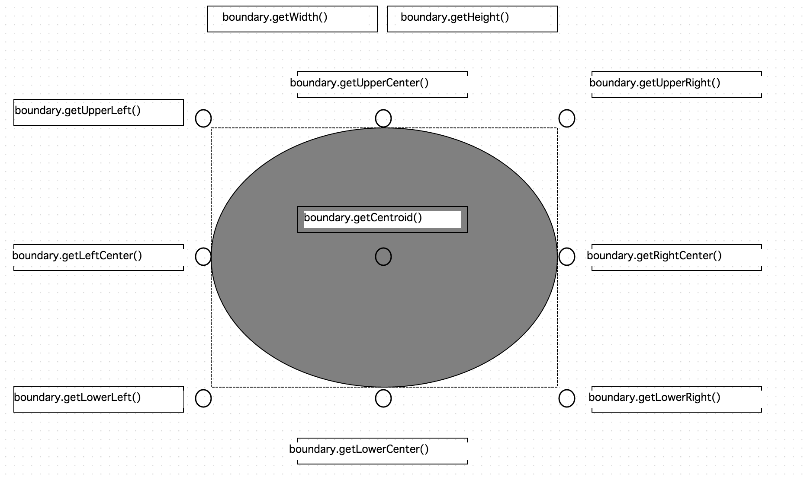
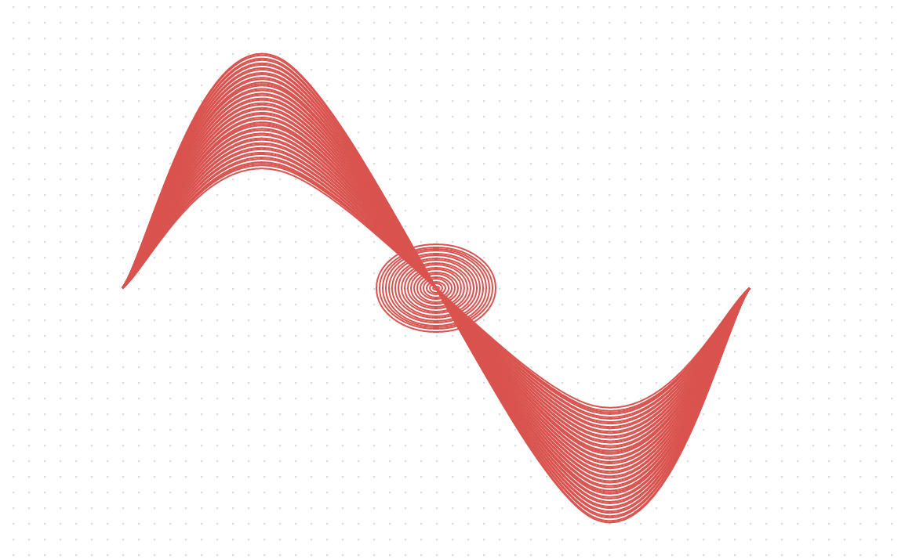
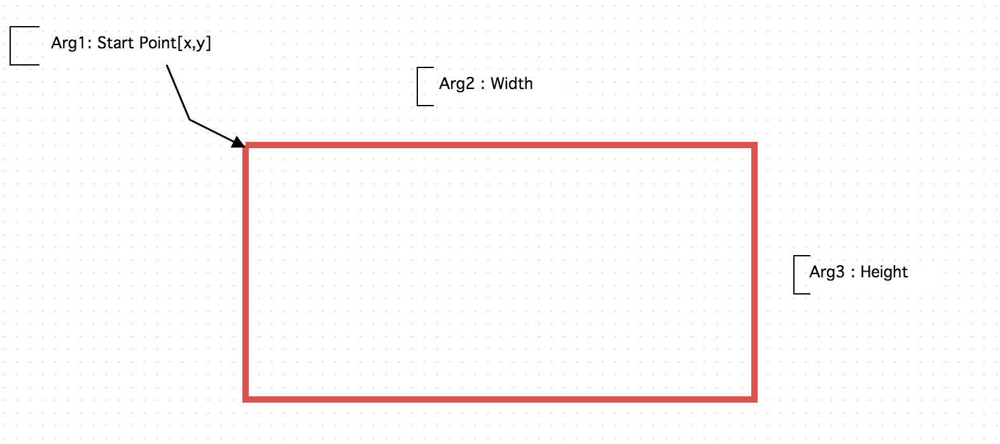
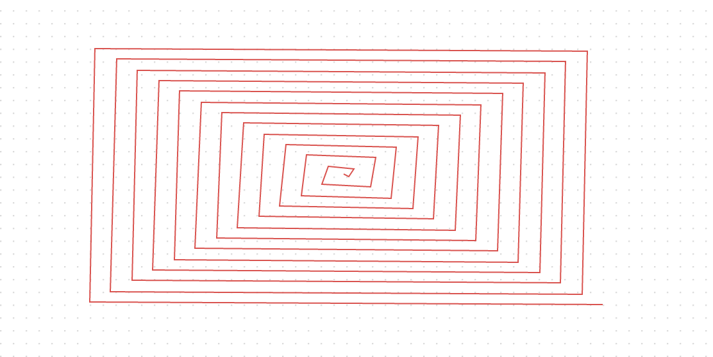
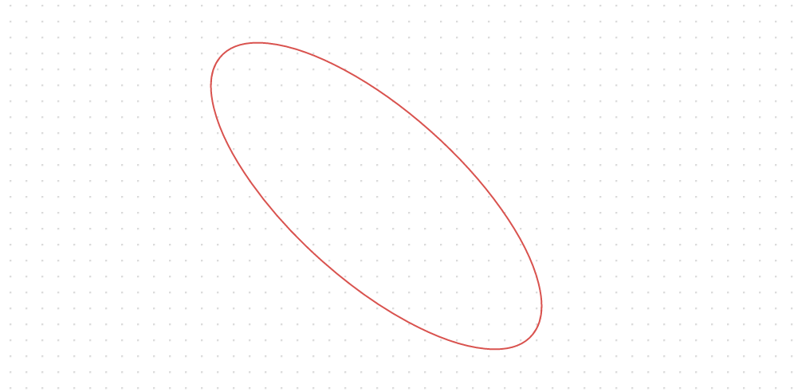

Geometry
========

Geometry 는 오픈그래프의 공간 기하 객체입니다.

앞선 과정들로 오픈그래프 Dom 객체 하위에 도형 클래스가 있고, 도형 클래스 하위에 Geometry 공간 기하 객체가 있다는 것을 기술했습니다.

도형 클래스는 Shape 이라고 표현하기도 합니다.

아래 예제에 몇가지 Shape 클래스를 호출하여 캔버스에 도형을 그려보도록 하겠습니다.

```
var circleShape = new OG.CircleShape();
var ellipseShape = new OG.EllipseShape();
var rectangleShape = new OG.RectangleShape();
var edgeShape1 = new OG.EdgeShape([50, 250], [200, 250]);
var edgeShape2 = new OG.EdgeShape([250, 250], [400, 250]);

var element1 = canvas.drawShape([100, 100], circleShape, [100, 100]);
var element2 = canvas.drawShape([250, 100], ellipseShape, [100, 50]);
var element3 = canvas.drawShape([400, 100], rectangleShape, [100, 50]);
var element4 = canvas.drawShape(null, edgeShape1, null, {
    'edge-type': 'plain',
    "arrow-start": "none",
    "arrow-end": "open-wide-long"
});
var element5 = canvas.drawShape(null, edgeShape2, null, {
    'edge-type': 'straight',
    "arrow-start": "classic-wide-long",
    "arrow-end": "block-wide-long",
    'stroke-dasharray': '-',
    'stroke-width': 4
});
```


각각의 Shape 가 Geometry 공간 기하 객체를 어떻게 호출하는지에 대해 살펴보기 위헤 오픈그래프에서 제공하는 기본 Shape 중 하나인  CircleShape 의 코드를 살펴보도록 하겠습니다.


```
/**
 * Circle Shape
 *
 * @class
 * @extends OG.shape.GeomShape
 * @requires OG.common.*
 * @requires OG.geometry.*
 *
 * @param {String} label 라벨 [Optional]
 * @author <a href="mailto:sppark@uengine.org">Seungpil Park</a>
 */
OG.shape.CircleShape = function (label) {
	OG.shape.CircleShape.superclass.call(this);

	this.SHAPE_ID = 'OG.shape.CircleShape';
	this.label = label;
};
OG.shape.CircleShape.prototype = new OG.shape.GeomShape();
OG.shape.CircleShape.superclass = OG.shape.GeomShape;
OG.shape.CircleShape.prototype.constructor = OG.shape.CircleShape;
OG.CircleShape = OG.shape.CircleShape;

/**
 * 드로잉할 Shape 을 생성하여 반환한다.
 *
 * @return {OG.geometry.Geometry} Shape 정보
 * @override
 */
OG.shape.CircleShape.prototype.createShape = function () {
	if (this.geom) {
		return this.geom;
	}

	this.geom = new OG.geometry.Circle([50, 50], 50);
	return this.geom;
};
```

CircleShape 의 createShape 메소드의 코드를 다시 살펴보면, new OG.geometry.Circle 클래스를 반환해주고 있는것을 볼 수 있습니다.
 
```
this.geom = new OG.geometry.Circle([50, 50], 50);
return this.geom;
```

Shape 의 createShape 메소드에 어떠한 geometry 공간 기하 객체를 삽입하는지에 따라 Shape 이 디스플레이 되는 모양이 달라지게 됩니다.
 
이를 사용하여 원 모양의 기하객체와 그 원의 중심선을 지나는 선분을 가진 도형을 직접 제작해보도록 하겠습니다.

```
var canvas = new OG.Canvas('canvas', [1000, 800], 'white', 'url(resources/images/symbol/grid.gif)');

//CircleShape 를 선언.
var shape = new OG.CircleShape();

//CircleShape 의 createShape 을 오버라이딩 하여, 새로운 geometry 를 서술한다.
shape.createShape = function () {
    if (this.geom) {
        return this.geom;
    }

    var geom1, geom2, geomCollection = [];
    if (this.geom) {
        return this.geom;
    }

    geom1 = new OG.geometry.Circle([50, 50], 50);
    geom2 = new OG.geometry.Line([0, 50], [100, 50]);

    geomCollection.push(geom1);
    geomCollection.push(geom2);
    this.geom = new OG.geometry.GeometryCollection(geomCollection);

    return this.geom;
};
canvas.drawShape([400, 300], shape, [400, 300]);
```


예제에서는 GeometryCollection 이라는 geometry 가 사용되었습니다.
 
GeometryCollection 은 다수의 geometry 를 혼합하여 그려야 할 경우 사용됩니다.

이어지는 내용은 오픈그래프에서 사용할 수 있는 geometry 목록과 그 사용법에 대한 기술입니다.   

## Point

```
/**
* Point 공간 기하 객체(Spatial Geometry Object)
*
* @class
* @extends OG.geometry.Geometry
* @requires OG.geometry.Coordinate
* @requires OG.geometry.Envelope
* @requires OG.geometry.Geometry
*
* @example
* var geom = new OG.geometry.Point([20, 5]);
*
* @param {OG.geometry.Coordinate} coordinate 좌표값
* @author <a href="mailto:sppark@uengine.org">Seungpil Park</a>
*/

Example
for (var i = 0; i < 100; i++) {
    var shape = new OG.GeomShape();
    shape.SHAPE_ID = 'OG.shape.PointExample';
    shape.createShape = function () {
        if (this.geom) {
            return this.geom;
        }
        this.geom = new OG.geometry.Point([0, 0]);
        return this.geom;
    };
    var x = (i % 10) * 20 + 100;
    var y = (Math.floor(i / 10) * 20) + 100;
    console.log(x,y);
    canvas.drawShape([x, y], shape, [0, 0]);
}
```


## Coordinate

Coordinate 는 오픈그래프의 2차원 좌표계를 나타내는 기하 객체로써, 도형의 각 꼭지점을 표현하거나 Boundary 영역을 표현하는데 사용됩니다.

```
/**
 * 2차원 좌표계에서의 좌표값
 *
 * @example
 * var coordinate1 = new OG.geometry.Coordinate(10, 10);
 * or
 * var coordinate2 = new OG.geometry.Coordinate([20, 20]);
 *
 * @class
 *
 * @param {Number} x x좌표
 * @param {Number} y y좌표
 * @author <a href="mailto:sppark@uengine.org">Seungpil Park</a>
 */
```

예제를 통해 다음의 두 도형을 그려보도록 합니다.

```
var rectElement = canvas.drawShape([200, 200], new OG.RectangleShape, [150, 150]);
var ellipseElement = canvas.drawShape([500, 200], new OG.EllipseShape, [150, 110]);

var rectVertices = rectElement.shape.geom.getVertices();
var ellipseVertices = ellipseElement.shape.geom.getVertices();

//print rectElement vertices
$.each(rectVertices, function(index, vertice){
    if(vertice instanceof OG.Coordinate){
        console.log(vertice.x , vertice.y);
    }
});

//print ellipseElement vertices
$.each(ellipseVertices, function(index, vertice){
    if(vertice instanceof OG.Coordinate){
        console.log(vertice.x , vertice.y);
    }
});
```


geometry 기하 객체 클래스의 getVertices 메소드는 기하객체가 가지고 있는 모든 꼭지점을 리턴합니다.

getVertices 메소드로 두 도형의 꼭지점들을 출력해보면, 
직사각형 모양의 rectElement 는 5개(선분이 사각형 모양을 그리기 위해서는 시작점으로 되돌아와야 하기 때문에 꼭지점이 하나 더 붙습니다.) 인 반면
타원 모양의 ellipseElement 는 매우 많은 꼭지점들을 출력하는 것을 알 수 있습니다.

각 꼭지점의 리턴값은 OG.geometry.Coordinate 이며, x 프로퍼티와 y 프로퍼티로 값을 가져올 수 있습니다.
 
geometry 기하 객체의 vertices 를 이루고 있는 Coordinate 를 변경 또는 추가 할 경우 커스텀한 도형을 그릴 수 있습니다.
 
다음 예제를 통해 편행사변형과 랜덤한 변을 가진 사각형을 그려볼 수 있도록 합니다.

```
var element1 = canvas.drawShape([200, 200], new OG.RectangleShape('Rect1'), [150, 150]);
var element2 = canvas.drawShape([500, 200], new OG.RectangleShape('Rect2'), [150, 150]);

//평행사변형 만들기
var vertices = element1.shape.geom.getVertices();
vertices[1] = new OG.Coordinate(vertices[1].x + 50, vertices[1].y);
vertices[3] = new OG.Coordinate(vertices[3].x - 50, vertices[3].y);
canvas.getRenderer().redrawShape(element1);


//랜덤 모양 만들기
vertices = element2.shape.geom.getVertices();
var newVertices = [];

newVertices[0] = vertices[0];
newVertices[100] = vertices[4];
for (var i = 1; i < 100; i++) {
    var x, y;
    if (i < 25) {
        x = vertices[0].x + Math.floor(((vertices[1].x - vertices[0].x) / 25) * i);
        y = vertices[0].y + Math.floor(Math.random() * 10) - 5;
        newVertices[i] = new OG.Coordinate(x, y);
    }
    else if (i < 50) {
        x = vertices[1].x + Math.floor(Math.random() * 10) - 5;
        y = vertices[1].y + Math.floor(((vertices[2].y - vertices[1].y) / 25) * (i - 25));
        newVertices[i] = new OG.Coordinate(x, y);
    }
    else if (i < 75) {
        x = vertices[2].x - Math.floor(((vertices[2].x - vertices[3].x) / 25) * (i - 50));
        y = vertices[2].y + Math.floor(Math.random() * 10) - 5;
        newVertices[i] = new OG.Coordinate(x, y);
    }
    else if (i < 100) {
        x = vertices[3].x + Math.floor(Math.random() * 10) - 5;
        y = vertices[3].y - Math.floor(((vertices[3].y - vertices[4].y) / 25) * (i - 75));
        newVertices[i] = new OG.Coordinate(x, y);
    }
}
element2.shape.geom.vertices = newVertices;
canvas.getRenderer().redrawShape(element2);
```


## Envelope

OG.geometry.Envelope 기하 객체는 앞선 [Canvas - getBoundary](./canvas.md#getboundary) 파트에서 canvas.getBoundary() 메소드를 통해서도 
접근할 수 있습니다.

canvas.getBoundary() 메소드를 호출하는 순간, 오픈그래프는 호출 대상이 어떠한 Shape 을 지니고 있던지 간에 
도형의 모든 꼭지점을 포함시키는 최소한의 사각형의 영역을 만들어내어, OG.geometry.Envelope 기하 객체를 리턴합니다.

```
/**
 * 2차원 좌표계에서 Envelope 영역을 정의
 *
 * @class
 * @requires OG.geometry.Coordinate
 *
 * @example
 * var boundingBox = new OG.geometry.Envelope([50, 50], 200, 100);
 *
 * @param {OG.geometry.Coordinate|Number[]} upperLeft 기준 좌상단 좌표
 * @param {Number} width 너비
 * @param {Number} height 높이
 * @author <a href="mailto:sppark@uengine.org">Seungpil Park</a>
 */
```



## Style

OG.geometry.Style 은 모든 기하 객체의 style 프로퍼티에 위치하게 되며, 기하 객체의 svg 스타일을 정의합니다.

```
/**
 * 스타일(StyleSheet) Property 정보 클래스
 *
 * @class
 * @extends OG.common.HashMap
 *
 * @example
 * var style = new OG.geometry.Style({
 *     'cursor': 'default',
 *     'stroke': 'black'
 * });
 *
 * @param {Object} style 키:값 매핑된 스타일 프라퍼티 정보
 * @author <a href="mailto:sppark@uengine.org">Seungpil Park</a>
 */
```

OG.geometry.Style 을 응용한 Shape 렌더링 예제를 살펴보겠습니다.

```
var shape = new OG.CircleShape();
shape.createShape = function () {
    if (this.geom) {
        return this.geom;
    }

    var geom1, geom2, geomCollection = [];
    if (this.geom) {
        return this.geom;
    }

    geom1 = new OG.geometry.Circle([50, 50], 50);
    geom2 = new OG.geometry.Line([0, 50], [100, 50]);

    geomCollection.push(geom1);
    geomCollection.push(geom2);
    this.geom = new OG.geometry.GeometryCollection(geomCollection);

    //geometry 의 스타일을 OG.geometry.Style 을 통해 정의한다.
    this.geom.style = new OG.geometry.Style({
        'cursor': 'default',
        'stroke': '#d9534f',
        'stroke-width': '5',
        'fill': '#5bc0de',
        'fill-opacity': 1
    });

    return this.geom;
};
canvas.drawShape([400, 300], shape, [400, 300]);
```


## Geometry

다음 한줄의 코드를 보겠습니다.

```
var geom = new OG.geometry.Circle([50, 50], 50);
```

지금 까지 나열되었던 Point,Coordinate,Envelope,Style 들은 위 코드의 OG.geometry.Circle 같은 geometry 기하 객체를 이루기 위한 부분적인 요소들이었습니다.
 
OG.geometry.Circle 같은 geometry 들은 경우에 따라 geometry 간의 상속을 반복할 수 있는데, 최상위 추상 클래스는 OG.geometry.Geometry 로써 항상 동일합니다.    

OG.geometry.Geometry 최상위 추상 클래스는 2차원 좌표계에서의 공간 기하 계산을 위한 메소드 및 vertices(꼭지점 집합), style , boundary 영역 정보를 제공합니다.

아래 표는 OG.geometry.Geometry 가 제공하는 공간 기하 관련 메소드들입니다.

각 메소드의 인터페이스와 예제는 API Reference 문서를 참조하시길 바랍니다.

| Method 명                      | 기능                                                                                          |
|--------------------------------|-----------------------------------------------------------------------------------------------|
| isEquals                       | 주어진 Geometry 객체와 같은지 비교한다.                                                       |
| isContains                     | 주어진 공간기하객체를 포함하는지 비교한다.                                                    |
| isWithin                       | 주어진 공간기하객체에 포함되는지 비교한다.                                                    |
| getBoundary                    | 공간기하객체를 포함하는 사각형의 Boundary 영역을 반환한다.                                    |
| getCentroid                    | 공간기하객체의 중심좌표를 반환한다.                                                           |
| getVertices                    | 공간기하객체의 모든 꼭지점을 반환한다.                                                        |
| minDistance                    | 주어진 좌표와의 최단거리를 반환한다.                                                          |
| distance                       | 주어진 공간기하객체와의 중심점 간의 거리를 반환한다.                                          |
| getLength                      | 공간기하객체의 길이를 반환한다.                                                               |
| move                           | 가로, 세로 Offset 만큼 좌표를 이동한다.                                                       |
| moveCentroid                   | 주어진 중심좌표로 공간기하객체를 이동한다.                                                    |
| resize                         | 상, 하, 좌, 우 외곽선을 이동하여 Envelope 을 리사이즈 한다.                                   |
| resizeBox                      | 중심좌표는 고정한 채 Bounding Box 의 width, height 를 리사이즈 한다.                          |
| rotate                         | 기준 좌표를 기준으로 주어진 각도 만큼 회전한다.                                               |
| fitToBoundary                  | 주어진 Boundary 영역 안으로 공간 기하 객체를 적용한다.(이동 & 리사이즈)                       |
| convertCoordinate              | 파라미터가 [x, y] 형식의 좌표 Array 이면 OG.geometry.Coordinate 인스턴스를 new 하여 반환한다. |
| distanceToLine                 | 포인트 P 로부터 라인 AB의 거리를 계산한다.                                                    |
| distanceLineToLine             | 라인1 로부터 라인2 의 거리를 계산한다.                                                        |
| intersectToLine                | 주어진 라인과 교차하는 좌표를 반환한다.                                                       |
| shortestIntersectToLine        | 주어진 라인과 교차하는 좌표중 시작좌표에 가장 가까운 좌표를 반환한다.                         |
| intersectLineToLine            | 라인1 로부터 라인2 의 교차점을 계산한다.                                                      |
| intersectCircleToLine          | 라인1 로부터 라인2 의 교차점을 계산한다.                                                      |
| intersectPointToLine           | 포인트 P 로부터 라인 AB의 교차점을 계산한다.                                                  |
| getPercentageDistanceFromPoint | 주어진 좌표에 대해 공간기하객체의 퍼센테이지 비율을 구한다.                                   |
| isContainsPoint                | 공간기하객체가 주어진 좌표를 포함하는지를 반환한다.                                           |
| getPointFromPercentageDistance | 공간기하객체에 대한 퍼센테이지 좌표의 실제 좌표를 구한다.                                     |
| reset                          | 저장된 boundary 를 클리어하여 새로 계산하도록 한다.                                           |

## GeometryCollection

GeometryCollection 은 다수의 Geometry 를 묶어 하나의 Geometry 로 제공하는 클래스입니다.
 
new OG.geometry.GeometryCollection([geom1, geom2, geom3]) 식으로 호출하여 씁니다.

```
/**
 * 공간 기하 객체(Spatial Geometry Object) Collection
 *
 * @class
 * @extends OG.geometry.Geometry
 * @requires OG.geometry.Coordinate
 * @requires OG.geometry.Envelope
 * @requires OG.geometry.Geometry
 *
 * @example
 * var geom1 = new OG.geometry.Point([20, 5]),
 *     geom2 = new OG.geometry.Line([20, 5], [30, 15]),
 *     geom3 = new OG.geometry.PolyLine([[20, 5], [30, 15], [40, 25], [50, 15]]);
 *
 * var collection = new OG.geometry.GeometryCollection([geom1, geom2, geom3]);
 *
 * @param geometries {OG.geometry.Geometry[]} 공간 기하 객체 Array
 * @author <a href="mailto:sppark@uengine.org">Seungpil Park</a>
 */
 
 Example)
var shape = new OG.GeomShape();
shape.SHAPE_ID = 'OG.shape.CustomCollection';
shape.createShape = function () {
    if (this.geom) {
        return this.geom;
    }

    var geomCollection = [];
    if (this.geom) {
        return this.geom;
    }

    for (var i = 0; i < 50; i++) {
        var geom = new OG.geometry.Curve([[200, 100], [100, 300 - i * 2], [-100, -100 + i * 2], [-200, 100]]);
        geomCollection.push(geom);
    }
    for (var i = 0; i < 20; i++) {
        geomCollection.push(new OG.geometry.Circle([0, 100], i * 2));
    }

    this.geom = new OG.geometry.GeometryCollection(geomCollection);

    this.geom.style = new OG.geometry.Style({
        'cursor': 'default',
        'stroke': '#d9534f',
        'stroke-width': '1',
        'fill': 'none',
        'fill-opacity': 0
    });
    return this.geom;
};
var customShape = canvas.drawShape([400, 300], shape, [400, 300]);
```




## Polygon

Polygon 은 닫힌 선분 도형을 그리는 클래스이며,  new OG.geometry.Polygon([[x,y],[x,y][x,y]...]) 으로 호출할 수 있습니다.
 
닫힌 선분 도형이기 때문에 시작점과 끝점은 같아야 합니다.

```
/**
 * Polygon 공간 기하 객체(Spatial Geometry Object)
 *
 * @class
 * @extends OG.geometry.PolyLine
 * @requires OG.geometry.Coordinate
 * @requires OG.geometry.Envelope
 * @requires OG.geometry.Geometry
 *
 * @example
 * var geom = new OG.geometry.Polygon([[20, 5], [30, 15], [40, 25], [50, 15], [60, 5], [20, 5]]);
 *
 * @param {OG.geometry.Coordinate[]} vertices Line Vertex 좌표 Array
 * @author <a href="mailto:sppark@uengine.org">Seungpil Park</a>
 */
 
Example)
var shape = new OG.GeomShape();
shape.SHAPE_ID = 'OG.shape.PolygonExample';
shape.createShape = function () {
    if (this.geom) {
        return this.geom;
    }
    this.geom = new OG.geometry.Polygon([[0, 0], [200, 50], [250, 150], [50, 100], [0, 0]]);

    this.geom.style = new OG.geometry.Style({
        'cursor': 'default',
        'stroke': '#d9534f',
        'stroke-width': '1',
        'fill': 'none',
        'fill-opacity': 0
    });
    return this.geom;
};
var customShape = canvas.drawShape([400, 300], shape, [400, 300]);

```


## Rectangle

OG.geometry.Rectangle 클래스는 OG.geometry.Polygon 을 상속받아 좌측상단의 시작점, 가로, 세로 세가지의 값으로 직사각형을 그려줍니다.

오픈그래프에서 지원하는 Shape 종류에는 mageShape, TextShape, HtmlShape 등과 같이 기하 도형으로 이루어지지 않은 도형들이 있는데,
이 Shape 들은 기본적으로 OG.geometry.Rectangle 를 Shape 의 geometry 로서 가져갑니다.

```
/**
 * Rectangle 공간 기하 객체(Spatial Geometry Object)
 *
 * @class
 * @extends OG.geometry.Polygon
 * @requires OG.geometry.Coordinate
 * @requires OG.geometry.Envelope
 * @requires OG.geometry.Geometry
 *
 * @example
 * var geom = new OG.geometry.Rectangle([20, 5], 10, 10);
 *
 * @param {OG.geometry.Coordinate} upperLeft 좌상단좌표
 * @param {Number} width 너비
 * @param {Number} height 높이
 * @author <a href="mailto:sppark@uengine.org">Seungpil Park</a>
 */

Example)
var shape = new OG.GeomShape();
shape.SHAPE_ID = 'OG.shape.RectExample';
shape.createShape = function () {
    if (this.geom) {
        return this.geom;
    }
    this.geom = new OG.geometry.Rectangle([0,0],200,50);

    this.geom.style = new OG.geometry.Style({
        'cursor': 'default',
        'stroke': '#d9534f',
        'stroke-width': '5',
        'fill': 'none',
        'fill-opacity': 0
    });
    return this.geom;
};
var customShape = canvas.drawShape([400, 300], shape, [400, 200]);
```



## PolyLine

OG.geometry.PolyLine 은 꺽은선 선분 기하 클래스이며 OG.geometry.PolyLine 을 extends 한 클래스는 다음 것들이 있습니다.

 - OG.geometry.BezierCurve
 - OG.geometry.Curve
 - OG.geometry.Line
 - OG.geometry.Polygon
 
아래 표는 OG.geometry.PolyLine 가 제공하는 공간 기하 관련 메소드들입니다.

각 메소드의 인터페이스와 예제는 API Reference 문서를 참조하시길 바랍니다.

| Method 명                 | 기능                                                                      |
|---------------------------|---------------------------------------------------------------------------|
| getVertices               | 공간기하객체의 모든 꼭지점을 반환한다.                                    |
| setVertices               | 공간기하객체의 꼭지점을 설정한다.                                         |
| move                      | 가로, 세로 Offset 만큼 좌표를 이동한다.                                   |
| resize                    | 상, 하, 좌, 우 외곽선을 이동하여 Envelope 을 리사이즈 한다.               |
| rotate                    | 기준 좌표를 기준으로 주어진 각도 만큼 회전한다.                           |
| toString                  | 객체 프라퍼티 정보를 JSON 스트링으로 반환한다.                            |
| angleBetweenPoints        | 공간기하객체의 두 꼭지점 사이에 가상의 선을 그렸을때, 그 기울기를 구한다. |
| isRightAngleBetweenPoints | 공간기하객체의 두 꼭지점 사이의 기울기가 수평또는 수직인지 판별한다.      |
| angleBetweenThreePoints   | 공간기하객체의 세 꼭지점 사이의 각도 중 작은 각도를 반환한다.             |

 
```
/**
 * PolyLine 공간 기하 객체(Spatial Geometry Object)
 *
 * @class
 * @extends OG.geometry.Geometry
 * @requires OG.geometry.Coordinate
 * @requires OG.geometry.Envelope
 * @requires OG.geometry.Geometry
 *
 * @example
 * var geom = new OG.geometry.PolyLine([[20, 5], [30, 15], [40, 25], [50, 15]]);
 *
 * @param {OG.geometry.Coordinate[]} vertices Line Vertex 좌표 Array
 * @author <a href="mailto:sppark@uengine.org">Seungpil Park</a>
 */

Example)
var shape = new OG.GeomShape();
shape.SHAPE_ID = 'OG.shape.PolyLineExample';
shape.createShape = function () {
    if (this.geom) {
        return this.geom;
    }
    var vertices = [];
    var distancs = 40;
    for(var i = 0 ; i < 50; i++){
        if(i % 4 == 0){
            vertices[i] = [ - Math.floor((i / 4) * distancs) , Math.floor((i / 4) * distancs)]
        }else if(i % 4 == 1){
            vertices[i] = [ Math.floor((i / 4) * distancs) , Math.floor((i / 4) * distancs)]
        }else if(i % 4 == 2){
            vertices[i] = [ Math.floor((i / 4) * distancs) , - Math.floor((i / 4) * distancs)]
        }else{
            vertices[i] = [ -Math.floor((i / 4) * distancs) , - Math.floor((i / 4) * distancs)]
        }
    }
    this.geom = new OG.geometry.PolyLine(vertices);

    this.geom.style = new OG.geometry.Style({
        'cursor': 'default',
        'stroke': '#d9534f',
        'stroke-width': '1',
        'fill': 'none',
        'fill-opacity': 0
    });
    return this.geom;
};
var customShape = canvas.drawShape([400, 300], shape, [400, 200]);
```


 
 
## Line

OG.geometry.Line OG.geometry.PolyLine 을 extends 한 클래스로서 시작과 끝점을 받아 직선을 표현합니다.

```
/**
 * Line 공간 기하 객체(Spatial Geometry Object)
 *
 * @class
 * @extends OG.geometry.PolyLine
 * @requires OG.geometry.Coordinate
 * @requires OG.geometry.Envelope
 * @requires OG.geometry.Geometry
 *
 * @example
 * var geom = new OG.geometry.Line([20, 5], [30, 15]);
 *
 * @param {OG.geometry.Coordinate} from 라인 시작 좌표값
 * @param {OG.geometry.Coordinate} to 라인 끝 좌표값
 * @author <a href="mailto:sppark@uengine.org">Seungpil Park</a>
 */
 
Example)
var geom = new OG.geometry.Line([20, 5], [30, 15]);
```

## Curve

OG.geometry.Curve 는 OG.geometry.PolyLine 을 extends 한 클래스로서 모든 콘트롤 포인트를 공유하는 곡선을 표현합니다.

```
/**
 * Catmull-Rom Spline Curve 공간 기하 객체(Spatial Geometry Object)
 * 모든 콘트롤포인트를 지나는 곡선을 나타낸다.
 *
 * @class
 * @extends OG.geometry.PolyLine
 * @requires OG.geometry.Coordinate
 * @requires OG.geometry.Envelope
 * @requires OG.geometry.Geometry
 * @requires OG.common.CurveUtil
 *
 * @example
 * var geom = new OG.geometry.Curve([[200, 100], [100, 300], [-100, -100], [-200, 100]]);
 *
 * @param {OG.geometry.Coordinate[]} controlPoints Curve Vertex 좌표 Array
 * @author <a href="mailto:sppark@uengine.org">Seungpil Park</a>
 */
 
Example)
var shape = new OG.GeomShape();
shape.SHAPE_ID = 'OG.shape.PolyLineExample';
shape.createShape = function () {
    if (this.geom) {
        return this.geom;
    }
    var vertices = [];
    var distancs = 40;
    for(var i = 0 ; i < 50; i++){
        if(i % 4 == 0){
            vertices[i] = [ - Math.floor((i / 4) * distancs) , Math.floor((i / 4) * distancs)]
        }else if(i % 4 == 1){
            vertices[i] = [ Math.floor((i / 4) * distancs) , Math.floor((i / 4) * distancs)]
        }else if(i % 4 == 2){
            vertices[i] = [ Math.floor((i / 4) * distancs) , - Math.floor((i / 4) * distancs)]
        }else{
            vertices[i] = [ -Math.floor((i / 4) * distancs) , - Math.floor((i / 4) * distancs)]
        }
    }
    this.geom = new OG.geometry.Curve(vertices);

    this.geom.style = new OG.geometry.Style({
        'cursor': 'default',
        'stroke': '#d9534f',
        'stroke-width': '1',
        'fill': 'none',
        'fill-opacity': 0
    });
    return this.geom;
};
var customShape = canvas.drawShape([400, 300], shape, [400, 200]);
```


## BezierCurve

OG.geometry.Curve 는 OG.geometry.PolyLine 을 extends 한 클래스로서 콘트롤포인트1, 콘트롤포인트2에 의해 시작좌표, 끝좌표를 지나는 곡선을 나타냅니다.

new OG.geometry.BezierCurve([시작좌표, 콘트롤 포인트1, 콘트롤 포인트2, 끝좌표]) 로 호출하며, 인자가 4개 가 아닐 경우 Exception 이 발생합니다.

```
/**
 * Cubic Bezier Curve 공간 기하 객체(Spatial Geometry Object)
 * 콘트롤포인트1, 콘트롤포인트2에 의해 시작좌표, 끝좌표를 지나는 곡선을 나타낸다.
 *
 * @class
 * @extends OG.geometry.PolyLine
 * @requires OG.geometry.Coordinate
 * @requires OG.geometry.Envelope
 * @requires OG.geometry.Geometry
 * @requires OG.common.CurveUtil
 *
 * @example
 * var geom = new OG.geometry.BezierCurve([[200, 100], [100, 300], [-100, -100], [-200, 100]]);
 *
 * @param {OG.geometry.Coordinate[]} controlPoints [from, control_point1, control_point2, to]
 * @author <a href="mailto:sppark@uengine.org">Seungpil Park</a>
 */

Example)
var shape = new OG.EdgeShape();
shape.SHAPE_ID = 'OG.shape.BezierCurveExample';
shape.createShape = function () {
    if (this.geom) {
        return this.geom;
    }
    this.geom = new OG.geometry.BezierCurve([[-200, 100], [-100, 0], [100, 200], [200, 100]]);

    this.geom.style = new OG.geometry.Style({
        'cursor': 'default',
        'stroke': '#d9534f',
        'stroke-width': '3',
        'fill': 'none',
        'fill-opacity': 0
    });
    return this.geom;
};
var customShape = canvas.drawShape([300, 100], shape);

```


## Ellipse

OG.geometry.Ellipse 는 OG.geometry.Curve 을 extends 한 클래스로서 타원형을 그립니다.

new OG.geometry.Ellipse(중심좌표, x 축 반경, y 축 반경, x 축 기울기) 로 호출합니다.

```
/**
 * Ellipse 공간 기하 객체(Spatial Geometry Object)
 *
 * @class
 * @extends OG.geometry.Curve
 * @requires OG.geometry.Coordinate
 * @requires OG.geometry.Envelope
 * @requires OG.geometry.Geometry
 *
 * @example
 * var geom = new OG.geometry.Ellipse([10, 10], 10, 5);
 *
 * @param {OG.geometry.Coordinate} center Ellipse 중심 좌표
 * @param {Number} radiusX X축 반경
 * @param {Number} radiusY Y축 반경
 * @param {Number} angle X축 기울기
 * @author <a href="mailto:sppark@uengine.org">Seungpil Park</a>
 */
 
Example)
var shape = new OG.GeomShape();
shape.SHAPE_ID = 'OG.shape.EllipseExample';
shape.createShape = function () {
    if (this.geom) {
        return this.geom;
    }
    this.geom = new OG.geometry.Ellipse([0, 0], 300, 100, 30);

    this.geom.style = new OG.geometry.Style({
        'cursor': 'default',
        'stroke': '#d9534f',
        'stroke-width': '1',
        'fill': 'none',
        'fill-opacity': 0
    });
    return this.geom;
};
var customShape = canvas.drawShape([300, 200], shape, [200, 200]);
```



## Circle

OG.geometry.Circle 은 OG.geometry.Ellipse 을 extends 한 클래스로서 원형을 그립니다.

new OG.geometry.Circle(중심좌표, 반경) 으로 호출합니다.

```
/**
 * Circle 공간 기하 객체(Spatial Geometry Object)
 *
 * @class
 * @extends OG.geometry.Ellipse
 * @requires OG.geometry.Coordinate
 * @requires OG.geometry.Envelope
 * @requires OG.geometry.Geometry
 *
 * @example
 * var geom = new OG.geometry.Circle([10, 10], 5);
 *
 * @param {OG.geometry.Coordinate} center Circle 중심 좌표
 * @param {Number} radius radius 반경
 * @author <a href="mailto:sppark@uengine.org">Seungpil Park</a>
 */
 
Example)
var shape = new OG.GeomShape();
shape.SHAPE_ID = 'OG.shape.CircleExample';
shape.createShape = function () {
    if (this.geom) {
        return this.geom;
    }
    this.geom = new OG.geometry.Circle([50, 50], 100);

    this.geom.style = new OG.geometry.Style({
        'cursor': 'default',
        'stroke': '#d9534f',
        'stroke-width': '1',
        'fill': 'none',
        'fill-opacity': 0
    });
    return this.geom;
};
var customShape = canvas.drawShape([300, 200], shape, [200, 200]);
```


