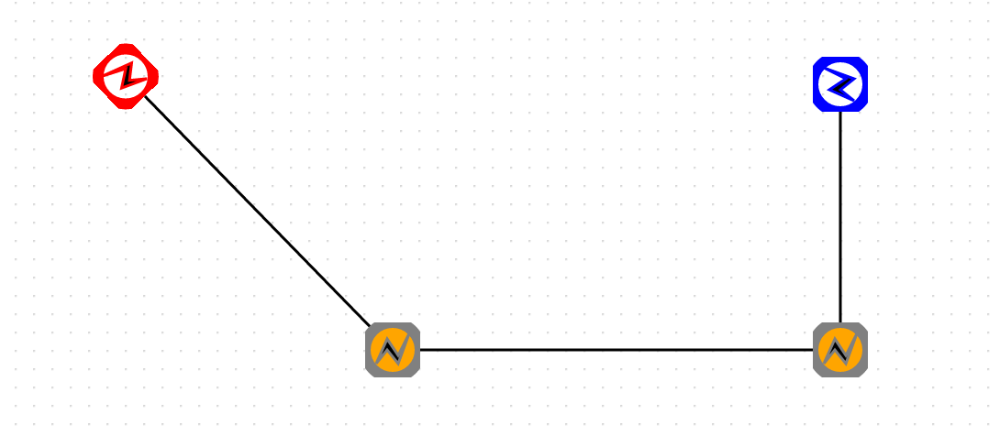

Marker
=====

 - [Default Marker](#default-marker)
 - [Custom Marker](#custom-marker)
 - [Custom Marker Size](#custom-marker-size)
 - [Custom Marker Ref](#custom-marker-ref)
 - [Custom Marker Style](#custom-marker-style)

마커 스타일링은 [EdgeShape](shapes.md#edgeshape) 에 적용되며, 선 양 끝 또는 중앙, 변곡점 구간에 SVG 마커를 표현합니다.

[SVG Marker Element](#http://tutorials.jenkov.com/svg/marker-element.html)
 
## Default Marker

오픈그래프의 디폴트 마커는 arrow-start 와 arrow-end 스타일 어트리뷰트로 설정할 수 있으며, block,classic 등 12 가지의 모양을 가지고 있습니다.


| 스타일 어트리뷰트 | 설명               |
|-------------------|--------------------|
| arrow-start       | 선 시작부분의 마커 |
| arrow-end         | 선 끝부분의 마커   |

위의 어트리뷰트 값을 12가지의 기본 모형을 적용하여 샘플코드를 작성해 봅니다.

```
var edge1 = canvas.drawShape(null, new OG.EdgeShape([100, 100], [500, 100]), null);
var edge2 = canvas.drawShape(null, new OG.EdgeShape([100, 120], [500, 120]), null);
var edge3 = canvas.drawShape(null, new OG.EdgeShape([100, 140], [500, 140]), null);
var edge4 = canvas.drawShape(null, new OG.EdgeShape([100, 160], [500, 160]), null);
var edge5 = canvas.drawShape(null, new OG.EdgeShape([100, 180], [500, 180]), null);
var edge6 = canvas.drawShape(null, new OG.EdgeShape([100, 200], [500, 200]), null);
var edge7 = canvas.drawShape(null, new OG.EdgeShape([100, 220], [500, 220]), null);
var edge8 = canvas.drawShape(null, new OG.EdgeShape([100, 240], [500, 240]), null);
var edge9 = canvas.drawShape(null, new OG.EdgeShape([100, 260], [500, 260]), null);
var edge10 = canvas.drawShape(null, new OG.EdgeShape([100, 280], [500, 280]), null);
var edge11 = canvas.drawShape(null, new OG.EdgeShape([100, 300], [500, 300]), null);
var edge12 = canvas.drawShape(null, new OG.EdgeShape([100, 320], [500, 320]), null);

canvas.setShapeStyle(edge1, {'arrow-start': 'block', 'arrow-end': 'block'});
canvas.setShapeStyle(edge2, {'arrow-start': 'classic', 'arrow-end': 'classic'});
canvas.setShapeStyle(edge3, {'arrow-start': 'oval', 'arrow-end': 'oval'});
canvas.setShapeStyle(edge4, {'arrow-start': 'diamond', 'arrow-end': 'diamond'});
canvas.setShapeStyle(edge5, {'arrow-start': 'open', 'arrow-end': 'open'});
canvas.setShapeStyle(edge6, {'arrow-start': 'open_block', 'arrow-end': 'open_block'});
canvas.setShapeStyle(edge7, {'arrow-start': 'open_oval', 'arrow-end': 'open_oval'});
canvas.setShapeStyle(edge8, {'arrow-start': 'open_diamond', 'arrow-end': 'open_diamond'});
canvas.setShapeStyle(edge9, {'arrow-start': 'wide', 'arrow-end': 'wide'});
canvas.setShapeStyle(edge10, {'arrow-start': 'narrow', 'arrow-end': 'narrow'});
canvas.setShapeStyle(edge11, {'arrow-start': 'long', 'arrow-end': 'long'});
canvas.setShapeStyle(edge12, {'arrow-start': 'short', 'arrow-end': 'short'});
```


## Custom Marker

오픈그래프는 사용자 스스로 마커를 제작하여 스타일링에 활용할 수 있도록 지원합니다.

커스텀 마커를 사용하기 위해서는, 우선 마커 클래스 하나를 제작해보도록 합니다.

마커 클래스 제작은 [Define Custom Shape](extend-shape.md#define-custom-shape) 제작방식과 동일하지만 네임스페이스만 바뀝니다.

다음은 사각형 안에 N 모양이 있는 커스텀 마커를 제작하는 샘플 코드입니다.

```
/**
 * Rectangle Maker
 *
 * @class
 * @extends OG.marker.IMarker
 * @requires OG.common.*
 * @requires OG.geometry.*
 *
 * @author <a href="mailto:sppark@uengine.org">Seungpil Park</a>
 */
OG.marker.RectangleMarker = function () {
	OG.marker.RectangleMarker.superclass.call(this);

	this.MARKER_ID = 'OG.marker.RectangleMarker';
};
OG.marker.RectangleMarker.prototype = new OG.marker.IMarker();
OG.marker.RectangleMarker.superclass = OG.marker.IMarker;
OG.marker.RectangleMarker.prototype.constructor = OG.marker.RectangleMarker;
OG.RectangleMarker = OG.marker.RectangleMarker;

/**
 * 드로잉할 marker 을 생성하여 반환한다.
 *
 * @return {OG.geometry.Geometry} marker 정보
 * @override
 */
OG.marker.RectangleMarker.prototype.createMarker = function () {
	var geom1, geom2, geomCollection = [];
	if (this.geom) {
		return this.geom;
	}

	geom1 = new OG.geometry.Circle([50, 50], 50);
	geom1.style = new OG.geometry.Style({
		"stroke-width": 4
	});

	geom2 = new OG.geometry.Polygon([
		[20, 75],
		[40, 30],
		[60, 60],
		[80, 20],
		[60, 75],
		[40, 50]

	]);
	geom2.style = new OG.geometry.Style({
		"fill": "black",
		"fill-opacity": 1
	});

	geomCollection.push(geom1);
	geomCollection.push(geom2);

	this.geom = new OG.geometry.GeometryCollection(geomCollection);
	
	return this.geom;
};
```

## Custom Marker Size

커스텀 Shape 를 생성할때와 모든 코드가 동일하지만, OG.shape 가 OG.marker 로 바뀌었음을 알 수 있습니다.

이제 이 코드를 오픈그래프 라이브러리를 불러온 후 html 페이지에 삽입하도록 합니다.

다음 할 일은 이 마커를 선 도형에 적용시키는 것입니다.

선 도형에 적용시킬 때는 "marker" 스타일 어트리뷰트를 사용하게 되는데, 몇가지 프로퍼티와 함께 json 형식으로 표현하도록 합니다.


| 위치 프로퍼티 | 타입   | 설명                |
|---------------|--------|---------------------|
| start         | Object | 선 시작부분의 마커  |
| end           | Object | 선 끝부분의 마커    |
| mid           | Object | 선 꺽임 부분의 마커 |


| 표현 프로퍼티 | 설명            | 설명                    |
|---------------|-----------------|-------------------------|
| id            | string          | 마커 클래스명           |
| size          | [number,number] | 가로, 세로 크기         |
| ref           | [number,number] | 경로상의 마커 참조 위치 |
| style         | Object          | 마커 스타일링           |


위의 표를 참조하여, 선의 시작, 꺽임, 끝 부분에 제작한 OG.marker.RectangleMarker 마커를 적용하도록 해봅니다. 

```
var edge1 = canvas.drawShape(null, new OG.EdgeShape([100, 100], [500, 100]), null);

canvas.setShapeStyle(edge1, {
	'marker': {
		'start': {
			'id': 'OG.marker.RectangleMarker',
			'size': [20, 20]
		},
		'mid': {
			'id': 'OG.marker.RectangleMarker',
			'size': [20, 20]
		},
		'end': {
			'id': 'OG.marker.RectangleMarker',
			'size': [20, 20]
		}
	}
});
```


## Custom Marker Ref

계속해서, 마커에 ref 를 적용해보도록 하겠습니다.

ref 는 선 경로상의 마커 위치를 뜻하는 것으로, ref 를 지정하지 않으면 오픈그래프가 마커의 사이즈에 맞추어서 자동으로 ref 를 배정해줍니다.

ref 를 직접 적용하여 아래 코드를 작성하도록 하고, ref 의 위치 지정 방식을 그림으로 살펴보고 이해해도록 합니다.

ref 의 x 좌표는 경로상을 기준으로 삼다보니, 실제 좌표계에서의 x 증분 값과 반대가 되니 혼동되지 않도록 합니다.

```
var edge1 = canvas.drawShape(null, new OG.EdgeShape([100, 100], [500, 100]), null);
var edge2 = canvas.drawShape(null, new OG.EdgeShape([100, 200], [500, 200]), null);

canvas.setShapeStyle(edge1, {
	'marker': {
		'start': {
			'id': 'OG.marker.RectangleMarker',
			'size': [20, 20],
			'ref': [0,0]
		},
		'end': {
			'id': 'OG.marker.RectangleMarker',
			'size': [20, 20],
			'ref': [0,0]
		}
	}
});

canvas.setShapeStyle(edge2, {
	'marker': {
		'start': {
			'id': 'OG.marker.RectangleMarker',
			'size': [20, 20],
			'ref': [20,10]
		},
		'end': {
			'id': 'OG.marker.RectangleMarker',
			'size': [20, 20],
			'ref': [0,10]
		}
	}
});

```


## Custom Marker Style

제작한 커스텀 마커를 적용시킬 때, 특정 마커마다의 스타일을 다르게 적용시킬 수 있습니다.

```
var edge1 = canvas.drawShape(null, new OG.EdgeShape([100, 100], [500, 100]), null);

canvas.setShapeStyle(edge1, {
	'marker': {
		'start': {
			'id': 'OG.marker.RectangleMarker',
			'size': [20, 20],
			'style':{
				'stroke': 'red'
			}
		},
		'mid': {
			'id': 'OG.marker.RectangleMarker',
			'size': [20, 20],
			'style':{
				'stroke': 'gray',
				'fill': 'orange',
				'fill-opacity': 'orange'
			}
		},
		'end': {
			'id': 'OG.marker.RectangleMarker',
			'size': [20, 20],
			'style':{
				'stroke': 'blue'
			}
		}
	}
});
```

