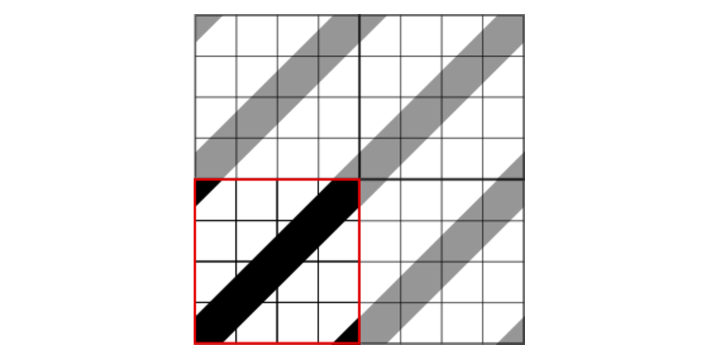

Pattern
=======

 - [Custom Pattern](#custom-pattern)
 - [Custom Pattern Size](#custom-pattern-size)
 - [Custom Pattern Unit Size](#custom-pattern-unit-size)
 - [Custom Pattern Style && Transform](#custom-pattern-style-&&-transform)
 - [Hatched Pattern](#hatched-pattern)
 - [Custom Pattern in EdgeShape](#custom-pattern-in-edgeshape)

패턴 스타일은 도형의 내부의 fill 어트리뷰트를 대체하며, 도형 속에 특정 패턴을 반복하여 드로잉합니다.

[SVG Fill Patterns](#http://tutorials.jenkov.com/svg/fill-patterns.html)
 
## Custom Pattern

오픈그래프는 사용자 스스로 패턴을 제작하여 스타일링에 활용할 수 있도록 지원하고, 기본 제공 패턴은 지원하지 않습니다.

커스텀 패턴을 사용하기 위해서는, 우선 패턴 클래스 하나를 제작해보도록 합니다.

패턴 클래스 제작은 [Define Custom Shape](extend-shape.md#define-custom-shape) 제작방식과 동일하지만 네임스페이스만 바뀝니다.

다음은 사각형 모양의 패턴 클래스 샘플입니다.

```
/**
 * Rect Pattern
 *
 * @class
 * @extends OG.pattern.IPattern
 * @requires OG.common.*
 * @requires OG.geometry.*
 *
 * @author <a href="mailto:sppark@uengine.org">Seungpil Park</a>
 */
OG.pattern.RectPattern = function () {
    OG.pattern.RectPattern.superclass.call(this);

    this.PATTERN_ID = 'OG.pattern.RectPattern';
};
OG.pattern.RectPattern.prototype = new OG.pattern.IPattern();
OG.pattern.RectPattern.superclass = OG.pattern.IPattern;
OG.pattern.RectPattern.prototype.constructor = OG.pattern.RectPattern;
OG.RectPattern = OG.pattern.RectPattern;

/**
 * 드로잉할 pattern 을 생성하여 반환한다.
 *
 * @return {OG.geometry.Geometry} pattern 정보
 * @override
 */
OG.pattern.RectPattern.prototype.createPattern = function () {
    if (this.geom) {
        return this.geom;
    }

    this.geom = new OG.geometry.Rectangle([0, 0], 100, 100);
    return this.geom;
};
```


## Custom Pattern Size

커스텀 Shape 를 생성할때와 모든 코드가 동일하지만, OG.shape 가 OG.pattern 으로 바뀌었음을 알 수 있습니다.

이제 이 코드를 오픈그래프 라이브러리를 불러온 후 html 페이지에 삽입하도록 합니다.

다음 할 일은 이 패턴을 도형에 적용시키는 것입니다.

도형에 적용시킬 때는 "pattern" 스타일 어트리뷰트를 사용하게 되는데, 몇가지 프로퍼티와 함께 json 형식으로 표현하도록 합니다.


| 패턴 프로퍼티    | 설명   | 설명                                | 비고                 |
|------------------|--------|-------------------------------------|----------------------|
| id               | string | 패턴 클래스명                       |                      |
| pattern-width    | number | 패턴 가로                           |                      |
| pattern-height   | number | 패턴 세로                           |                      |
| patternTransform | number | 패턴의 transform                    | Svg transform syntax |
| unit-width       | number | 패턴 유닛의 가로                    |                      |
| unit-height      | number | 패턴 유닛의 세로                    |                      |
| thickness        | number | 선 도형에 패턴을 채울경우 패턴 두께 | EdgeShape 도형 한정  |
| style            | Object | 패턴 유닛 스타일                    |                      |


위의 표를 참조하여 사각형의 도형 안에 OG.pattern.RectPattern 패턴을 적용하도록 해봅니다. 

```
var rect = canvas.drawShape([200,200], new OG.RectangleShape(), [300,200]);

canvas.setShapeStyle(rect, {
	pattern: {
		'id': 'OG.pattern.RectPattern',
		'thickness': 10,
		'pattern-width': 60,
		'pattern-height': 60,
	},
	'fill-opacity':1
});
```


## Custom Pattern Unit Size

계속해서, 마커에 unit-width 와 unit-height 를 적용해보도록 하겠습니다.

pattern-width 와 pattern-size 는 도형안에의 하나의 패턴이 차지하는 블록 영역이라면, unit 은 블록안에서 차지하는 패턴의 geometry 영역을 뜻합니다. 

unit-width 와 unit-height 를 직접 적용하여 아래 코드를 실행시키고 이해하여 보도록 합니다.

```
var rect = canvas.drawShape([200,200], new OG.RectangleShape(), [300,200]);

canvas.setShapeStyle(rect, {
	pattern: {
		'id': 'OG.pattern.RectPattern',
		'unit-width': 15,
        'unit-height': 15,
		'pattern-width': 30,
		'pattern-height': 30
	},
	'fill-opacity':1
});
```


## Custom Pattern Style && Transform

제작한 커스텀 패턴를 적용시킬 때, style 프로퍼티로 패턴에 스타일을 적용할 수 있습니다.

patternTransform 은 패턴 각각의 transform 을 의미하는것 아닌, 전체적 패턴 배열의 transform 을 정의합니다.

아래 예제를 통해 patternTransform 과 style 을 적용해보도록 합니다.

```
var rect = canvas.drawShape([200,200], new OG.RectangleShape(), [300,200]);

canvas.setShapeStyle(rect, {
	pattern: {
		'id': 'OG.pattern.RectPattern',
		'pattern-width': 30,
		'pattern-height': 30,
		'unit-width': 15,
		'unit-height': 15,
		'patternTransform': 'rotate(35)',
		'style': {
			'stroke-width': 2,
			'stroke': 'orange'
		}
	},
	'fill-opacity':1
});
```


## Hatched Pattern

패턴 클래스 제작시 독립적인 모양의 패턴이 아닌 패턴끼리 연결되어 특정 모양을 나타내야 할 경우가 있습니다.

아래 그림과 같은 Hatched (빗금) 모양 패턴이 좋은 예입니다.



위의 그림에서처럼, 연속된 모양의 빗금 처리를 위해서는 하나의 패턴에 세 줄의 라인이 있어야 합니다.

위의 모양을 구현하기 위한 geometry 처리를 하는 패턴 클래스를 제작해보도록 합니다.

```
/**
 * Hatched Pattern
 *
 * @class
 * @extends OG.pattern.IPattern
 * @requires OG.common.*
 * @requires OG.geometry.*
 *
 * @author <a href="mailto:sppark@uengine.org">Seungpil Park</a>
 */
OG.pattern.HatchedPattern = function () {
    OG.pattern.HatchedPattern.superclass.call(this);

    this.PATTERN_ID = 'OG.pattern.HatchedPattern';
};
OG.pattern.HatchedPattern.prototype = new OG.pattern.IPattern();
OG.pattern.HatchedPattern.superclass = OG.pattern.IPattern;
OG.pattern.HatchedPattern.prototype.constructor = OG.pattern.HatchedPattern;
OG.HatchedPattern = OG.pattern.HatchedPattern;

/**
 * 드로잉할 pattern 을 생성하여 반환한다.
 *
 * @return {OG.geometry.Geometry} pattern 정보
 * @override
 */
OG.pattern.HatchedPattern.prototype.createPattern = function () {
    var geom1, geom2, geom3, geomCollection = [];
    if (this.geom) {
        return this.geom;
    }

    geom1 = new OG.geometry.Line([-1, 1], [1, -1]);
    geom2 = new OG.geometry.Line([0, 4], [4, 0]);
    geom3 = new OG.geometry.Line([3, 5], [5, 3]);

    geomCollection.push(geom1);
    geomCollection.push(geom2);
    geomCollection.push(geom3);

    this.geom = new OG.geometry.GeometryCollection(geomCollection);

    return this.geom;
};
```

위 패턴 클래스를 이용해 도형을 그릴 경우 빗금 모양의 패턴으로 채워지게 됩니다.

```
var rect = canvas.drawShape([200, 200], new OG.RectangleShape(), [300, 200]);

canvas.setShapeStyle(rect, {
	pattern: {
		'id': 'OG.pattern.HatchedPattern',
		'unit-width': 18,
		'unit-height': 18,
		'pattern-width': 12,
		'pattern-height': 12,
		'style': {
			'stroke': 'black'
		}
	},
	'fill-opacity': 1
});
```


## Custom Pattern in EdgeShape

오픈그래프에서는 선 도형에도 패턴을 적용시킬 수 있도록 지원합니다.

패턴 스타일을 EdgeShape 선도형에 주게 될 경우, 패턴 두께 프로퍼티인 thickness 를 추가로 지정해야 합니다.

thickness 를 추가하여 샘플 코드를 작성해보도록 합니다.

```
var edge1 = canvas.drawShape(null, new OG.EdgeShape([100, 100], [500, 100]), null);
var edge2 = canvas.drawShape(null, new OG.EdgeShape([100, 150], [500, 150]), null);

canvas.setShapeStyle(edge1, {
	pattern: {
		'id': 'OG.pattern.HatchedPattern',
		'thickness': 15,
		'unit-width': 18,
		'unit-height': 18,
		'pattern-width': 12,
		'pattern-height': 12,
		'style': {
			'stroke': 'black'
		}
	},
	'stroke': 'none'
});
canvas.setShapeStyle(edge2, {
	pattern: {
		'id': 'OG.pattern.RectPattern',
		'thickness': 20,
		'pattern-width': 20,
		'pattern-height': 20,
		'style': {
			'stroke': 'black'
		}
	},
	'stroke': 'none'
});
```


