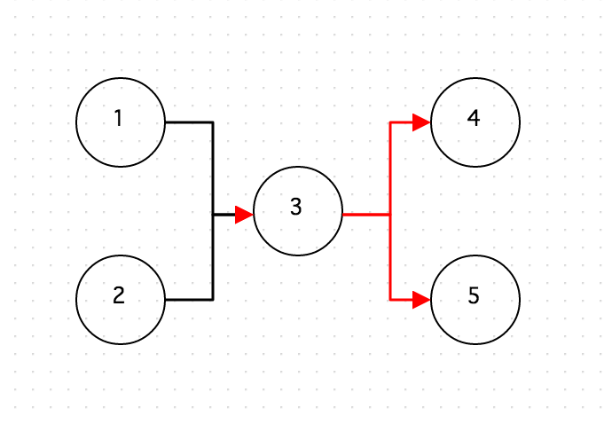

Canvas Selector
===============

오픈그래프의 캔버스의 셀렉터 메소드들에 대해 알아보겠습니다.

## getElementById

ID 로 도형을 반환합니다.
```
/**
* ID로 Node Element 를 반환한다.
*
* @param {String} id
* @return {Element} Element
*/
var rectShape = canvas.drawShape([100, 100], new OG.RectangleShape(), [100, 100], null, 'RectShape');
var selectShape = canvas.getElementById('RectShape');
console.log(selectShape);
```

## getElementsByType

도형의 Type 에 따라 도형들을 반환합니다.

```
/**
* Shape 타입에 해당하는 Node Element 들을 반환한다.
*
* @param {String} shapeType Shape 타입(GEOM, HTML, IMAGE, EDGE, GROUP), Null 이면 모든 타입
* @param {String} excludeType 제외 할 타입
* @return {Element[]} Element's Array
*/
var rectShape = canvas.drawShape([100, 100], new OG.RectangleShape(), [100, 100], null, 'RectShape');
var circleShape = canvas.drawShape([100, 100], new OG.CircleShape(), [50, 50], null, 'CircleShape');
var selectShapes = canvas.getElementsByType('GEOM');
console.log(selectShapes);
```

## getElementsByShapeId

도형의 shape ID 에 해당하는 도형들을 반환합니다.

```
/**
* Shape ID에 해당하는 Node Element 들을 반환한다.
*
* @param {String} shapeId Shape ID
* @return {Element[]} Element's Array
*/
var rectShape = canvas.drawShape([100, 100], new OG.RectangleShape(), [100, 100], null, 'RectShape');
var circleShape = canvas.drawShape([100, 100], new OG.CircleShape(), [50, 50], null, 'CircleShape');

var shapeId = $(rectShape).attr('_shape_id');//OG.shape.RectangleShape
var selectShapes = canvas.getElementsByShapeId(shapeId);
console.log(selectShapes);
```

## getRelatedElementsFromEdge

주어진 연결선과 연결된 도형들을 구합니다.

```
/**
* Edge 엘리먼트와 연결된 fromShape, toShape 엘리먼트를 반환한다.
*
* @param {Element|String} edgeElement Element 또는 ID
* @return {Object}
*/
var rectShape = canvas.drawShape([100, 100], new OG.RectangleShape(), [100, 100], null, 'RectShape');
var circleShape = canvas.drawShape([200, 200], new OG.CircleShape(), [50, 50], null, 'CircleShape');

var edge = canvas.connect(rectShape,circleShape);
var relatedElementsFromEdge = canvas.getRelatedElementsFromEdge(edge);
console.log(relatedElementsFromEdge.from);  ==> rectShape
console.log(relatedElementsFromEdge.to); ==> circleShape
```

## getParent

```
/**
* 부모 엘리먼트를 반환한다. 부모가 루트일때는 반환하지 않는다.
*
* @param {Element} Element  엘리먼트
* @return {Element} Element  엘리먼트
*/
canvas.getParent(element);
```

## getChilds

```
/**
* 그룹의 하위 엘리먼트를 반환한다.
*
* @param {Element} element  엘리먼트
* @returns {Array} Elements
*/
canvas.getChilds(element);
```

## getAllShapes

```
/**
* 캔버스의 모든 Shape 들을 리턴
*
* @return {Array} Elements
*/
canvas.getAllShapes();
```

## getAllEdges

```
/**
* 캔버스의 모든 Edge를 리턴
*
* @return {Array} Edge Elements
*/
canvas.getAllEdges();
```

## getPrevEdges

주어진 도형과 연결된 이전 연결선들을 반환합니다.

```
/**
* 연결된 이전 Edge Element 들을 반환한다.
*
* @param {Element|String} element Element 또는 ID
* @return {Element[]} Previous Element's Array
*/

var circleShape1 = canvas.drawShape([100, 100], new OG.CircleShape('1'), [50, 50], null);
var circleShape2 = canvas.drawShape([100, 200], new OG.CircleShape('2'), [50, 50], null);
var circleShape3 = canvas.drawShape([200, 150], new OG.CircleShape('3'), [50, 50], null);
var circleShape4 = canvas.drawShape([300, 100], new OG.CircleShape('4'), [50, 50], null);
var circleShape5 = canvas.drawShape([300, 200], new OG.CircleShape('5'), [50, 50], null);

canvas.connect(circleShape1, circleShape3);
canvas.connect(circleShape2, circleShape3);
canvas.connect(circleShape3, circleShape4);
canvas.connect(circleShape3, circleShape5);

var prevEdges = canvas.getPrevEdges(circleShape3);
for (var i = 0, leni = prevEdges.length; i < leni; i++) {
    canvas.setShapeStyle(prevEdges[i],{stroke: 'red'});
}
```


## getNextEdges

주어진 도형과 연결된 Next 연결선들을 반환합니다.

```
/**
* 연결된 이후 Edge Element 들을 반환한다.
*
* @param {Element|String} element Element 또는 ID
* @return {Element[]} Previous Element's Array
*/

var circleShape1 = canvas.drawShape([100, 100], new OG.CircleShape('1'), [50, 50], null);
var circleShape2 = canvas.drawShape([100, 200], new OG.CircleShape('2'), [50, 50], null);
var circleShape3 = canvas.drawShape([200, 150], new OG.CircleShape('3'), [50, 50], null);
var circleShape4 = canvas.drawShape([300, 100], new OG.CircleShape('4'), [50, 50], null);
var circleShape5 = canvas.drawShape([300, 200], new OG.CircleShape('5'), [50, 50], null);

canvas.connect(circleShape1, circleShape3);
canvas.connect(circleShape2, circleShape3);
canvas.connect(circleShape3, circleShape4);
canvas.connect(circleShape3, circleShape5);

var nextEdges = canvas.getNextEdges(circleShape3);
for (var i = 0, leni = nextEdges.length; i < leni; i++) {
    canvas.setShapeStyle(nextEdges[i],{stroke: 'red'});
}
```



## getPrevShapes

주어진 도형과 연결된 이전 도형들을 반환합니다.

```
/**
* 연결된 이전 노드 Element 들을 반환한다.
*
* @param {Element|String} element Element 또는 ID
* @return {Element[]} Previous Element's Array
*/

var circleShape1 = canvas.drawShape([100, 100], new OG.CircleShape('1'), [50, 50], null);
var circleShape2 = canvas.drawShape([100, 200], new OG.CircleShape('2'), [50, 50], null);
var circleShape3 = canvas.drawShape([200, 150], new OG.CircleShape('3'), [50, 50], null);
var circleShape4 = canvas.drawShape([300, 100], new OG.CircleShape('4'), [50, 50], null);
var circleShape5 = canvas.drawShape([300, 200], new OG.CircleShape('5'), [50, 50], null);

canvas.connect(circleShape1, circleShape3);
canvas.connect(circleShape2, circleShape3);
canvas.connect(circleShape3, circleShape4);
canvas.connect(circleShape3, circleShape5);

var prevShapes = canvas.getPrevShapes(circleShape3);
for (var i = 0, leni = prevShapes.length; i < leni; i++) {
    canvas.setShapeStyle(prevShapes[i],{stroke: 'red'});
}
```


## getPrevShapeIds

주어진 도형과 연결된 이전 도형들의 아이디들을 반환합니다.

```
/**
* 연결된 이전 노드 Element ID들을 반환한다.
*
* @param {Element|String} element Element 또는 ID
* @return {String[]} Previous Element Id's Array
*/
canvas.getPrevShapeIds(element);
```

## getNextShapes

주어진 도형과 연결된 Next 도형들을 반환합니다.

```
/**
* 연결된 이후 노드 Element 들을 반환한다.
*
* @param {Element|String} element Element 또는 ID
* @return {Element[]} Previous Element's Array
*/
var circleShape1 = canvas.drawShape([100, 100], new OG.CircleShape('1'), [50, 50], null);
var circleShape2 = canvas.drawShape([100, 200], new OG.CircleShape('2'), [50, 50], null);
var circleShape3 = canvas.drawShape([200, 150], new OG.CircleShape('3'), [50, 50], null);
var circleShape4 = canvas.drawShape([300, 100], new OG.CircleShape('4'), [50, 50], null);
var circleShape5 = canvas.drawShape([300, 200], new OG.CircleShape('5'), [50, 50], null);

canvas.connect(circleShape1, circleShape3);
canvas.connect(circleShape2, circleShape3);
canvas.connect(circleShape3, circleShape4);
canvas.connect(circleShape3, circleShape5);

var nextShapes = canvas.getNextShapes(circleShape3);
for (var i = 0, leni = nextShapes.length; i < leni; i++) {
    canvas.setShapeStyle(nextShapes[i],{stroke: 'red'});
}
```


## getNextShapeIds

주어진 도형과 연결된 Next 도형들의 아이디들을 반환합니다.

```
**
* 연결된 이후 노드 Element ID들을 반환한다.
*
* @param {Element|String} element Element 또는 ID
* @return {String[]} Previous Element Id's Array
*/
canvas.getNextShapeIds(element);
```


