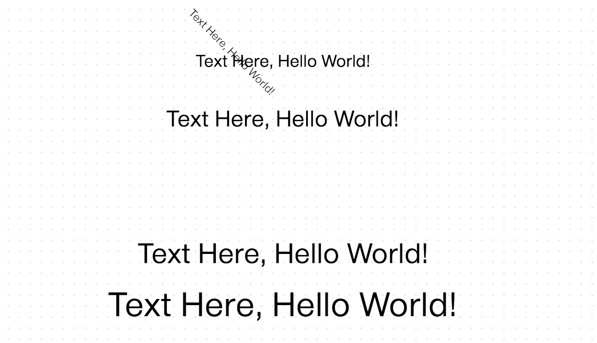

Shape
=====

Shape 은 오픈그래프 캔버스 에 drawing 하기 위한 도형을 정의한 클래스입니다.

Shape 은 화면에 표현될 Geometry 클래스를 가지고 있고, 사용자가 UI 상에서 도형을 선택하거나 이동시키는 등의 이벤트에 대한 제어 내용을 포함하고 있습니다.
 
Shape 에 대한 접근은 도형 Dom 객체의 shape 프로퍼티를 통해 가져올 수 있습니다.

```
var canvas = new OG.Canvas('canvas', [1000, 800], 'white', 'url(resources/images/symbol/grid.gif)');

//Shape 정의
var shape = new OG.RectangleShape();

//Shape 을 화면에 drawing 하여 Dom 객체를 얻음.
var element = canvas.drawShape([400, 300], new OG.RectangleShape(), [400, 300]);

//Dom 객체의 shape 프로퍼티에 등록되어있음.
element.shape ==> Shape 클래스
```

## IShape

OG.shape.IShape 는 Shape 의 최상위 추상 클래스입니다.

OG.shape.IShape 에는 도형, 텍스트, 이미지 등의 드로잉 될 Object 의 정보를 저장과 이벤트 제어를 담당합니다.

OG.shape.IShape 의 소스코드를 본 후, Shape 클래스의 Configuration 설정 방법을 알아보도록 하겠습니다.

```
/**
 * 도형, 텍스트, 이미지 등의 드로잉 될 Object 의 정보를 저장하는 Shape 정보 최상위 인터페이스
 *
 * @class
 * @requires OG.common.*
 * @requires OG.geometry.*
 *
 * @author <a href="mailto:sppark@uengine.org">Seungpil Park</a>
 */
OG.shape.IShape = function () {
	/**
	 * Shape 유형(GEOM, TEXT, HTML, IMAGE, EDGE, GROUP)
	 * @type String
	 */
	this.TYPE = null;

	/**
	 * Shape 을 구분하는 Shape ID(Shape 클래스명과 일치)
	 * @type String
	 */
	this.SHAPE_ID = null;

	/**
	 * Shape 모양을 나타내는 공간기하객체(Geometry)
	 * @type OG.geometry.Geometry
	 */
	this.geom = null;

	/**
	 * Shape 라벨 텍스트
	 * @type String
	 */
	this.label = null;

	/**
	 * Shape 의 Collapse 여부
	 * @type Boolean
	 */
	this.isCollapsed = false;

//	 이벤트 속성
	/**
	 * 선택 가능여부
	 * @type Boolean
	 */
	this.SELECTABLE = true;

	/**
	 * 이동 가능여부
	 * @type Boolean
	 */
	this.MOVABLE = true;

	/**
	 * 리사이즈 가능여부
	 * @type Boolean
	 */
	this.RESIZABLE = true;

	/**
	 * 연결 가능여부
	 * @type Boolean
	 */
	this.CONNECTABLE = true;

	/**
	 * From 연결 가능여부 (From(Shape) => To)
	 * @type Boolean
	 */
	this.ENABLE_FROM = true;

	/**
	 * To 연결 가능여부 (From => To(Shape))
	 * @type Boolean
	 */
	this.ENABLE_TO = true;

	/**
	 * TO 연결 가능여부
	 * @type Boolean
	 */
	this.ENABLE_FROM = true;

	/**
	 * Self 연결 가능여부
	 * @type Boolean
	 */
	this.SELF_CONNECTABLE = true;

	/**
	 * 가이드에 자기자신을 복사하는 컨트롤러 여부.
	 * @type Boolean
	 */
	this.CONNECT_CLONEABLE = true;

	/**
	 * 드래그하여 연결시 연결대상 있는 경우에만 Edge 드로잉 처리 여부
	 * @type Boolean
	 */
	this.CONNECT_REQUIRED = true;

	/**
	 * 드래그하여 연결시 그룹을 건너뛸때 스타일 변경 여부
	 * @type Boolean
	 */
	this.CONNECT_STYLE_CHANGE = true;

	/**
	 * 가이드에 삭제 컨트롤러 여부
	 * @type Boolean
	 */
	this.DELETABLE = true;

	/**
	 * 라벨 수정여부
	 * @type Boolean
	 */
	this.LABEL_EDITABLE = true;


	this.exceptionType = '';
};
OG.shape.IShape.prototype = {

	/**
	 * 드로잉할 Shape 를 생성하여 반환한다.
	 *
	 * @return {*} Shape 정보
	 * @abstract
	 */
	createShape: function () {
		throw new OG.NotImplementedException("OG.shape.IShape.createShape");
	},

	/**
	 * Shape 을 복사하여 새로인 인스턴스로 반환한다.
	 *
	 * @return {OG.shape.IShape} 복사된 인스턴스
	 * @abstract
	 */
	clone: function () {
		throw new OG.NotImplementedException("OG.shape.IShape.clone");
	},
	addEve : function(){
	},

	// (void) 특수한 컨트롤을 생성하기 위한 함수
	drawCustomControl: function(){
	}
};
OG.shape.IShape.prototype.constructor = OG.shape.IShape;
OG.IShape = OG.shape.IShape;
```

## Configuration

아래 표는 OG.shape.IShape 가 제공하는 이벤트 핸들링 Configuration 및 Object 정보를 담당하는 프로퍼티 리스트입니다.

| Property 명          | 역할                                                           | 타입                 |
|----------------------|----------------------------------------------------------------|----------------------|
| TYPE                 | Shape 유형(GEOM, TEXT, HTML, IMAGE, EDGE, GROUP)               | String               |
| SHAPE_ID             | Shape 을 구분하는 Shape ID(Shape 클래스명과 일치)              | String               |
| geom                 | Shape 모양을 나타내는 공간기하객체(Geometry)                   | OG.geometry.Geometry |
| label                | Shape 라벨 텍스트                                              | String               |
| isCollapsed          | Shape 의 Collapse 여부                                         | Boolean              |
| SELECTABLE           | 선택 가능여부                                                  | Boolean              |
| MOVABLE              | 이동 가능여부                                                  | Boolean              |
| RESIZABLE            | 리사이즈 가능여부                                              | Boolean              |
| CONNECTABLE          | 연결 가능여부                                                  | Boolean              |
| ENABLE_FROM          | From 연결 가능여부 (From(Shape) => To)                         | Boolean              |
| ENABLE_TO            | To 연결 가능여부 (From => To(Shape))                           | Boolean              |
| SELF_CONNECTABLE     | Self 연결 가능여부                                             | Boolean              |
| CONNECT_CLONEABLE    | 가이드에 자기자신을 복사하는 컨트롤러 여부.                    | Boolean              |
| CONNECT_REQUIRED     | 드래그하여 연결시 연결대상 있는 경우에만 Edge 드로잉 처리 여부 | Boolean              |
| CONNECT_STYLE_CHANGE | 드래그하여 연결시 그룹을 건너뛸때 스타일 변경 여부             | Boolean              |
| DELETABLE            | 가이드에 삭제 컨트롤러 여부                                    | Boolean              |
| LABEL_EDITABLE       | 라벨 수정여부                                                  | Boolean              |


위의 프로퍼티 값을 이용해서 몇가지 이벤트를 막아놓은 RectShape 도형을 그리는 예제입니다.

```
var canvas = new OG.Canvas('canvas', [1000, 800], 'white', 'url(resources/images/symbol/grid.gif)');

//Block Edit Shape 만들기
var shape = new OG.RectangleShape('Block Edit');

//이동 불가
shape.MOVABLE = false;

//리사이징 불가
shape.RESIZABLE = false;

//연결 불가
shape.CONNECTABLE = false;

//삭제 불가
shape.DELETABLE = false;

//자기 자신 복사 불가
shape.CONNECT_CLONEABLE = false;

canvas.drawShape([200, 200], shape, [150, 150]);

canvas.drawShape([500, 200], new OG.RectangleShape('Enable Edit'), [150, 150]);

```


오픈그래프에서 제공하고 있는 IShape 를 확장한 5가지 기본 Shape 를 알아보도록 하겠습니다.

## GeomShape

OG.shape.GeomShape 클래스는 geometry 를 사용하여 드로잉하는 Shape 의 기본 클래스입니다.

OG.shape.GeomShape 를 바로 상속받아 사용하기 위해서는, 아래 예제와 같이 SHAPE_ID 를 부여해주도록 합니다.
 
```
/**
 * Geometry Shape
 *
 * @class
 * @extends OG.shape.IShape
 * @requires OG.common.*
 * @requires OG.geometry.*
 *
 * @author <a href="mailto:sppark@uengine.org">Seungpil Park</a>
 */
 
Example)
var shape = new OG.GeomShape();
shape.SHAPE_ID = 'OG.shape.CircleExample';
shape.createShape = function () {
    if (this.geom) {
        return this.geom;
    }
    this.geom = new OG.geometry.Circle([50, 50], 100);

    this.geom.style = new OG.geometry.Style({
        'cursor': 'default',
        'stroke': '#d9534f',
        'stroke-width': '1',
        'fill': 'none',
        'fill-opacity': 0
    });
    return this.geom;
};
var customShape = canvas.drawShape([300, 200], shape, [200, 200]);
```

## EdgeShape

OG.shape.EdgeShape 클래스는 선분 및 도형간의 선연결을 할 수 있는 Shape 입니다.

```
/**
 * Edge Shape
 *
 * @class
 * @extends OG.shape.IShape
 * @requires OG.common.*
 * @requires OG.geometry.*
 *
 * @param {Number[]} from 와이어 시작 좌표
 * @param {Number[]} to 와이어 끝 좌표
 * @param {String} label 라벨 [Optional]
 * @param {String} fromLabel 시작점 라벨 [Optional]
 * @param {String} toLabel 끝점 라벨 [Optional]
 * @author <a href="mailto:sppark@uengine.org">Seungpil Park</a>
 */
 
Example)
var canvas = new OG.Canvas('canvas', [1000, 800], 'white', 'url(resources/images/symbol/grid.gif)');
var edgeShape = new OG.shape.EdgeShape([100, 200], [600, 450], 'label');
canvas.drawShape(null, edgeShape, null, {'edge-type': 'plain', "arrow-start": "none", "arrow-end": "open-wide-long"});
```


도형끼리의 선 연결을 수행했을 경우 리턴되는 것도 EdgeShape 인데, 이렇게 생성된 연결 도형들은 Dom 객체의 attribute 에 특정한 값을 가지게 됩니다.

다음 예제를 실행해봅니다.

```
//From 도형
var element1 = canvas.drawShape([200,200],new OG.RectangleShape('From'),[150,150]);

//To 도형
var element2 = canvas.drawShape([600,200],new OG.RectangleShape('To'),[150,150]);

//connect 시킬 경우 edgeShape Dom 객체가 리턴된다.
var edge = canvas.connect(element1, element2, null, 'edge');

//각 어트리뷰트 확인
console.log($(element1).attr('_toedge'));
console.log($(element2).attr('_fromedge'));
console.log($(edge).attr('_from'));
console.log($(edge).attr('_to'));
```


| Dom 객체     | 어트리뷰트 | 값 예시                  | 설명                                                                        | 멀티 value      |
|--------------|------------|--------------------------|-----------------------------------------------------------------------------|-----------------|
| From element | _toedge    | OG_1277_8                | 자신으로 부터 외부로 나간 edge 아이디                                       | 콤마 세퍼레이터 |
| To element   | _fromedge  | OG_1277_8                | 자신을 향해 안으로 들어온 edge 아이디                                       | 콤마 세퍼레이터 |
| Edge element | _from      | OG_1277_2_TERMINAL_50_50 | 선분과 from 으로 연결된 도형의 아이디 와 그 도형의 접점의 퍼센테이지 포인트 | 단일값          |
|              | _to        | OG_1277_5_TERMINAL_50_50 | 선분과 to 으로 연결된 도형의 아이디 와 그 도형의 접점의 퍼센테이지 포인트   | 단일값          |


이번에는, 화면에 이미 그려진 Edge 와 두 두형을 연결하는 예제를 실행해보겠습니다.

이미 그려진 Edge 를 연결하기 위해서는 canvas.getRenderer().connect(fromTerminal,toTerminal,edgeElement) 메소드를 사용합니다.
 
fromTerminal 과 toTerminal 은 Edge 의 _from 어트리뷰트와 _to 어트리뷰터 값입니다.

terminal 스트링을 만드는 것은 위의 표처럼 직접 스트링을 만드실 수도 있고, canvas.getRenderer().createDefaultTerminalString(fromElement|toElement) 를 호출할 수 도 있습니다.

```
var fromElement = canvas.drawShape([200,200],new OG.RectangleShape('From'),[150,150]);
var toElement = canvas.drawShape([600,200],new OG.RectangleShape('To'),[150,150]);

var edgeShape = new OG.shape.EdgeShape([100, 100], [700, 300], 'edge');
var edgeElement = canvas.drawShape(null, edgeShape);

//fromTerminal 스트링 만들기
var fromTerminal = canvas.getRenderer().createDefaultTerminalString(fromElement);

//toTerminal 스트링 만들기
var toTerminal = canvas.getRenderer().createDefaultTerminalString(toElement);

//fromTerminal,toTerminal,edgeElement 를 연결하기
canvas.getRenderer().connect(fromTerminal,toTerminal,edgeElement);
```


## GroupShape

OG.shape.GroupShape 클래스는 기본적으로 OG.geometry.Rectangle 을 그리게 되며, 자신 안에 다른 도형을 포함시킬 수 있습니다.
 
앞서 [Canvas Drawing - group](document/canvas.md#group) 파트에서 canvas.group([도형1,도형2...]) 메소드로 그룹핑을 할때 리턴되는 Dom 객체가
OG.shape.GroupShape 클래스를 shape 으로 가지고 있습니다.


```
/**
 * Group Shape
 *
 * @class
 * @extends OG.shape.IShape
 * @requires OG.common.*
 * @requires OG.geometry.*
 *
 * @param {String} label 라벨 [Optional]
 * @author <a href="mailto:sppark@uengine.org">Seungpil Park</a>
 */

Example)
var canvas = new OG.Canvas('canvas', [1000, 800], 'white', 'url(resources/images/symbol/grid.gif)');

var rectangleShape = canvas.drawShape([100, 100], new OG.RectangleShape('1'), [100, 100]);
var circleShape = canvas.drawShape([300, 200], new OG.RectangleShape('2'), [80, 80]);

//create OG.shape.GroupShape Dom Element
var group = canvas.group([rectangleShape,circleShape]);

var addShape1 = canvas.drawShape([300, 100], new OG.CircleShape('add1'), [50, 50]);
var addShape2 = canvas.drawShape([100, 200], new OG.CircleShape('add2'), [50, 50]);
canvas.addToGroup(group,[addShape1,addShape2]);
```

OG.geometry.Rectangle 사각형 틀 이외의 다른 특수한 모양들도 GroupShape 로 만들 수 있습니다.

다음의 예제를 진행하여 봅니다.

```
var shape = new OG.GroupShape();
shape.createShape = function () {
    if (this.geom) {
        return this.geom;
    }
    this.geom = new OG.geometry.PolyLine([[0,0],[50,50],[150,50],[75,100],[-75,100],[-150,50],[-50,50],[0,0]]);

    this.geom.style = new OG.geometry.Style({
        'cursor': 'default',
        'stroke': '#d9534f',
        'stroke-width': '1',
        'fill': 'none',
        'fill-opacity': 0
    });
    return this.geom;
};
var customShape = canvas.drawShape([300, 200], shape, [200, 200]);
```

위의 코드로 생성된 도형은 다른 도형을 자식으로 가질 수 있게 됩니다. 또한 UI 에서 사용자가 드래그 하여 다른 도형을 집어넣을 수 있습니다.


## ImageShape

OG.shape.ImageShape 는 이미지를 드로잉 할 수 있는 shape 클래스 입니다.

new OG.ImageShape(이미지 url) 로 사용할 수 있습니다.

```
var imageShape1 = new OG.ImageShape('resources/images/router/Api.png');
var imageShape2 = new OG.ImageShape('resources/images/router/Function.svg');
var imageShape3 = new OG.ImageShape('resources/images/router/Oauth.png');
var imageShape4 = new OG.ImageShape('resources/images/router/Proxy.png');
var imageShape5 = new OG.ImageShape('resources/images/router/Request.png');
var imageShape6 = new OG.ImageShape('resources/images/router/Response.png');

canvas.drawShape([100, 100], imageShape1, [200, 150]);
canvas.drawShape([300, 100], imageShape2, [200, 150]);
canvas.drawShape([500, 100], imageShape3, [100, 100]);
canvas.drawShape([100, 300], imageShape4, [200, 150]);
canvas.drawShape([300, 300], imageShape5, [100, 100]);
canvas.drawShape([500, 300], imageShape6, [100, 100]);
```


## TextShape

OG.shape.TextShape 는 텍스트를 드로잉 할 수 있는 shape 클래스입니다.

```
var textShape1 = new OG.TextShape("Text Here, Hello World!");
var textShape2 = new OG.TextShape("Text Here, Hello World!");
var textShape3 = new OG.TextShape("Text Here, Hello World!");
var textShape4 = new OG.TextShape("Text Here, Hello World!");
var textShape5 = new OG.TextShape("Text Here, Hello World!");

canvas.drawShape([300, 100], textShape1, [200, 100, 45], {'font-size': 10, 'text-anchor': 'start', 'vertical-align': 'middle'});
canvas.drawShape([300, 150], textShape2, [200, 100], {'font-size': 15, 'text-anchor': 'middle', 'vertical-align': 'top'});
canvas.drawShape([300, 200], textShape3, [200, 100], {'font-size': 20, 'text-anchor': 'end', 'vertical-align': 'top'});
canvas.drawShape([300, 250], textShape4, [200, 100], {'font-size': 25, 'text-anchor': 'middle', 'vertical-align': 'bottom'});
canvas.drawShape([300, 300], textShape5, [200, 100], {'font-size': 30, 'text-anchor': 'end', 'vertical-align': 'bottom'});
```

