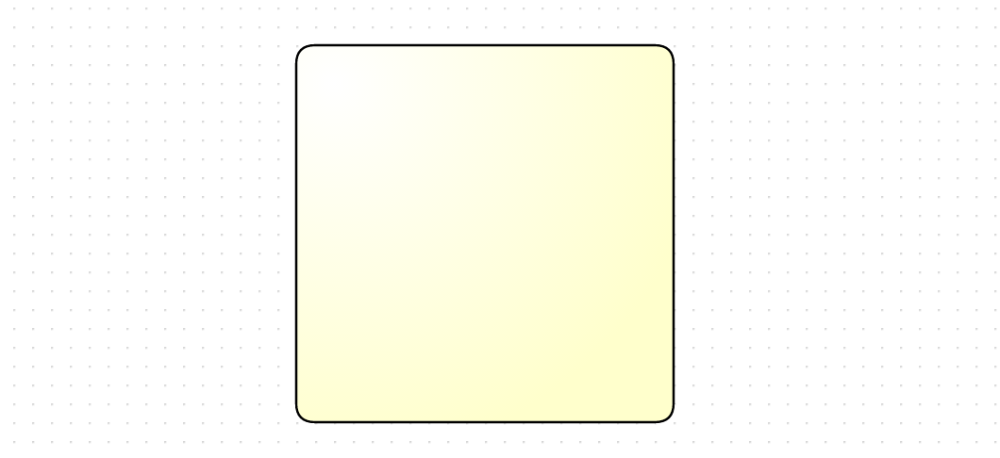

Sub Shape
=========

 - [Basic Sub Shape](#basic-sub-shape)
 - [Sub Shape Size && Position](#sub-shape-size-&&-position)
 - [Sub Shape index](#sub-shape-index)
 - [Sub Shape Data model](#sub-shape-data-model)

앞서 [Define Custom Shape](extend-shape.md#define-custom-shape) 파트를 통해 복잡한 기하학 도형을 표현하는 것을 살펴보았습니다.

Sub Shape 기능이 위와 차이가 있다면 위와 같은 도형은 정해진 geometry 대로 도형을 그리지만, 
Sub Shape 기능은 다수의 Shape 을 도형의 상태 또는 데이터에 따라 유기적으로 배치할 수 있도록 모델링 한 도형입니다.

## Basic Sub Shape

Sub Shape 은 도형 클래스 정의시 createSubShape 메소드를 정의함으로써 사용할 수 있습니다.

먼저, 베이스가 될 라운드 사각형 모양의 도형 클래스를 정희해보도록 합니다.

```
OG.shape.SampleShape = function (label) {
	OG.shape.SampleShape.superclass.call(this);

	this.GROUP_DROPABLE = false;
	this.SHAPE_ID = 'OG.shape.SampleShape';
	this.label = label;
	this.CONNECTABLE = true;
	this.GROUP_COLLAPSIBLE = false;
	this.LoopType = "None";
	this.TaskType = "None";
	this.status = "None";
	this.Events = [];

};
OG.shape.SampleShape.prototype = new OG.shape.GeomShape();
OG.shape.SampleShape.superclass = OG.shape.GeomShape;
OG.shape.SampleShape.prototype.constructor = OG.shape.SampleShape;
OG.SampleShape = OG.shape.SampleShape;

/**
 * 드로잉할 Shape 을 생성하여 반환한다.
 *
 * @return {OG.geometry.Geometry} Shape 정보
 * @override
 */
OG.shape.SampleShape.prototype.createShape = function () {
	if (this.geom) {
		return this.geom;
	}

	this.geom = new OG.geometry.Rectangle([0, 0], 100, 100);
	this.geom.style = new OG.geometry.Style({
		'fill-r': 1,
		'fill-cx': .1,
		'fill-cy': .1,
		"stroke-width": 1.2,
		fill: 'r(.1, .1)#FFFFFF-#FFFFCC',
		'fill-opacity': 1,
		r: '10'
	});
	return this.geom;
};

canvas.drawShape([300,200],new OG.SampleShape(), [200,200]);
```




이제 이 클래스에 createSubShape 메소드를 정의합니다.

createSubShape 메소드는 this.sub 객체를 리턴하도록 하는데, this.sub 안에는 추가적으로 그려야 할 sub shapes 들을 기술합니다.

기술 내용에 대한 프로퍼티는 다음과 같습니다.

| 프로퍼티       | 타입             | 설명                           |
|----------------|------------------|--------------------------------|
| shape          | OG.shape.IShape  | 서브 도형 클래스               |
| width          | number or string | 서브 도형 가로                 |
| height         | number or string | 서브 도형 세로                 |
| top            | number or string | 서브 도형 top 포지션           |
| bottom         | number or string | 서브 도형 bottom 포지션        |
| left           | number or string | 서브 도형 left 포지션          |
| right          | number or string | 서브 도형 right 포지션         |
| align          | string           | 가로 정렬 (start,center,end) |
| vertical-align | string           | 세로 정렬 (start,center,end) |
| style          | Object           | 서브 도형 스타일               |


```
OG.shape.SampleShape.prototype.createSubShape = function () {
	this.sub = [
		{
			shape: new OG.RectangleShape('Sub shape'),
			width: '50%',
			height: '50%',
			align: 'center',
			'vertical-align': 'center',
			style: {
				fill: 'gray',
				'fill-opacity': 1
			}
		}
	];

	return this.sub;
};

canvas.drawShape([300,200],new OG.SampleShape(), [200,200]);
```


## Sub Shape Size && Position

서브 도형의 사이즈와 포지션은 CSS 어트리뷰트 표기법과 동일하게 표현할 수 있습니다.

서브 도형의 사이즈는 width 와 height 프로퍼티로 결정합니다. px 로 표기할경우 표기한 px 만큼 표현되고, 
% 로 표기할 경우 부모 도형의 가로, 세로 대비 % 로 계산되어 표현됩니다.

```
OG.shape.SampleShape.prototype.createSubShape = function () {
	this.sub = [
		{
			shape: new OG.RectangleShape('Sub shape'),
			width: '70%',
			height: '50px',
			align: 'center',
			'vertical-align': 'center',
			style: {
				fill: 'gray',
				'fill-opacity': 1
			}
		}
	];

	return this.sub;
};

canvas.drawShape([300,200],new OG.SampleShape(), [200,200]);
```


서브 도형의 포지션은 CSS position 어트리뷰트 중, "absolute" 포지션 계산과 동일합니다.

```
OG.shape.SampleShape.prototype.createSubShape = function () {
	this.sub = [
		{
			shape: new OG.RectangleShape('Sub1'),
			width: '50px',
			height: '50px',
			align: 'start',
			'vertical-align': 'end',
			style: {
				fill: 'gray',
				'fill-opacity': 1
			}
		},
		{
			shape: new OG.RectangleShape('Sub2'),
			width: '50px',
			height: '50px',
			align: 'end',
			'vertical-align': 'start',
			style: {
				fill: 'gray',
				'fill-opacity': 1
			}
		},
		{
			shape: new OG.RectangleShape('Sub3'),
			width: '50px',
			height: '50px',
			top: '40px',
			left: '40px',
			style: {
				fill: 'gray',
				'fill-opacity': 1
			}
		},
		{
			shape: new OG.RectangleShape('Sub4'),
			width: '50px',
			height: '50px',
			right: '20%',
			bottom: '20%',
			style: {
				fill: 'gray',
				'fill-opacity': 1
			}
		},
		{
			shape: new OG.RectangleShape('Sub5'),
			width: '50px',
			height: '50px',
			right: '-150px',
			'vertical-align': 'center',
			style: {
				fill: 'gray',
				'fill-opacity': 1
			}
		},
		{
			shape: new OG.RectangleShape('Sub6'),
			width: '50px',
			height: '50px',
			left: '-150px',
			'vertical-align': 'center',
			style: {
				fill: 'gray',
				'fill-opacity': 1
			}
		}
	];

	return this.sub;
};

canvas.drawShape([500, 300], new OG.SampleShape(), [300, 300]);
```


## Sub Shape index

z-index 프로퍼티로 서브 도형간의 앞,뒤 순서를 표현할 수 있습니다.

이 떄, 음의 값이면 부모 도형의 뒤에, 양의 값이면 부모 도형의 앞에 위치하게 됩니다.

```
OG.shape.SampleShape.prototype.createSubShape = function () {
this.sub = [
	{
		shape: new OG.RectangleShape('Sub1'),
		width: '50%',
		height: '40%',
		left: '-30%',
		'vertical-align' : 'center',
		style: {
			'fill' : 'gray',
			'fill-opacity' : 1
		},
		'z-index': -1
	},
	{
		shape: new OG.RectangleShape('Sub2'),
		width: '50%',
		height: '40%',
		left: '20%',
		'vertical-align' : 'center',
		style: {
			'fill' : 'red',
			'fill-opacity' : 1
		},
		'z-index': 1
	}
];

return this.sub;
};

canvas.drawShape([500, 300], new OG.SampleShape(), [300, 300]);
```


## Sub Shape Data model

도형이 지니고 있는 데이터 값에 따라 서브 도형들이 유기적으로 대응할 수 있게 모델링 해 봅니다.

```
OG.shape.SampleShape.prototype.createShape = function () {
	if (this.geom) {
		return this.geom;
	}

	this.geom = new OG.geometry.Rectangle([0, 0], 100, 100);
	this.geom.style = new OG.geometry.Style({
		'fill-r': 1,
		'fill-cx': .1,
		'fill-cy': .1,
		"stroke-width": 1.2,
		fill: 'r(.1, .1)#FFFFFF-#FFFFCC',
		'fill-opacity': 1,
		r: '10'
	});
	return this.geom;
};

OG.shape.SampleShape.prototype.createSubShape = function () {
	this.sub = [];

	var loopShape;
	switch (this.data.LoopType) {
		case 'Standard' :
			loopShape = new OG.ImageShape('resources/images/symbol/loop_standard.png');
			break;
		case 'MIParallel' :
			loopShape = new OG.MIParallel();
			break;
		case 'MISequential' :
			loopShape = new OG.MISequential();
			break;
	}
	if (loopShape) {
		this.sub.push({
			shape: loopShape,
			width: '15px',
			height: '15px',
			bottom: '5px',
			align: 'center',
			style: {}
		})
	}

	var taskTypeShape;
	switch (this.data.TaskType) {
		case "User":
			taskTypeShape = new OG.ImageShape("resources/images/symbol/User.png");
			break;
		case "Send":
			taskTypeShape = new OG.ImageShape('resources/images/symbol/Send.png');
			break;
		case "Receive":
			taskTypeShape = new OG.ImageShape("resources/images/symbol/Receive.png");
			break;
		case "Manual":
			taskTypeShape = new OG.ImageShape("resources/images/symbol/Manual.png");
			break;
		case "Service":
			taskTypeShape = new OG.ImageShape("resources/images/symbol/Service.png");
			break;
		case "BusinessRule":
			taskTypeShape = new OG.ImageShape("resources/images/symbol/BusinessRule.png");
			break;
		case "Script":
			taskTypeShape = new OG.ImageShape("resources/images/symbol/Script.png");
			break;
		case "Mapper":
			taskTypeShape = new OG.ImageShape("resources/images/symbol/Mapper.png");
			break;
		case "WebService":
			taskTypeShape = new OG.ImageShape("resources/images/symbol/WebService.png");
			break;
	}
	if (taskTypeShape) {
		this.sub.push({
			shape: taskTypeShape,
			width: '20px',
			height: '20px',
			top: '5px',
			left: '5px',
			style: {}
		})
	}

	var statusShape, statusAnimation;
	switch (this.data.status) {
		case "Completed":
			statusShape = new OG.ImageShape("resources/images/symbol/complete.png");
			break;
		case "Running":
			statusShape = new OG.ImageShape('resources/images/symbol/running.png');
			statusAnimation = new OG.RectangleShape();
			break;
	}
	if (statusShape) {
		this.sub.push({
			shape: statusShape,
			width: '20px',
			height: '20px',
			right: '25px',
			top: '5px',
			style: {}
		})
	}
	if (statusAnimation) {
		this.sub.push({
			shape: statusAnimation,
			'z-index': -1,
			width: '120%',
			height: '120%',
			left: '-10%',
			top: '-10%',
			style: {
				'fill-opacity': 1,
				animation: [
					{
						start: {
							fill: 'white'
						},
						to: {
							fill: '#C9E2FC'
						},
						ms: 1000
					},
					{
						start: {
							fill: '#C9E2FC'
						},
						to: {
							fill: 'white'
						},
						ms: 1000,
						delay: 1000
					}
				],
				'animation-repeat': true,
				"fill": "#C9E2FC",
				"stroke-width": "0.2",
				"r": "10",
				'stroke-dasharray': '--'
			}
		})
	}

	return this.sub;
};

var sampleShape1 = new OG.SampleShape();
sampleShape1.data = {
	LoopType: 'Standard',
	TaskType: 'User',
	status : 'Completed'
};
canvas.drawShape([300, 300], sampleShape1, [100, 100]);

var sampleShape2 = new OG.SampleShape();
sampleShape2.data = {
	LoopType: 'MIParallel',
	TaskType: 'Send',
	status : 'Running'
};
canvas.drawShape([500, 300], sampleShape2, [100, 100]);

var sampleShape3 = new OG.SampleShape();
sampleShape2.data = {
	LoopType: 'MISequential',
	TaskType: 'Manual',
	status : 'Completed'
};
canvas.drawShape([700, 300], sampleShape3, [100, 100]);

```


